## 11.5 [v2.1 增補] 民間河川拓樸註冊表 (WRA-Civ) 與社群共創規範

隨者河流探索的深入，官方水利署（WRA）所定義的 6 碼河川拓樸編碼（例如主流與二級支流的英數編碼 `114021`）在面對細部小支流、野溪或無名溪時，常面臨資料缺失的窘境。為此，我們推出了「官方圖資為底，民間協作補齊」的 **WRA-Civ（Civilian River Topology Registry）編碼與社群共創架構**，讓所有探索者都能一同描繪台灣細緻的水系網路。

---

### 1. WRA-Civ 編碼原則

為了避免與官方未來發布的編碼產生衝突，並維持資料庫的嚴謹性，民間編碼遵循以下規則：

*   **連字號下鑽協定 (`-[CivCode]`)**：以官方編碼為前綴，後面加上連字號 `-` 與民間編碼。
    *   *官方前綴*：南勢溪為 `114021`。
    *   *民間一級支流*：加九寮溪編為 `114021-C01`、給里瀨溪為 `114021-C02`、內洞溪為 `114021-C03`（其中 `C` 代表 Civilian 貢獻）。
    *   *民間二級支流*：若要編寫流入加九寮溪的更小無名溪，可直接下鑽為 `114021-C01-C01`。
*   **優點**：此編碼方式在資料庫中能自動保留父子級（Parent-Child）的拓樸依存關係，同時保證與官方官方 6 碼編碼完全隔離，互不干涉。

以下為整個淡水河流域（官方與民間 WRA-Civ 結合）的最新拓樸結構圖：

```mermaid
graph TD
    classDef official fill:#e1f5fe,stroke:#0288d1,stroke-width:1px;
    classDef civilian fill:#fff3e0,stroke:#f57c00,stroke-width:1px;

    R_114000["淡水河 (114000)"] --> R_114010["大漢溪 (114010)"]
    R_114000["淡水河 (114000)"] --> R_114020["新店溪 (114020)"]
    R_114000["淡水河 (114000)"] --> R_114030["基隆河 (114030)"]

    %% 大漢溪水系
    R_114010 --> R_114011["三峽溪 (114011)"]
    R_114011 --> R_11401B["大豹溪 (11401B)"]
    R_114010 --> R_114018["玉峰溪 (114018)"]
    
    %% 大漢溪民間支流
    R_114010 -.-> R_114010_C01["草嶺溪 (114010-C01)"]
    R_114010 -.-> R_114010_C02["三民溪 (114010-C02)"]
    R_114010 -.-> R_114010_C03["奎輝溪 (114010-C03)"]
    R_114010 -.-> R_114010_C04["霞雲溪 (114010-C04)"]
    R_114010 -.-> R_114010_C05["宇內溪 (114010-C05)"]
    R_114010 -.-> R_114010_C06["寶里苦溪 (114010-C06)"]
    R_114010 -.-> R_114010_C07["卡拉溪 (114010-C07)"]
    R_114011 -.-> R_114011_C01["五寮溪 (114011-C01)"]
    R_11401B -.-> R_11401B_C01["蚋仔溪 (11401B-C01)"]
    R_11401B -.-> R_11401B_C02["熊空溪 (11401B-C02)"]
    R_11401B -.-> R_11401B_C03["水車寮溪 (11401B-C03)"]
    R_11401B_C01 -.-> R_11401B_C01_C01["蚋仔溪次級支流 (11401B-C01-C01)"]
    R_114018 -.-> R_114018_C01["薩克亞金溪 (114018-C01)"]

    %% 新店溪水系
    R_114020 --> R_114021["南勢溪 (114021)"]
    R_114020 --> R_114022["北勢溪 (114022)"]
    R_114020 --> R_114023["景美溪 (114023)"]
    
    %% 新店溪民間支流
    R_114020 -.-> R_114020_C01["平廣溪 (114020-C01)"]
    R_114020 -.-> R_114020_C02["磺窟溪 (114020-C02)"]
    R_114020 -.-> R_114020_C03["粗坑溪 (114020-C03)"]
    
    R_114021 --> R_11402A["桶後溪 (11402A)"]
    R_114021 -.-> R_114021_C01["加九寮溪 (114021-C01)"]
    R_114021 -.-> R_114021_C02["給里瀨溪 (114021-C02)"]
    R_114021 -.-> R_114021_C03["內洞溪 (114021-C03)"]
    R_114021 -.-> R_114021_C04["卡拉莫基溪 (114021-C04)"]
    R_114021 -.-> R_114021_C05["波露溪 (114021-C05)"]
    R_114021 -.-> R_114021_C06["露門溪 (114021-C06)"]
    R_11402A -.-> R_11402A_C01["阿玉溪 (11402A-C01)"]
    
    R_114022 --> R_11402F["金瓜寮溪 (11402F)"]
    R_114022 --> R_11402E["灣潭溪 (11402E)"]
    R_11402F -.-> R_11402F_C01["九芎根溪 (11402F-C01)"]
    R_11402E -.-> R_11402E_C01["子口溪 (11402E-C01)"]
    R_11402E -.-> R_11402E_C02["南勢子溪 (11402E-C02)"]
    
    R_114023 -.-> R_114023_C01["石碇溪 (114023-C01)"]
    R_114023 -.-> R_114023_C02["大溪墘溪 (114023-C02)"]

    %% 基隆河水系
    R_114030 --> R_114036["保長坑溪 (114036)"]
    
    %% 基隆河民間支流
    R_114030 -.-> R_114030_C01["竿蓁林溪 (114030-C01)"]
    R_114030 -.-> R_114030_C02["火燒寮溪 (114030-C02)"]
    R_114030 -.-> R_114030_C03["灰窯溪 (114030-C03)"]
    R_114030 -.-> R_114030_C04["尪子上天溪 (114030-C04)"]
    R_114030 -.-> R_114030_C05["魚桀魚坑溪 (114030-C05)"]
    R_114036 -.-> R_114036_C01["姜子寮溪 (114036-C01)"]

    class R_114000,R_114010,R_114011,R_11401B,R_114018,R_114020,R_114021,R_114022,R_114023,R_114030,R_114036,R_11402A,R_11402F,R_11402E official;
    class R_114010_C01,R_114010_C02,R_114010_C03,R_114010_C04,R_114010_C05,R_114010_C06,R_114010_C07,R_114011_C01,R_11401B_C01,R_11401B_C02,R_11401B_C03,R_11401B_C01_C01,R_114018_C01 civilian;
    class R_114020_C01,R_114020_C02,R_114020_C03,R_114021_C01,R_114021_C02,R_114021_C03,R_114021_C04,R_114021_C05,R_114021_C06,R_11402A_C01,R_11402F_C01,R_11402E_C01,R_11402E_C02,R_114023_C01,R_114023_C02 civilian;
    class R_114030_C01,R_114030_C02,R_114030_C03,R_114030_C04,R_114030_C05,R_114036_C01 civilian;
```

---

### 2. 註冊表欄位定義與 GPS 留空規範

民間河川拓樸註冊表採用 CSV 格式儲存於 [taiwan_river_topology_registry.csv](file:///Users/wuulong/github/bmad-pa/events/AIBooks/RiverExploration/taiwan_river_topology_registry.csv)，核心欄位包含：

| 欄位名稱 | 說明 | 範例 |
| :--- | :--- | :--- |
| `river_code` | 河川拓樸編碼（官方或 WRA-Civ） | `114021-C01` |
| `river_name` | 河川中文名稱（若無名則寫「無名溪」並加描述） | `加九寮溪` |
| `parent_code` | 父級河川編碼 | `114021` |
| `confluence_lon` | 匯流口經度 (WGS84) | `121.5972` |
| `confluence_lat` | 匯流口緯度 (WGS84) | `24.8931` |
| `is_civilian` | 是否為民間延伸資料 (0: 官方, 1: 民間) | `1` |
| `contributor` | 貢獻者標記（以電子郵件或 GitHub 帳號識別） | `wuulong@gmail.com` |
| `meta_data` | JSON 格式擴充欄位（可記錄步道、探險難度等） | `{"trail_name": "紅河谷步道"}` |

#### ⚠️ 關鍵：未確認 GPS 之「預設留空白」規範
在地理資訊系統中，錯誤的定位數據（Garbage In）會嚴重誤導後續的空間分析（例如在 QGIS 中使交點偏離至山脊）。因此，我們制定了**嚴格的預設留空白規範**：
*   **規範**：若匯流口座標尚未經過「衛星影像視覺對齊」或「現地 GPX 航跡校正」驗證，經緯度欄位**必須保持空值（Null，在 CSV 中留白）**。
*   **價值**：這些空白座標在資料庫中會自動轉化為 **「待辦勘查清單 (TODO List)」**，成為社群在規劃下一次實地河流探勘行程時的明確目標。

---

### 3. 社群共創與維護工作流

WRA-Civ 的生命力來自社群的集體智慧。我們透過以下流程實現分散式協作：

#### 步驟 A：Fork 與本地編修
1.  將本專案的 GitHub 資源庫 Fork 至您的個人帳號。
2.  在本地複製的 [taiwan_river_topology_registry.csv](file:///Users/wuulong/github/bmad-pa/events/AIBooks/RiverExploration/taiwan_river_topology_registry.csv) 中新增您的支流資料。
3.  填入 WRA-Civ 編碼，並在 `contributor` 填寫您的名稱（例如 `wuulong@gmail.com`）。若匯流口尚未驗證，請維持 `confluence_lon` 與 `confluence_lat` 為空。

#### 步驟 B：提出 Pull Request (PR)
1.  提交變更並推送至您的 Fork 資源庫。
2.  向主專案發起 Pull Request。
3.  專案維護者或 AI 審計代理人將會啟動自動化 CI 檢查：
    *   檢查 `river_code` 與 `parent_code` 的拓樸關聯性是否成立。
    *   若有提供經緯度，自動以 GIS 工具進行投影與位置合法性盲檢。

#### 步驟 C：現地勘查與回傳校正
1.  當社群成員攜帶 WalkGIS 或手持 GPS 前往現場，記錄了該匯流口的實際軌跡（GPX 格式）後。
2.  可透過 GitHub Issue 提交軌跡資料與照片，或直接發起 PR 更新該支流的經緯度數值。
3.  一經合併，此「空白點」即被成功「點亮」，完成該河流拼圖的數位永生。
