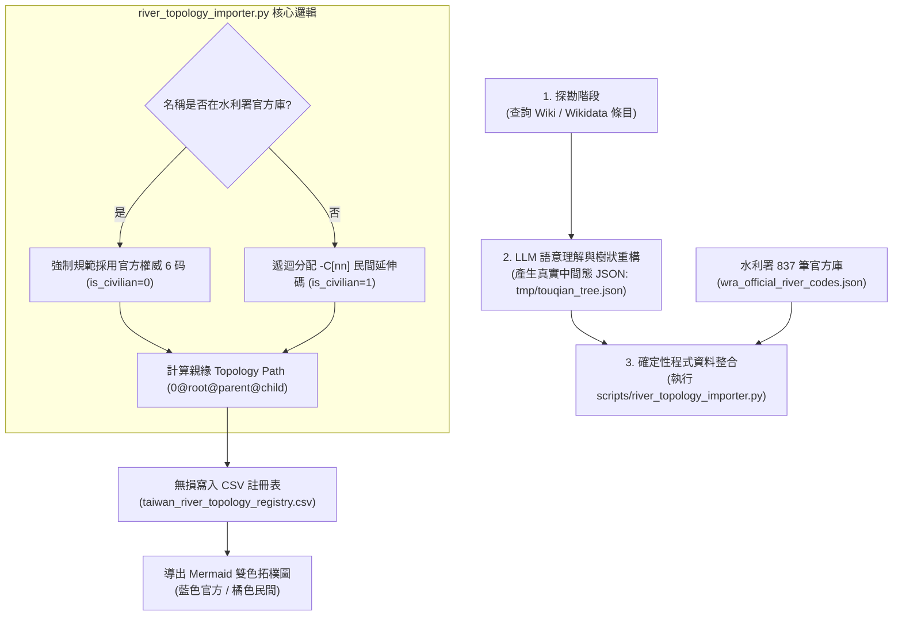

## 11.5 [v2.2 大一統] 民間河川拓樸註冊表 (WRA-Civ) 與四大水資源區全景

隨著河流探索的深入，經濟部水利署（WRA）所定義的官方 6 碼河川拓樸編碼（例如主流與二級支流的英數編碼 `114021`）在面對細部小支流、野溪或無名溪時，常面臨資料缺失的窘境。為此，我們推出了「官方圖資為底，民間協作補齊」的 **WRA-Civ（Civilian River Topology Registry）編碼與社群共創架構**，讓所有探索者都能一同描繪台灣細緻的水系網路。

本專章記錄了連結 **水利署 110 年全量官方開放資料集 (`wra_official_river_codes.json`)** 達成全台灣四大水資源區中央管 26 大水系、共 573 筆水文拓樸的完整落庫成果與「兩階段 AI-CLI 協作產製邏輯」。

---

### 1. 人機協作產製與運作邏輯 (Human-AI-CLI Collaborative Architecture)

整個 WRA-Civ 拓樸註冊表的建構與維護，遵循極致的 **「LLM 語意理解 + CLI 確定性寫入」** 兩階段分工邏輯，核心寫入引擎為 `scripts/river_topology_importer.py`：



#### 📌 運作邏輯三步驟說明：
1. **第一步：Wiki 探勘與網頁抓取**
   * 查詢維基百科 / Wikidata 中的水系條目，獲取原始非結構化的河流清單與說明文字。
2. **第二步：LLM 語意理解與樹狀結構 JSON 生成**
   * 由 LLM（AI）閱讀非結構化的 Wiki 文字，自動解析出水系「相對縮排階層（level 1, 2, 3...）」，無需每筆顯式寫死父節點名稱，產出真實的中間態 JSON（參見下方真實產物截錄）。
3. **第三步：確定性程式資料整合 (`scripts/river_topology_importer.py`)**
   * 執行核心腳本 `scripts/river_topology_importer.py`（專屬說明書參見 `scripts/manuals/river_topology_importer.md`）。程式讀取中間態 JSON 後，**自動利用 Stack 堆疊演算還原父子親緣，並與水利署 837 筆官方開放資料庫對照整合**：
     * **官方存在者**：強制規範綁定官方 6 碼（如油羅溪 `130020`、宜蘭河 `256020`）。
     * **野溪與無名溪**：自動計算 `-C[nn]` 下鑽號碼與 `0@...` 親緣拓樸路徑。
     * **無損落庫**：最終確定性寫入專書附帶之 `taiwan_river_topology_registry.csv`，徹底避免 AI 隨機發揮與程式碼幻覺。

---

### 2. 中間態樹狀 JSON 規格與真實產物 (Real Tree JSON Output)

在實際運作中，LLM 解析 Wiki 水系列表時，只需要依據 Wiki 的清單縮排產出 `level` 數字即可，**不需要在 JSON 每一筆中指定父節點**，後續的父子親緣關係與程式碼完全交由 `river_topology_importer.py` 透過 Stack 堆疊演演演演演演演演演演演演演演演演演演演演演演演演演算法精確還原。

#### 💡 頭前溪實測真實產出片段（`templates/touqian_tree_real.json`）：
```json
[
  {
    "level": 1,
    "name": "'''頭前溪'''：新竹縣、新竹市",
    "wiki_title": "'''頭前溪'''：新竹縣、新竹市"
  },
  {
    "level": 2,
    "name": "油羅溪",
    "wiki_title": "油羅溪"
  },
  {
    "level": 3,
    "name": "馬胎溪",
    "wiki_title": "馬胎溪"
  },
  {
    "level": 3,
    "name": "那羅溪",
    "wiki_title": "那羅溪"
  },
  {
    "level": 2,
    "name": "上坪溪",
    "wiki_title": "上坪溪"
  },
  {
    "level": 3,
    "name": "麥巴來溪",
    "wiki_title": "麥巴來溪"
  },
  {
    "level": 3,
    "name": "霞喀羅溪",
    "wiki_title": "霞喀羅溪"
  }
]
```

---

### 3. 全台灣四大水資源區拓樸總覽

目前註冊表已完整收錄全台灣 **573 筆** 權威拓樸記錄：

* 💙 **北部水資源區 (110 筆)**：淡水河 (`114000`)、頭前溪 (`114004`)、鳳山溪 (`129000`)、中港溪 (`134000`) 及其全體野溪。
* 💚 **中部水資源區 (185 筆)**：濁水溪 (`151000`)、大甲溪 (`142000`)、大安溪 (`140000`)、烏溪 (`143000`)、後龍溪 (`135000`) 及其全體野溪。
* 🧡 **南部水資源區 (160 筆)**：曾文溪 (`163000`)、高屏溪 (`173000`)、北港溪 (`154000`)、二仁溪 (`166000`)、八掌溪 (`158000`)、急水溪 (`159000`)、朴子溪 (`155000`)、鹽水溪 (`165000`) 及其全體野溪。
* ❤️ **東部水資源區 (118 筆)**：蘭陽溪 (`114001`)、花蓮溪 (`242000`)、秀姑巒溪 (`237000`)、卑南溪 (`220000`) 及其全體野溪。

---

### 4. 社群共創與 CLI 導出使用指南

社群探索者可透過以下 CLI SOP，無縫進行全台任意水系的拓樸計算、寫入與 Mermaid 導出：

```bash
# 1. 執行本專書腳本進行拓樸導入 (LLM 語意理解產物 -> CSV)
python3 scripts/river_topology_importer.py import -i tmp/<basin>_tree.json -p <官方主流6碼> -b "<水系名稱>"

# 2. 導出該水系之雙色 Mermaid 拓樸圖
python3 scripts/river_topology_importer.py mermaid -b "<水系名稱>"
```
