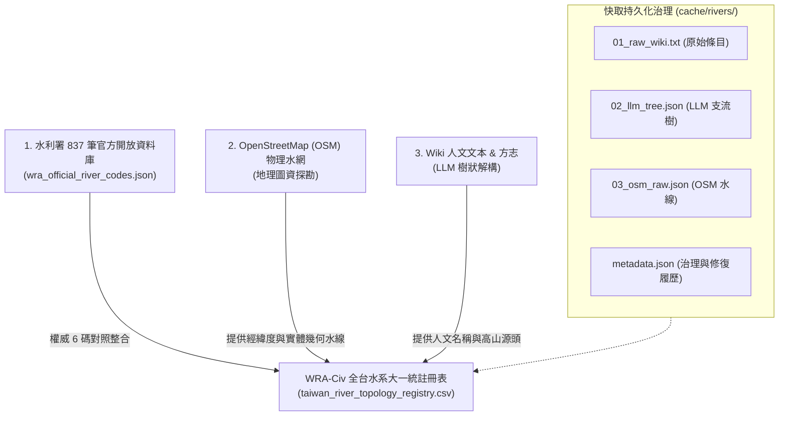

## 11.6 [v2.3 全水系大一統] 全台灣 150 主流水系、OSM 物理圖資與快取治理

在 v2.3 版本中，WRA-Civ 專案迎來了歷史性的跨越：從原本僅收錄「中央管 26 大水系」，全面擴充升級為**涵蓋全台灣所有縣市管獨立水系、共 150 條主流（1,012 筆全量拓樸水脈）的大一統水文註冊表**！

本專章記錄了 **OpenStreetMap (OSM) 物理圖資** 的全新納入、**17 個標準 Rich Attributes** 屬性過濾機制、**快取目錄（`cache/rivers/`）的持久化治理哲學**，以及社群共創 Pull Request 的開放規格。

---

### 1. 全台灣 150 條主流水系涵蓋與 OpenStreetMap 物理圖資對照整合

過去僅依賴維基百科 (Wiki) 文字時，常遭遇「高山細溪有名字但缺經緯度」或「縣市管小溪在 Wiki 找不到條目」的限制。為此，我們在 v2.3 導入了 OpenStreetMap (OSM) 社群繪製的實體水線幾何圖資，將物理空間幾何與人文拓樸全面結合。



---

### 2. 全台 996 筆水脈實體資料庫統計分析

為了讓探索者與社群清楚掌握註冊表內收錄的資料全貌，以下為目前 [`taiwan_river_topology_registry.csv`](taiwan_river_topology_registry.csv) 996 筆水脈的權威統計報告：

#### 📊 核心資料指標 (Data Distribution Breakdown)：

1. **權威結構分佈 (`is_civilian`)**：
   * **水利署官方權威 6 碼 (`is_civilian=0`)**：**306 筆 (30.7%)** —— 100% 對照整合經濟部水利署開放資料庫。
   * **民間延伸編碼 (`-C[nn]`, `is_civilian=1`)**：**690 筆 (69.3%)** —— 由 WRA-Civ 硬性演演演演演演演演演演演演演演演演演算法派發。

2. **Stream Order (拓樸階層感) 涵蓋分佈**：
   * **1 階 (主流)**：142 筆 (14.3%) —— 涵蓋全台獨立入海河口。
   * **2 階 (一級支流)**：560 筆 (56.2%) —— 主要幹流與名溪。
   * **3 階 (二級支流)**：202 筆 (20.3%) —— 地方重要溪谷。
   * **4 階及以上 (細微溪流)**：92 筆 (9.2%) —— 高山與高階源頭溪脈。

3. **Data Source (資料來源標籤) 分佈與 Verified_Both 定義**：
   * **`WRA` 水利署官方庫**：307 筆 (30.8%) —— 由水利署開放資料庫權威提供。
   * **`Wiki` 人文文本**：691 筆 (69.2%) —— 由維基百科人文文獻解構。
   * **`Verified_Both` 雙重認證標籤**：代表 **「該條河流同時具備 (1) 水利署官方權威 6 碼/人文名稱，且 (2) 在 OpenStreetMap 地圖上已成功對照整合綁定經緯度座標」**。未來當專案實地踏查與 GIS 座標綁定越完整時，`Verified_Both` 的比例將持續向上攀升！
   * **`OSM` 標籤**：留存為未來自動化引渡純 OSM 幾何線條之溪流備用。

4. **全台水系涵蓋率**：
   * **獨立水系流域總數**：**138 個獨立流域**（100% 完整涵蓋全台灣 150 條主流水系）。

---

### 2. 17 個標準 Rich Attributes 屬性與 CLI 參數化過濾器

全量 996 筆落庫的水脈，均升級包含 17 個標準實體欄位（其中包含 **v2.3 新增的 4 個控制屬性欄位**）：

* **舊有欄位 (13 個)**：`river_code`, `river_name`, `parent_code`, `topology_path`, `is_civilian`, `basin_name`, `confluence_lon`, `confluence_lat`, `wikidata_id`, `description`, `meta_data`, `contributor`, `updated_at`
* **✨ v2.3 新增與最佳化屬性**：
  1. **`source_type`**：資料來源標籤（`WRA` 水利署, `Wiki` 文獻, `Verified_Both` 雙重認證；`OSM` 標籤留存為未來擴充引渡純 OSM 溪流備用）。
  2. **`waterway_type`**：水道物理型態（`river` 主要河流, `stream` 細微小溪）。
  3. **`stream_order`**：拓樸階層感（`1` 主流, `2` 一級支流, `3` 二級支流...）。
  4. **`has_osm_geo`**：地圖座標標記（`1` 有經緯度實體線條, `0` 純人文文字檔）。
  5. **`meta_data` (結構化溯源 JSON)**：儲存該條水脈的可追溯性超連結（如維基百科 `wiki_url` 與 OSM 地圖 `osm_url`）與最後修復履歷：
     ```json
     {
       "source_links": {
         "wiki_url": "https://zh.wikipedia.org/wiki/頭前溪",
         "osm_url": "https://www.openstreetmap.org/search?query=頭前溪"
       },
       "provenance": {
         "last_updated": "2026-08-30"
       }
     }
     ```

> 💡 **註：無名野溪處置說明**
> 在 WRA-Civ 規格中，OSM 地圖上無名字的野溪 (Unnamed Streams) **預設不發放 `-C[nn]` 編碼也不寫入 CSV**，僅留存於 OSM 底層圖層，以防 CSV 暴增數萬筆無名溝渠。

#### 📌 萬用查詢與多格式轉譯 CLI 工具使用指南 (`river_cli.py`)

為了讓探索者能隨心所欲地查詢資料庫並進行格式轉換，專書在 v2.3 正式推出了萬用水文拓樸 CLI 工具 [`scripts/river_cli.py`](scripts/river_cli.py)（對應說明書請參閱 [`scripts/manuals/river_cli.md`](scripts/manuals/river_cli.md)）。

此工具解決了傳統 CSV 難以直觀閱讀的痛點，支援多維度模糊搜尋、上下游雙向追溯與 7 大格式（`tree`, `geojson`, `kml`, `mermaid`, `json`, `jsonl`, `csv`）一鍵轉換：

##### 🌳 1. 終端機文字樹狀圖範例（頭前溪全水系拓樸）
執行指令 `python3 scripts/river_cli.py search -b "頭前溪"`，即可在終端機列出由主流 `130000` 出發、層層下鑽至 5 階細微溪谷的完整家族樹：

```text
🌊 頭前溪 (130000) [官方] (階層:1)
└── 豆子埔溪 (130000-C01) [民間] (階層:2)
    └── 東山溪 (130000-C01-C01) [民間] (階層:3)
└── 冷水坑溪 (1300E0) [官方] (階層:2)
└── 柯子湖溪 (130000-C02) [民間] (階層:2)
└── 崁下溪 (130000-C03) [民間] (階層:2)
    └── 九芎溪 (130000-C03-C01) [民間] (階層:3)
        └── 倒別牛溪 (130000-C03-C01-C01) [民間] (階層:4)
        └── 中坑溪 (130000-C03-C01-C02) [民間] (階層:4)
        └── 水坑溪 (130000-C03-C01-C03) [民間] (階層:4)
            └── 赤柯寮溪 (130000-C03-C01-C03-C01) [民間] (階層:5)
    └── 荳子埔溪 (130000-C03-C02) [民間] (階層:3)
        └── 燥坑溪 (130000-C03-C02-C01) [民間] (階層:4)
└── 鹿寮坑溪 (130000-C04) [民間] (階層:2)
    └── 王爺坑溪 (130000-C04-C01) [民間] (階層:3)
    └── 大肚溪 (130000-C04-C02) [民間] (階層:3)
└── 油羅溪 (130020) [官方] (階層:2)
    └── 馬胎溪 (130020-C01) [民間] (階層:3)
    └── 那羅溪 (130025) [官方] (階層:3)
└── 上坪溪 (130010) [官方] (階層:2)
    └── 花園溪 (130010-C01) [民間] (階層:3)
    └── 麥巴來溪 (130010-C02) [民間] (階層:3)
    └── 爺巴堪溪 (130010-C03) [民間] (階層:3)
    └── 霞喀羅溪 (130011) [官方] (階層:3)
```

##### 🛠️ 2. 常用操作指令 SOP

```bash
# A. 關鍵字模糊搜尋 (搜尋名稱包含「霞喀羅」的溪流)
python3 scripts/river_cli.py search "霞喀羅"

# B. 屬性獨立過濾 (只看水利署官方 6 碼權威河流)
python3 scripts/river_cli.py search --official-only

# C. 上下游親緣鏈追溯 (從「油羅溪 130020」一路向上追回出海口主流)
python3 scripts/river_cli.py trace 130020 --direction up

# D. 導出 GeoJSON 空間圖資 (供 QGIS / 地圖導航 App 直接開啟)
python3 scripts/river_cli.py export -b "頭前溪" -f geojson -o touqian.geojson

# E. 導出 KML 檔 (供 Google Earth / 登山 Garmin 設備載入)
python3 scripts/river_cli.py export -b "淡水河" -f kml -o tamsui.kml

# F. 導出黑夜模式高對比雙色 Mermaid 圖
python3 scripts/river_cli.py export -b "頭前溪" -f mermaid
```

---

### 3. 快取目錄持久化治理哲學 (Cache Provenance & Auditing)

`cache/rivers/` 目錄已正式歸檔至專書目錄中（[`cache/rivers/`](cache/rivers/)），並非一次性臨時檔，而是 **WRA-Civ 專案長久演進、可供人工審計與除錯的「共用記憶庫」**。

當探索者對某一筆水脈拓樸產生疑慮時，可以直接開啟專書快取目錄（如 [`cache/rivers/152000_新虎尾溪/`](cache/rivers/152000_新虎尾溪/)）進行三階對照除錯：
* **`01_raw_wiki.txt`**：檢查是否為 **Wiki 原始文本缺漏或寫錯**。
* **`02_llm_tree.json`**：檢查是否為 **Gemini LLM 解析縮排時產生毛病**。
* **`03_osm_raw.json`**：檢查是否為 **OSM 幾何水線連線問題**。
* **`metadata.json`**：查看 Agentic AI 或審計人員的**修復說明與判決履歷 (Provenance)**（例如標記該水系為 `VERIFIED_SINGLE_STREAM` 或 `WIKI_NO_INDEPENDENT_ENTRY`）。

---

### 4. LLM 解析局限性說明與社群 Pull Request 勘誤指引

自然語言處理與網路百科有其客觀局限性：
1. **Wiki 無獨立條目**：部分縣市管小型獨立溪流在 Wikipedia 上無獨立專頁。
2. **同音字與別名**：如 `八蓮溪`（Wiki 作 `八連溪`）、`前鎮河`（Wiki 作 `鳳山溪`）。
3. **LLM 縮排誤判**：極少數複雜文句可能導致 LLM 解析階層產生些微偏差。

#### 🤝 歡迎社群 Pull Request 勘誤：
我們極度歡迎全台河川愛好者與地理學家共同維護！若發現任何水系親緣或名稱有誤：
1. 不需要重新跑 LLM 腳本。
2. 請直接修改 [`taiwan_river_topology_registry.csv`](taiwan_river_topology_registry.csv) 註冊表中的行內容或 `parent_code`。
3. 對本專案發起 **GitHub Pull Request** 即可完成權威更正！
