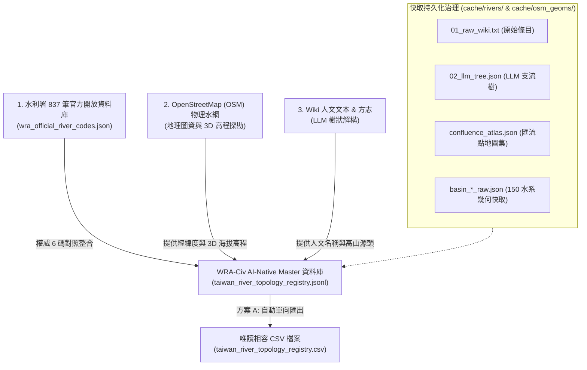
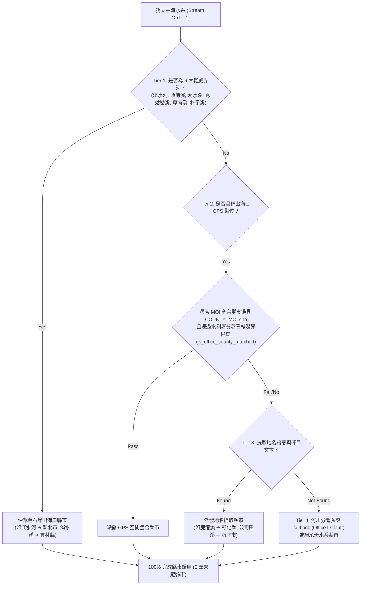

## 11.6 [v2.5 全水系大一統] 全台灣 150 主流水系、AI-Native 雙軌 JSONL 資料庫、1,403 實體親緣目錄與四階縣市歸屬仲裁

在 v2.4 至 v2.5 的演進中，WRA-Civ 專案迎來了資料庫架構與實體檔案層級的歷史性轉型：正式從傳統 CSV 表格全面升級為 **AI-Native 雙軌 JSONL 資料庫 (`taiwan_river_topology_registry.jsonl`)**，實裝「方案 A：JSONL 為 Master，衍生唯讀相容 CSV 檔」，並建立全台 **1,403 個極淨實體目錄構造 (`data/river_tree/`)**！

本專章記錄了 **OpenStreetMap (OSM) 物理圖資** 的全新納入、**17 個標準 Rich Attributes 與 attribute_json 擴充欄位**、**水脈檔名極致淨化與備註/異名落庫機制**、**全台主流四階縣市歸屬仲裁機制**，以及 **`river_cli.py` 萬用查詢與實體目錄導出** 的完整 SOP。

---

### 1. 全台灣 150 條主流水系涵蓋與 AI-Native 雙軌資料庫架構

過去僅依賴傳統 CSV 表格時，常遭遇「跨庫關聯外鏈 (WalkGIS / Wikipedia / Wikidata) 難以靈活展開」或「3D 海拔與幾何品質擴充受到結構限制」的瓶頸。為此，我們在 v2.4 正式建立了 AI-Native JSONL Master 資料庫，將 17 個標準欄位與延伸 Plugin 全量收納：



---

### 2. 全台 1,418 筆水脈實體資料庫最新統計分析

為了讓探索者與 AI Agent 清楚掌握資料庫全貌，以下為 Master JSONL (`taiwan_river_topology_registry.jsonl`) 全量 **1,418 筆水脈** 的最新權威統計報告：

#### 📊 核心資料指標與厚化率 (Data Distribution & Hydration Breakdown)：

1. **權威結構分佈 (`is_civilian`)**：
   * **水利署官方權威 6 碼 (`is_civilian=0`)**：**727 筆 (51.3%)** —— 100% 對照整合經濟部水利署全台主流與主要支流。
   * **民間延伸編碼 (`-C[nn]`, `is_civilian=1`)**：**691 筆 (48.7%)** —— 由 WRA-Civ 拓樸演算演演演演演算法派發。

2. **Stream Order (拓樸階層感) 涵蓋分佈**：
   * **1 階 (主流)**：178 筆 (12.6%) —— 涵蓋全台 150 條獨立入海河口與大幹流。
   * **2 階 (一級支流)**：692 筆 (48.8%) —— 主要幹流與名溪。
   * **3 階 (二級支流)**：453 筆 (31.9%) —— 地方重要溪谷。
   * **4 階及以上 (細微溪流)**：95 筆 (6.7%) —— 高山與高階源頭溪脈。

3. **實體 GIS 幾何與 3D 海拔高程厚化率 (`plugins`)**：
   * **實體幾何匯流點已定位**：**356 筆 (25.1%)**
     * **`OSM_Shared_Node` (100% 拓樸精確節點)**：**304 筆** —— 在地圖上有實體交點 Node。
     * **`Nearest_Match` (幾何端點吸附匹配)**：**52 筆** —— 演演演演演算法自動找到兩者最接近端點完成幾何匹配。
   * **3D 海拔高程已厚化注入 (`plugins.elevation`)**：**356 筆 (25.1%)** —— 全量注入 3D 海拔高度，賦能終端機與 GIS 3D 透視分析。

---

### 3. 17 個標準 Rich Attributes 屬性與 JSONL 擴充架構

1. **基本拓樸欄位 (1-6)**：`river_code`, `river_name`, `parent_code`, `parent_name`, `basin_code`, `basin_name`
2. **拓樸控制與層級 (7-12)**：`topology_path`, `is_civilian`, `source_type`, `waterway_type`, `stream_order`, `description`
3. **權威外鏈面板 (13, `links`)**：
   * `links.walkgis_url`: WalkGIS 空間實體網址
   * `links.wikipedia_url`: 維基百科權威條目
   * `links.osm_url`: OpenStreetMap 地理圖資連結
   * `links.wikidata_id`: 跨語言與跨庫唯一識別碼 (`Q[id]`)
4. **AI-Native 插件屬性 (14, `plugins`)**：
   * `plugins.gis`: `confluence_lon`, `confluence_lat`, `confluence_type`, `estimated_length_km`, `estimated_velocity_ms`, `osm_wikipedia_tag`
   * `plugins.elevation`: `confluence_elevation_m` (3D 海拔高度)
5. **資料來源與治理 (15-17)**：`meta_data`, `contributor`, `updated_at`

---

### 4. [v2.5 核心技術進展] 水脈檔名極致淨化、`attribute_json` 擴充與四階縣市歸屬仲裁

隨著全台拓樸大一統，原始維基百科表格與地方志記錄中夾雜了大量括號、別稱、俗稱或條目說明（如 `166000-C02_註1.台南市龍崎區境內...` 或 `154010-C02_大埔溪（當地人稱外湖溪口...）`）。若直接將這些字樣做為檔案系統目錄或權威資料庫名稱，會導致 CLI 處理、檔案路徑跳脫與跨庫對照產生大量 Bug。

在 v2.5 中，我們制定了**「極致檔名淨化原則」**，並全面擴充 `attribute_json` 結構：

#### 🧹 A. 極致檔名淨化與異名/備註落庫 (`attribute_json`)
1. **目錄與檔名絕對簡明**：所有水脈名稱徹底剝離括號（半角與全角 `()` `（）`）、異名/俗稱備註、條目指示（如 `流經區域`）與維基結構雜訊。例如：
   * `166000-C02_註1...松子腳溪...` ➔ 簡化正名為 **`166000-C02_松子腳溪`**
   * `154010-C02_大埔溪（當地人稱外湖溪口...` ➔ 簡化正名為 **`154010-C02_大埔溪`**
   * `256000-C06-C04_逸久溪或仍稱「耶克糾溪」` ➔ 簡化正名為 **`256000-C06-C04_耶克糾溪`**
2. **原始疑慮與描述寫入 `attribute_json`**：所有採集到的原始名稱與疑慮備註，100% 完整保留於 `attribute_json` 的擴充欄位中：
   * **`raw_river_name`**：記錄未經過淨化的原始採集名稱（如 `大埔溪（當地人稱外湖溪口...`）。
   * **`description`**：收錄詳細地名由來、歷史別稱與河流流域備註。

#### 🏛️ B. 四階縣市歸屬仲裁推導機制 (County Derivation Tiers)
為解決跨縣市界河、沒有 GPS 座標或維基百科未寫明縣市之獨立水系問題，確保全台 **172 條獨立入海主流 100% 歸屬至 16 個縣市目錄**（徹底消除 `99999_未定縣市`），專書建構了以下四階推導機制：



* **`county_derivation_tier` 屬性標記**：
  1. **Tier 1 (Right-Bank Border Arbitration)**：權威雙縣市界河依右岸出海口管轄歸屬。
  2. **Tier 2 (GPS Spatial Join)**：出海口經緯度與內政部縣市邊界疊合，並具有 `river_office_name` 邊界防護。
  3. **Tier 3 (Text & Locality Extraction)**：由水脈名稱與條目內文語意萃取縣市。
  4. **Tier 4 (Basin & Office Fallback)**：由河川分署管轄區域與親緣關係補齊。
* **`attribute_json` 相關新增與生命週期屬性**：
  * **`code_status`（程式碼生命週期狀態）**：
    * **`draft`（草案中/演演演演算法推導態）**：代表該水脈編碼、拓樸關係或歸屬屬性仍屬於自動化程式（LLM/GIS）初次推導產出的草案，允許隨演演演演算法升級進行修正或重新命名。
    * **`confirmed`（權威鎖定態）**：代表該筆水脈已經過人工審計或社群對照整合確認，具備最高穩定度。**系統會啟動「程式碼鎖定警報」，嚴禁任何腳本直接刪除已 confirmed 的 `river_code`**。
    * **`deprecated`（廢棄/已被替代態）**：當水脈因重構而廢棄或被更準確的編碼取代時，編碼不直接刪除，而是轉為此狀態並留存追溯履歷。
  * **`deprecated_codes`**：陣列格式，記錄過去曾使用過但已廢棄的舊編碼清單（例如舊版 CSV 中誤編的編碼）。
  * **`replaced_by`**：字串格式，記錄若此編碼被廢棄後，所指向的新權威編碼（如 `166000-C02`）。
  * `county_name`：歸屬縣市名稱（如 `臺南市`, `宜蘭縣`）。
  * `county_derivation_tier`：推導階層標籤（`Tier 1` ~ `Tier 4`）。
  * `county_assignment_reason`：歸屬判決具體理由說明。
  * `river_office_name`：經濟部水利署該管河川分署名稱（如 `第一河川分署`）。
  * `is_office_county_matched`：分署與縣市邊界是否吻合之安全檢查布林值。
  * `raw_river_name`：淨化前的原始水脈名稱與備註。

#### 📂 C. 1,403 個實體樹狀目錄匯出 (`data/river_tree/`)
發動 `river_cli.py export-dirs` 命令後，系統會自動在 `data/river_tree/` 底下依據「縣市目錄 ➔ 獨立水系目錄 ➔ 支流親緣樹目錄」構建實體檔案夾構造：

```text
data/river_tree/
├── 67000_臺南市/
│   ├── 166000_二仁溪/
│   │   ├── 166000-C01_三爺宮溪/
│   │   │   └── record.json
│   │   ├── 166000-C02_松子腳溪/
│   │   │   └── record.json
│   │   └── record.json
│   └── record.json
```
每個目錄下的 `record.json` 均完整存放該水脈的 `attribute_json` 資訊與親緣 metadata，為後續 Field Logs 與 Agentic AI 探勘提供極致的「共用記憶體」。

#### 🛡️ D. 水脈編碼持久化與防變更保護機制 (Code Immutability Spec & Methods)
在分散式 GIS 與 AI 協作開發中，水脈編碼（`river_code`，如 `166000-C02`）不僅是資料庫的主鍵 (Primary Key)，更是實體目錄路徑 (`data/river_tree/`) 與外部系統引用此水系的唯一錨點。若編碼隨意更動，將導致關聯紀錄失效、目錄結構破裂與外鏈斷裂。

為實現「編碼盡可能不被更改」的持久化目標，專書建立了以下四大規範與防禦機制：

1. **官方 6 碼物理凍結機制 (Official Standard Anchor)**：
   * 所有水利署官方管轄主流與重要支流（`is_civilian=0`），強制綁定經濟部水利署 6 位數權威編碼（如 `130000` 頭前溪, `151000` 濁水溪）。此類編碼具備國家級權威性，系統**硬性凍結禁止變更**。
2. **民間編碼確定性排序派發 (Deterministic Indexing)**：
   * 民間延伸支流（`is_civilian=1`）之 `-C[nn]` 後綴編碼（如 `166000-C01`, `166000-C02`），在採集演演算法中**禁止採用隨機 Hash 或動態生成 UUID**。
   * 系統依據「物理匯流點距離出海口里程」或「拓樸結構順序」進行確定性排序（Deterministic Order）派發編碼。只要水網親緣拓樸不變，重新跑腳本產出的 `-C[nn]` 編碼便 100% 保持不變。
3. **`code_status` 門鎖防護機制 (Status Verdict Lock)**：
   * 轉檔與維護腳本（`convert_topology_to_jsonl.py`）建置了「 confirmed 程式碼鎖定警報」。當某筆編碼被標記為 `code_status: confirmed` 後，若腳本在執行過程中檢測到該 `river_code` 缺失，會**自動中斷並丟出 Exit Code 1 警報**，防止任何程式因重構而意外刪除已認證的編碼。
4. **軟性廢棄與相容轉址機制 (Soft Deprecation & Alias Pointer)**：
   * 若因水理拓樸重大更正必須變更編碼，系統**嚴禁物理刪除舊編碼**，必須採用「軟性廢棄 (Soft Deprecation)」：
     * 舊編碼之 `code_status` 設為 `deprecated`。
     * 於 `replaced_by` 指向新編碼（如 `166000-C02`）。
     * 新編碼之 `deprecated_codes` 陣列記錄舊編碼（如 `["166000-C99"]`）。
   * 透過此指引，CLI 工具與目錄檢索器能自動實現 301 轉址式的向下相容，確保歷史 Field Logs 與延伸應用程式絕不斷鍊。

> 💡 **註：無名野溪處置說明**
> 在 WRA-Civ 規格中，OSM 地圖上無名字的野溪 (Unnamed Streams) **預設不發放 `-C[nn]` 編碼也不寫入 CSV**，僅留存於 OSM 底層圖層，以防 CSV 暴增數萬筆無名溝渠。

#### 📌 萬用查詢與多格式轉譯 CLI 工具使用指南 (`river_cli.py`)

為了讓探索者能隨心所欲地查詢資料庫並進行格式轉換，專書在 v2.4 正式推出了 3D 水文拓樸萬用 CLI 工具 [`scripts/river_cli.py`](scripts/river_cli.py)（對應說明書請參閱 [`scripts/manuals/river_cli.md`](scripts/manuals/river_cli.md)）。

此工具解決了傳統 CSV 難以直觀閱讀的痛點，預設直接讀取 Master JSONL 資料庫，支援 3D 海拔縱剖面 (`profile`)、權威外鏈面板 (`links`)、多維度模糊搜尋、上下游雙向追溯與 7 大格式（`tree`, `3d geojson`, `3d kml`, `mermaid`, `json`, `jsonl`, `csv`）一鍵轉換：

##### 🌳 1. 終端機 3D 豐富文字樹狀圖範例（頭前溪全水系拓樸）
執行指令 `python3 scripts/river_cli.py search -b "頭前溪"`，即可在終端機列出由主流 `130000` 出發，附帶 **3D 海拔 (`⛰️`)** 與 **📍 OSM 幾何交點品質標籤** 的完整家族樹：

```text
🌊 頭前溪 (130000) [官方] (階層:1) ⛰️ 121m
└── 豆子埔溪 (130000-C01) [民間] (階層:2)
    └── 東山溪 (130000-C01-C01) [民間] (階層:3)
└── 冷水坑溪 (1300E0) [官方] (階層:2)
└── 柯子湖溪 (130000-C02) [民間] (階層:2)
└── 崁下溪 (130000-C03) [民間] (階層:2)
    └── 九芎溪 (130000-C03-C01) [民間] (階層:3)
        └── 倒別牛溪 (130000-C03-C01-C01) [民間] (階層:4)
        └── 中坑溪 (130000-C03-C01-C02) [民間] (階層:4)
        └── 水坑溪 (130000-C03-C01-C03) [民間] (階層:4)
            └── 赤柯寮溪 (130000-C03-C01-C03-C01) [民間] (階層:5)
    └── 荳子埔溪 (130000-C03-C02) [民間] (階層:3)
        └── 燥坑溪 (130000-C03-C02-C01) [民間] (階層:4)
└── 鹿寮坑溪 (130000-C04) [民間] (階層:2)
    └── 王爺坑溪 (130000-C04-C01) [民間] (階層:3) ⛰️ 150m | 📍 Geometric_Endpoint_Match_1833m
    └── 大肚溪 (130000-C04-C02) [民間] (階層:3) ⛰️ 115m | 📍 OSM_Shared_Node
└── 油羅溪 (130020) [官方] (階層:2)
    └── 馬胎溪 (130020-C01) [民間] (階層:3)
    └── 那羅溪 (130025) [官方] (階層:3) ⛰️ 420m | 📍 OSM_Shared_Node
└── 上坪溪 (130010) [官方] (階層:2)
    └── 花園溪 (130010-C01) [民間] (階層:3) ⛰️ 310m | 📍 OSM_Shared_Node
    └── 麥巴來溪 (130010-C02) [民間] (階層:3) ⛰️ 380m | 📍 OSM_Shared_Node
    └── 爺巴堪溪 (130010-C03) [民間] (階層:3) ⛰️ 510m | 📍 OSM_Shared_Node
    └── 霞喀羅溪 (130011) [官方] (階層:3) ⛰️ 650m | 📍 OSM_Shared_Node
```

##### 🛠️ 2. 常用操作指令 SOP

```bash
# A. 3D 海拔縱剖面分析 (繪製「頭前溪」水系的 3D 海拔降落趨勢圖)
python3 scripts/river_cli.py profile 頭前溪

# B. 查詢水脈權威外鏈面板 (包含 Wikipedia, OSM, WalkGIS 與 Wikidata)
python3 scripts/river_cli.py links 桶後溪

# C. 關鍵字模糊搜尋 (搜尋名稱包含「王爺坑溪」帶有高程與幾何品質標籤的家族樹)
python3 scripts/river_cli.py search 王爺坑溪

# D. 上下游親緣鏈追溯 (從「油羅溪 130020」一路向上追回出海口主流)
python3 scripts/river_cli.py trace 130020 --direction up

# E. 導出 3D GeoJSON 空間圖資 (包含 Z 軸高程，供 QGIS 直接開啟)
python3 scripts/river_cli.py search -b "頭前溪" -f geojson -o touqian_3d.geojson

# F. 導出 3D KML 檔 (供 Google Earth 3D 擬真載入)
python3 scripts/river_cli.py search -b "淡水河" -f kml -o tamsui_3d.kml
```

---

### 3. 快取目錄持久化治理哲學 (Cache Provenance & Auditing)

`cache/rivers/` 目錄已正式歸檔至專書目錄中（[`cache/rivers/`](cache/rivers/)），並非一次性臨時檔，而是 **WRA-Civ 專案長久演進、可供人工審計與除錯的「共用記憶庫」**。

當探索者對某一筆水脈拓樸產生疑慮時，可以直接開啟專書快取目錄（如 [`cache/rivers/152000_新虎尾溪/`](cache/rivers/152000_新虎尾溪/)）進行三階對照除錯：
* **`01_raw_wiki.txt`**：檢查是否為 **Wiki 原始文本缺漏或寫錯**。
* **`02_llm_tree.json`**：檢查是否為 **Gemini LLM 解析縮排時產生毛病**。
* **`03_osm_raw.json`**：檢查是否為 **OSM 幾何水線連線問題**。
* **`metadata.json`**：查看 Agentic AI 或審計人員的**修復說明與判決履歷 (Provenance)**（例如標記該水系為 `VERIFIED_SINGLE_STREAM` 或 `WIKI_NO_INDEPENDENT_ENTRY`）。

---

### 4. LLM 解析局限性說明與社群 Pull Request 勘誤指引

自然語言處理與網路百科有其客觀局限性：
1. **Wiki 無獨立條目**：部分縣市管小型獨立溪流在 Wikipedia 上無獨立專頁。
2. **同音字與別名**：如 `八蓮溪`（Wiki 作 `八連溪`）、`前鎮河`（Wiki 作 `鳳山溪`）。
3. **LLM 縮排誤判**：極少數複雜文句可能導致 LLM 解析階層產生些微偏差。

#### 🤝 歡迎社群 Pull Request 勘誤：
我們極度歡迎全台河川愛好者與地理學家共同維護！若發現任何水系親緣或名稱有誤：
1. 不需要重新跑 LLM 腳本。
2. 請直接修改 Master 資料庫 [`taiwan_river_topology_registry.jsonl`](taiwan_river_topology_registry.jsonl) 註冊表中的行內容、`links` 或 `parent_code`（若需要相容導出 CSV 檔可發動 `python scripts/convert_topology_to_jsonl.py --export-csv`）。
3. 對本專案發起 **GitHub Pull Request** 即可完成權威更正！
