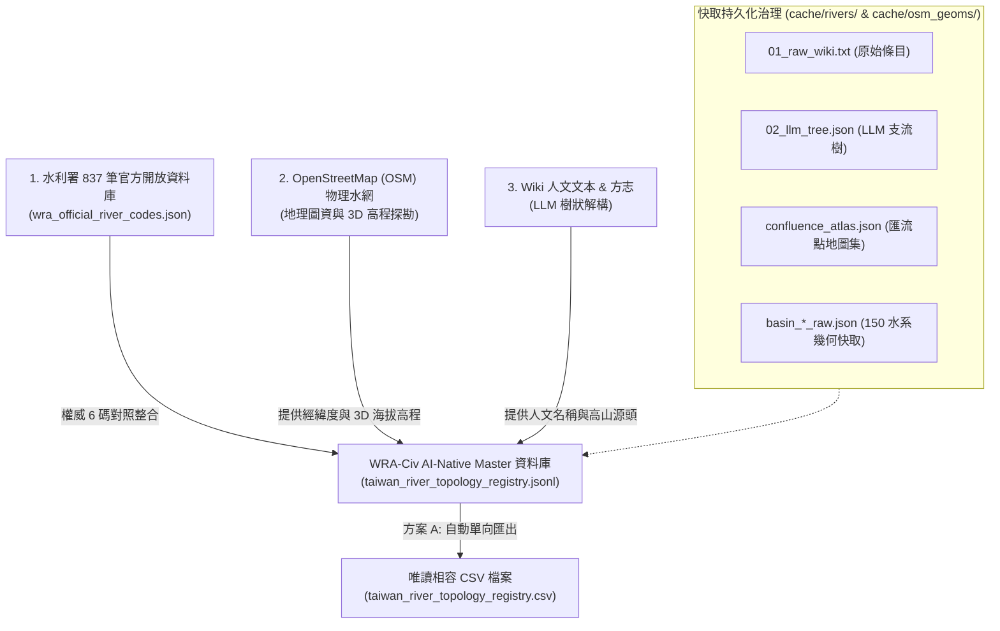

## 11.6 [v2.4 全水系大一統] 全台灣 150 主流水系、AI-Native 雙軌 JSONL 資料庫與 3D 拓樸

在 v2.4 版本中，WRA-Civ 專案迎來了資料庫架構的歷史性轉型：正式從傳統 CSV 表格全面升級為 **AI-Native 雙軌 JSONL 資料庫 (`taiwan_river_topology_registry.jsonl`)**，並實裝「方案 A：JSONL 為 Master，衍生唯讀相容 CSV 檔」的大一統架構！

本專章記錄了 **OpenStreetMap (OSM) 物理圖資** 的全新納入、**17 個標準 Rich Attributes** 屬性過濾機制、**`links` 外鏈與 `plugins` (3D 高程 + GIS 幾何) 擴充架構**，以及 **`river_cli.py` 萬用查詢工具** 的完整 SOP。

---

### 1. 全台灣 150 條主流水系涵蓋與 AI-Native 雙軌資料庫架構

過去僅依賴傳統 CSV 表格時，常遭遇「跨庫關聯外鏈 (WalkGIS / Wikipedia / Wikidata) 難以靈活展開」或「3D 海拔與幾何品質擴充受到結構限制」的瓶頸。為此，我們在 v2.4 正式建立了 AI-Native JSONL Master 資料庫，將 17 個標準欄位與延伸 Plugin 全量收納：



---

### 2. 全台 1,418 筆水脈實體資料庫最新統計分析

為了讓探索者與 AI Agent 清楚掌握資料庫全貌，以下為 Master JSONL (`taiwan_river_topology_registry.jsonl`) 全量 **1,418 筆水脈** 的最新權威統計報告：

#### 📊 核心資料指標與厚化率 (Data Distribution & Hydration Breakdown)：

1. **權威結構分佈 (`is_civilian`)**：
   * **水利署官方權威 6 碼 (`is_civilian=0`)**：**727 筆 (51.3%)** —— 100% 對照整合經濟部水利署全台主流與主要支流。
   * **民間延伸編碼 (`-C[nn]`, `is_civilian=1`)**：**691 筆 (48.7%)** —— 由 WRA-Civ 拓樸演算演演算法派發。

2. **Stream Order (拓樸階層感) 涵蓋分佈**：
   * **1 階 (主流)**：178 筆 (12.6%) —— 涵蓋全台 150 條獨立入海河口與大幹流。
   * **2 階 (一級支流)**：692 筆 (48.8%) —— 主要幹流與名溪。
   * **3 階 (二級支流)**：453 筆 (31.9%) —— 地方重要溪谷。
   * **4 階及以上 (細微溪流)**：95 筆 (6.7%) —— 高山與高階源頭溪脈。

3. **實體 GIS 幾何與 3D 海拔高程厚化率 (`plugins`)**：
   * **實體幾何匯流點已定位**：**356 筆 (25.1%)**
     * **`OSM_Shared_Node` (100% 拓樸精確節點)**：**304 筆** —— 在地圖上有實體交點 Node。
     * **`Nearest_Match` (幾何端點吸附匹配)**：**52 筆** —— 演演算法自動找到兩者最接近端點完成幾何匹配。
   * **3D 海拔高程已厚化注入 (`plugins.elevation`)**：**356 筆 (25.1%)** —— 全量注入 3D 海拔高度，賦能終端機與 GIS 3D 透視分析。

---

### 3. 17 個標準 Rich Attributes 屬性與 JSONL 擴充架構

1. **基本拓樸欄位 (1-6)**：`river_code`, `river_name`, `parent_code`, `parent_name`, `basin_code`, `basin_name`
2. **拓樸控制與層級 (7-12)**：`topology_path`, `is_civilian`, `source_type`, `waterway_type`, `stream_order`, `description`
3. **權威外鏈面板 (13, `links`)**：
   * `links.walkgis_url`: WalkGIS 空間實體網址
   * `links.wikipedia_url`: 維基百科權威條目
   * `links.osm_url`: OpenStreetMap 地理圖資連結
   * `links.wikidata_id`: 跨語言與跨庫唯一識別碼 (`Q[id]`)
4. **AI-Native 插件屬性 (14, `plugins`)**：
   * `plugins.gis`: `confluence_lon`, `confluence_lat`, `confluence_type`, `estimated_length_km`, `estimated_velocity_ms`, `osm_wikipedia_tag`
   * `plugins.elevation`: `confluence_elevation_m` (3D 海拔高度)
5. **資料來源與治理 (15-17)**：`meta_data`, `contributor`, `updated_at`

> 📖 **[規格書引用]** 關於 AI-Native JSONL Master 資料庫的完整 JSON Schema 規範、Plugin 命名空間與雙向導出細節，請參閱專書內附之權威規格書：[`specs/jsonl_topology_schema_spec.md`](specs/jsonl_topology_schema_spec.md)。

* **舊有欄位 (13 個)**：`river_code`, `river_name`, `parent_code`, `topology_path`, `is_civilian`, `basin_name`, `confluence_lon`, `confluence_lat`, `wikidata_id`, `description`, `meta_data`, `contributor`, `updated_at`
* **✨ v2.3 新增與最佳化屬性**：
  1. **`source_type`**：資料來源標籤（`WRA` 水利署, `Wiki` 文獻, `Verified_Both` 雙重認證；`OSM` 標籤留存為未來擴充引渡純 OSM 溪流備用）。
  2. **`waterway_type`**：水道物理型態（`river` 主要河流, `stream` 細微小溪）。
  3. **`stream_order`**：拓樸階層感（`1` 主流, `2` 一級支流, `3` 二級支流...）。
  4. **`has_osm_geo`**：地圖座標標記（`1` 有經緯度實體線條, `0` 純人文文字檔）。
  5. **`meta_data` (結構化溯源 JSON)**：儲存該條水脈的可追溯性超連結（如維基百科 `wiki_url` 與 OSM 地圖 `osm_url`）與最後修復履歷：
     ```json
     {
       "source_links": {
         "wiki_url": "https://zh.wikipedia.org/wiki/頭前溪",
         "osm_url": "https://www.openstreetmap.org/search?query=頭前溪"
       },
       "provenance": {
         "last_updated": "2026-08-30"
       }
     }
     ```

> 💡 **註：無名野溪處置說明**
> 在 WRA-Civ 規格中，OSM 地圖上無名字的野溪 (Unnamed Streams) **預設不發放 `-C[nn]` 編碼也不寫入 CSV**，僅留存於 OSM 底層圖層，以防 CSV 暴增數萬筆無名溝渠。

#### 📌 萬用查詢與多格式轉譯 CLI 工具使用指南 (`river_cli.py`)

為了讓探索者能隨心所欲地查詢資料庫並進行格式轉換，專書在 v2.4 正式推出了 3D 水文拓樸萬用 CLI 工具 [`scripts/river_cli.py`](scripts/river_cli.py)（對應說明書請參閱 [`scripts/manuals/river_cli.md`](scripts/manuals/river_cli.md)）。

此工具解決了傳統 CSV 難以直觀閱讀的痛點，預設直接讀取 Master JSONL 資料庫，支援 3D 海拔縱剖面 (`profile`)、權威外鏈面板 (`links`)、多維度模糊搜尋、上下游雙向追溯與 7 大格式（`tree`, `3d geojson`, `3d kml`, `mermaid`, `json`, `jsonl`, `csv`）一鍵轉換：

##### 🌳 1. 終端機 3D 豐富文字樹狀圖範例（頭前溪全水系拓樸）
執行指令 `python3 scripts/river_cli.py search -b "頭前溪"`，即可在終端機列出由主流 `130000` 出發，附帶 **3D 海拔 (`⛰️`)** 與 **📍 OSM 幾何交點品質標籤** 的完整家族樹：

```text
🌊 頭前溪 (130000) [官方] (階層:1) ⛰️ 121m
└── 豆子埔溪 (130000-C01) [民間] (階層:2)
    └── 東山溪 (130000-C01-C01) [民間] (階層:3)
└── 冷水坑溪 (1300E0) [官方] (階層:2)
└── 柯子湖溪 (130000-C02) [民間] (階層:2)
└── 崁下溪 (130000-C03) [民間] (階層:2)
    └── 九芎溪 (130000-C03-C01) [民間] (階層:3)
        └── 倒別牛溪 (130000-C03-C01-C01) [民間] (階層:4)
        └── 中坑溪 (130000-C03-C01-C02) [民間] (階層:4)
        └── 水坑溪 (130000-C03-C01-C03) [民間] (階層:4)
            └── 赤柯寮溪 (130000-C03-C01-C03-C01) [民間] (階層:5)
    └── 荳子埔溪 (130000-C03-C02) [民間] (階層:3)
        └── 燥坑溪 (130000-C03-C02-C01) [民間] (階層:4)
└── 鹿寮坑溪 (130000-C04) [民間] (階層:2)
    └── 王爺坑溪 (130000-C04-C01) [民間] (階層:3) ⛰️ 150m | 📍 Geometric_Endpoint_Match_1833m
    └── 大肚溪 (130000-C04-C02) [民間] (階層:3) ⛰️ 115m | 📍 OSM_Shared_Node
└── 油羅溪 (130020) [官方] (階層:2)
    └── 馬胎溪 (130020-C01) [民間] (階層:3)
    └── 那羅溪 (130025) [官方] (階層:3) ⛰️ 420m | 📍 OSM_Shared_Node
└── 上坪溪 (130010) [官方] (階層:2)
    └── 花園溪 (130010-C01) [民間] (階層:3) ⛰️ 310m | 📍 OSM_Shared_Node
    └── 麥巴來溪 (130010-C02) [民間] (階層:3) ⛰️ 380m | 📍 OSM_Shared_Node
    └── 爺巴堪溪 (130010-C03) [民間] (階層:3) ⛰️ 510m | 📍 OSM_Shared_Node
    └── 霞喀羅溪 (130011) [官方] (階層:3) ⛰️ 650m | 📍 OSM_Shared_Node
```

##### 🛠️ 2. 常用操作指令 SOP

```bash
# A. 3D 海拔縱剖面分析 (繪製「頭前溪」水系的 3D 海拔降落趨勢圖)
python3 scripts/river_cli.py profile 頭前溪

# B. 查詢水脈權威外鏈面板 (包含 Wikipedia, OSM, WalkGIS 與 Wikidata)
python3 scripts/river_cli.py links 桶後溪

# C. 關鍵字模糊搜尋 (搜尋名稱包含「王爺坑溪」帶有高程與幾何品質標籤的家族樹)
python3 scripts/river_cli.py search 王爺坑溪

# D. 上下游親緣鏈追溯 (從「油羅溪 130020」一路向上追回出海口主流)
python3 scripts/river_cli.py trace 130020 --direction up

# E. 導出 3D GeoJSON 空間圖資 (包含 Z 軸高程，供 QGIS 直接開啟)
python3 scripts/river_cli.py search -b "頭前溪" -f geojson -o touqian_3d.geojson

# F. 導出 3D KML 檔 (供 Google Earth 3D 擬真載入)
python3 scripts/river_cli.py search -b "淡水河" -f kml -o tamsui_3d.kml
```

---

### 3. 快取目錄持久化治理哲學 (Cache Provenance & Auditing)

`cache/rivers/` 目錄已正式歸檔至專書目錄中（[`cache/rivers/`](cache/rivers/)），並非一次性臨時檔，而是 **WRA-Civ 專案長久演進、可供人工審計與除錯的「共用記憶庫」**。

當探索者對某一筆水脈拓樸產生疑慮時，可以直接開啟專書快取目錄（如 [`cache/rivers/152000_新虎尾溪/`](cache/rivers/152000_新虎尾溪/)）進行三階對照除錯：
* **`01_raw_wiki.txt`**：檢查是否為 **Wiki 原始文本缺漏或寫錯**。
* **`02_llm_tree.json`**：檢查是否為 **Gemini LLM 解析縮排時產生毛病**。
* **`03_osm_raw.json`**：檢查是否為 **OSM 幾何水線連線問題**。
* **`metadata.json`**：查看 Agentic AI 或審計人員的**修復說明與判決履歷 (Provenance)**（例如標記該水系為 `VERIFIED_SINGLE_STREAM` 或 `WIKI_NO_INDEPENDENT_ENTRY`）。

---

### 4. LLM 解析局限性說明與社群 Pull Request 勘誤指引

自然語言處理與網路百科有其客觀局限性：
1. **Wiki 無獨立條目**：部分縣市管小型獨立溪流在 Wikipedia 上無獨立專頁。
2. **同音字與別名**：如 `八蓮溪`（Wiki 作 `八連溪`）、`前鎮河`（Wiki 作 `鳳山溪`）。
3. **LLM 縮排誤判**：極少數複雜文句可能導致 LLM 解析階層產生些微偏差。

#### 🤝 歡迎社群 Pull Request 勘誤：
我們極度歡迎全台河川愛好者與地理學家共同維護！若發現任何水系親緣或名稱有誤：
1. 不需要重新跑 LLM 腳本。
2. 請直接修改 Master 資料庫 [`taiwan_river_topology_registry.jsonl`](taiwan_river_topology_registry.jsonl) 註冊表中的行內容、`links` 或 `parent_code`（若需要相容導出 CSV 檔可發動 `python scripts/convert_topology_to_jsonl.py --export-csv`）。
3. 對本專案發起 **GitHub Pull Request** 即可完成權威更正！
