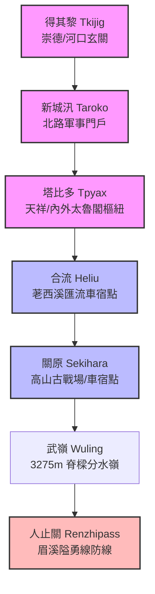

# 立霧溪流域聚落時空交集與空間脈絡

在立霧溪流域「東進西退」大縱走的 5 天 4 夜探索計畫中，每一個紮營車宿點與地貌節點，都是歷史洪流中極具分量的空間地標。本篇將實地探索的核心 POIs（Point of Interest），與 HGIS 歷史文獻資料庫之記載進行時空對合與空間厚化，重現這些聚落與隘口的時空演變。

---

## 一、 得其黎（崇德 / Tkijig）

*   **空間位置**：立霧溪河口北側沖積扇，今花蓮縣秀林鄉崇德村。
*   **歷史脈絡**：太魯閣族 **德其黎社（Tkijig）** 之傳統地盤。在太魯閣語中，*Tkijig* 意指「有箭竹的地方」或「砍伐箭竹之地」。
*   **文獻交集**：在《臺灣通史·卷十九·郵傳志》所收錄之清代「後山道里表」中，得其黎是北路（蘇花古道）上緊鄰新城的重要中繼驛站：
    > 「後山道里表：自三貂溪……大南澳三十五里大濁水二十五里大清水三十五里得其黎十里新城五十里花蓮港。」
*   **空間厚化**：得其黎正好坐落在清水斷崖垂直峭壁陡降至平地的玄關處。清代北路軍在此處涉溪、設碉堡，是控制太魯閣族人出入立霧溪口與海岸線的關鍵哨所。實地探索至此，可俯瞰立霧溪寬廣的河口沖積扇與驚濤拍岸的太平洋地景。

---

## 二、 新城（新城 / Taroko）

*   **空間位置**：立霧溪口南側平原，今花蓮縣新城鄉新城村。
*   **歷史脈絡**：新城是漢人進入奇萊平原（花蓮港）的先鋒聚落，古稱 **「太魯閣口」**，亦是清代與日治時期外來勢力討伐太魯閣族人的大軍基地與防禦前哨。
*   **文獻交集**：
    1.  **軍事防備防線**：在《臺灣通史·卷十三·軍備志》中，新城是清廷駐軍分防的汛防重地：
        > 「新城汛：歸東汛分防，設兵六名。」
        > 「新城汛：歸西汛分防，設兵六名。」
    2.  **開山撫番北路終點**：同治 13 年（1874 年）羅大春北路大軍開山，新城是北路山道的終點，由此開始進入寬闊平坦的平原區：
        > 「自蘇澳至新城，計山路二萬七千餘丈；自新城至花蓮港，計平路九千餘丈，統計二百里有奇。」
    3.  **加禮宛事件之役（光緒 4 年 / 1878 年）**：當噶瑪蘭族與撒奇萊雅族聯合抗清時，新城汛的駐軍亦是衝突交鋒的第一線：
        > 「四年春正月，商人陳文禮至加禮宛墾田，為番所殺……六月，陳得勝率新城之兵討，不利。光亮自將，以張兆連自花蓮港……進兵合勦。」
*   **空間厚化**：新城兼具了「開山古道終點」、「防汛汛塘」、「討番基地」等多重歷史重力。1896 年在此爆發了日治初期的「新城事件」（太魯閣族勇士殲滅日本駐軍哨所），直接引發了後續長達 18 年的衝突，並以 1914 年太魯閣戰役作結。探索新城神社（現為新城天主堂，呈現極致的神社鳥居與教堂共生景觀），可深刻感受此地多元族群衝突與融合的史跡。

---

## 三、 塔比多（天祥 / Tpyax）

*   **空間位置**：立霧溪主流與大沙溪、瓦黑爾溪匯流之河階台地，今花蓮縣秀林鄉天祥聚落。
*   **歷史脈絡**：太魯閣族傳統大型部落 **「塔比多社（Tpyax）」**。在太魯閣語中，*Tpyax* 意指「山棕」或「棕葉」，因該河階地在過去長滿了山棕而得名。
*   **文獻交集**：在清代文獻中，塔比多屬於深居立霧溪峽谷腹地的「內太魯閣生番」，清廷官兵的足跡僅止於新城與立霧溪口，無法深入此一天然屏障。直至 1914 年（大正 3 年）日本總督佐久間左馬太發動「太魯閣戰役」，動員兩萬大軍進行東西夾擊，塔比多才成為戰役中兩路日軍包抄會師的核心節點。
*   **空間厚化**：日治時期在塔比多設立佐久間神社以茲紀念，中橫公路開闢後，蔣介石政府為紀念文天祥，將其改名為「天祥」。從「山棕之地 Tpyax」到「佐久間神社」，再到「天祥」，地名的疊加深刻反映了政權更迭與歷史話語權的爭奪。此處地處三水匯流之樞紐，是內外太魯閣的分界點，地勢雄渾。

---

## 四、 合流（合流）

*   **空間位置**：立霧溪主流與荖西溪（源自立霧主山）匯流處，今中橫公路約 172 公里處，合流露營區。
*   **歷史脈絡與地景**：此處是立霧溪峽谷劇烈下切的窄口之一。荖西溪自南向北注入立霧溪，匯流處兩側大理岩壁立千仞，河道曲折，是標準的峽谷咽喉。
*   **探索實踐**：作為探索計畫的 **Day 1 車宿點（合流營地）**，此處不僅提供靜謐的高山車宿體驗，更是實地觀察大理石峽谷流變美學與向源侵蝕力量的絕佳場所。夜宿於此，聽立霧溪與荖西溪雙溪激盪的巨響，彷彿能聽見 150 年前大清水峽谷山腰清軍與太魯閣族交鋒的餘音。

---

## 五、 關原（關原）

*   **空間位置**：立霧溪上游源頭河谷，海拔約 2370 公尺，今中橫公路關原加油站與關原駐車場。
*   **歷史脈絡**：1914 年太魯閣戰役中，日本討伐軍分成「東路軍」（由新城東進）與「西路軍」（由合歡山東進）。關原是西路軍翻越中央山脈脊樑後，與太魯閣族人爆發激烈戰鬥的古戰場，史稱 **「關原之役」**。
*   **地名由來**：日軍西路軍司令部在翻越中央山脈、推進至此處河谷時，因見此地地勢開闊、群山環抱，地形酷似日本本土戰國時代決定天下大勢的「關原古戰場」，遂命名為「關原（Sekihara）」，帶有強烈的殖民地景命名與歷史投射色彩。
*   **探索實踐**：作為 **Day 3 車宿點（關原）**，此處是立霧溪向源侵蝕的最前線，常年雲海翻騰。夜宿於此，我們不僅站在立霧溪的高山源頭，更是站在百年前太魯閣戰役最關鍵的歷史重力場上，感受高山冷冽的空氣與歷史的蒼茫。

---

## 六、 人止關（人止關）

*   **空間位置**：中央山脈分水嶺西側，濁水溪支流眉溪上游之深邃峽谷，今台 14 線埔里往霧社途中。
*   **歷史脈絡**：人止關地處眉溪兩側峭壁夾峙的窄縫中，是平埔族群、漢人與山地賽德克族（Toda、Tgdaya）的天然分界線。「人止關」之名，意指「漢人與平地人至此止步，踏入番界即有生命危險」。
*   **文獻交集**：在《臺灣通史·卷十五·撫墾志》中，嚴格記載了清代將此地列為「番界」的嚴厲禁令：
    > 「又稱人民私入番境者杖一百；如在近番處所抽藤、釣鹿、伐木、採棕者杖一百、徒三年。又臺灣南勢一帶山口，勒石分為番界……臺地人民不得與番民結親，違者離異治罪，地方官參處。」
*   **空間厚化**：人止關是西側眉溪谷地的最強防線。1902 年在此爆發了賽德克族重創日本軍警的「人止關之役」；1930 年的霧社事件中，此處亦是莫那·魯道帶領勇士構築的險要防線。在大縱走探索計畫中，**Day 5 經由人止關出埔里**，象徵著我們從東部的立霧溪水系、跨越脊樑分水嶺（武嶺），正式進入西部的烏溪/濁水溪水系。人止關作為行程的終點，不僅是地理水系的分水嶺，更是從野性自然回歸塵囂、跨越平野與山林邊界的精神隘口。

---

## 結語：空間與時間的經緯對合

立霧溪大縱走探索，是一場將「空間點位」與「時間史實」縱橫交織的旅程。
當我們在地圖上標記出：
$$\text{新城} \longrightarrow \text{得其黎} \longrightarrow \text{塔比多} \longrightarrow \text{合流} \longrightarrow \text{關原} \longrightarrow \text{人止關}$$
我們標記的不僅是省道上的公里數，更是在閱讀一部橫跨 150 年，由太魯閣族勇士的獵槍、羅大春北路軍的開山斧、淘金客的沙金篩、以及日軍的野砲共同寫就的後山開拓與禦侮史詩。在立霧溪狂濤的怒吼中，這些聚落的時空脈絡將指引我們，以更具敬畏與理解的目光，凝視這片偉大的山河。
