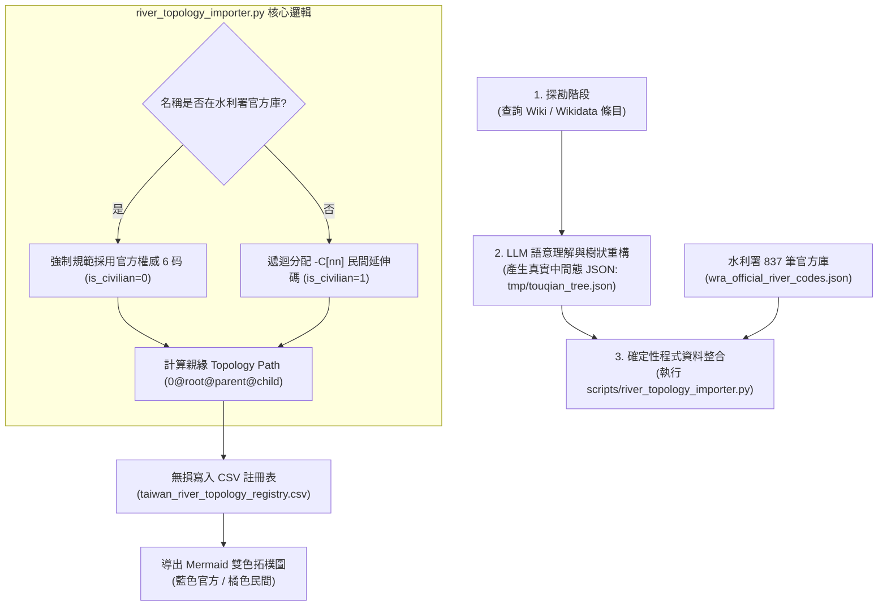
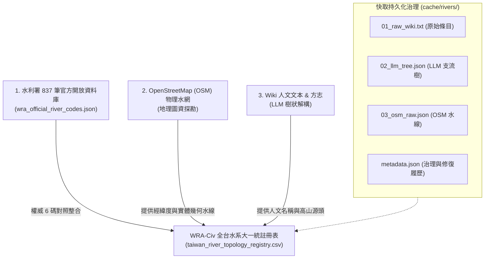

# 《流域導航：台灣母親之河的深度探索與實踐指南》全書合訂本 (v2.1)

> 本檔案由腳本自動生成，整合了 v2.1 方法論、流域索引、實境紀錄與 AI 探索工具箱。
> 最後更新日期: 2026-08-30

---

---
book_spec_version: "2.0"
book_id: "RiverExploration"
title: "流域導航：台灣母親之河的深度探索與實踐指南"
category: "methodology"
author: "wuulong / Antigravity"
version: "1.0.0"
---

# 《流域導航：台灣母親之河的深度探索與實踐指南》

## 版本資訊
*   **版本**：v2.3 (WRA-Civ Full Taiwan 150 Rivers & OSM Geometry Alignment)
*   **日期**：2026-08-30
*   **狀態**：完成全台灣 150 條主流水系（998 筆水脈）大一統拓樸登錄，對照整合 OpenStreetMap 物理水網經緯度座標與水利署官方 Baseline。

## 目錄

### **第一部分：探索基本功 —— 閱讀河流的方法論 (Chapters 1-5)**

*   **第 1 章：解讀地景 —— 跨領域的偵探技術**
*   **第 2 章：文獻與數位檔案的採掘 —— 專家級的知識底盤**
    *   2.1 判讀官方治理計畫：從「災害源」到「資源庫」的治理變遷。
    *   2.2 搶救消失的數位遺產：數位時代的知識考古學。
    *   2.3 方志與古籍的時空漫遊：還原早期的河流社會動態。
    *   2.4 流域歷史資料庫 (History DB) 方法論：Layer 0-1-2 知識架構解析。
    *   2.5 實務應用：引入與使用「台灣歷史地圖資料庫」(taiwan-history-atlas)。
    *   2.6 **[v2.1 增補] 超越文獻的硬證據：考古遺址的資料讀取、ID 勾稽與空間標定**。
*   **第 3 章：視覺化還原 —— GIS 與「透視眼」技術**
    *   3.1 古今地圖鑽探：利用百年歷史地圖進行「河道顯影」。
    *   3.2 大資料與實時監控：看見河流的即時脈動。
    *   3.3 時光羅盤與 HGIS —— 1920 空間錨定與座標修正技術。
*   **第 4 章：田野實務與研究者心法**
*   **第 5 章：現代探險家的數位工具箱 —— 從資料處理到跨時空演繹**
    *   **【第一階段：數位賦能 —— 處理「現在」與「表層」】**
    *   5.1 知識模型化 (AI RAG)：建立你的流域知識大腦。
    *   5.2 多點紀錄整合：建立「從規畫到發布」的自動化數位資產流。
    *   5.3 從方法到實踐：如何閱讀「流域索引」導覽。
    *   **【第二階段：深度模型化 —— 透視「遺跡」與「底層規律」】**
    *   5.4 **[v2.1 增補] 物件導向地誌學 (OO-History)：建構流域的邏輯樣態 (立論：基本樣態建構)**。
    *   5.5 **[v2.1 增補] 遺蹟與屬性分析：跨時空的劇本想像 (立論：Layer 3 演義與模擬，含南科實戰案例)**。

### **第二部分：流域導航索引 —— 11 個靈魂流域的深度解讀 (Chapters 6-9)**

*   **第 6 章：北部水路：都會邊緣、地貌重構與歷史對照整合**
*   **第 7 章：中部命脈：垂直治理、沖積扇與能源衝突**
*   **第 8 章：南部紋理：災難記憶、流動建築與跨族群信仰**
    *   8.1 曾文溪：[Layer 2+ 考證與演繹] 青瞑蛇改道下的「五塊厝」遷徙邏輯。
*   **第 9 章：東部脈動：峽谷奇觀、技術挪用與化學地景**

### **第三部分：動態實境錄檔案櫃 —— 那些河流教我們的事 (Field Logs)**

*   *(更多實境紀錄收錄於 `./FieldLogs/` 目錄中)*

### **第四部分：未來導航 —— 當 Rivers 遇見 AI (Chapters 10-13)**

*   **第 10 章：AI 作為流域分析師**
    *   10.1 知識模型化：如何快速消化 5 萬字 Deep Research 報告。
    *   10.2 批判思考的數位共生。
    *   10.3 從 SOP 到 AI Skill —— 封裝個人探索技能組 (Skill-First Approach)。
    *   10.4 **[v2.1 增補] 物件導向與地景模擬：實踐「預測 -> 驗證 -> 修正」的工作流**。

*   **第 11 章：WalkGIS —— 流域的數位神經與集體共創**
    *   11.4 **[v2.1 增補] 厚資料標註與遺跡標級化實務**。
    *   11.5 **[v2.1 增補] 民間河川拓樸註冊表 (WRA-Civ) 與社群共創規範**。

*   **第 12 章：邁向人、河、AI 的共生導航 (總結)**

*   **第 13 章：[v2.1 增補] 未來展望：邁向跨時空虛擬對照整合**

### **附錄 (Appendices)**
*   A. 流域探索萬用 Prompt 集錦 (v2.1 加強版)。
*   B. HGIS 數位工具箱：包含 `hgis-atlas-architect` 核心腳本與 SQL Snippets。
*   C. 關鍵圖資與數位遺產清單。


---

# 第 1 章：解讀地景 —— 跨領域的偵探技術

## 1.1 地名學與地名政治：尋找咱消失的水文座標

在咱們背起行囊、踏上河流的實地現場前，有一項基本功必須先練成，那就是「閱讀」。台灣的河流不僅在地理空間中流動，更在時間與文化的維度中刻下了深深的痕跡。而其中最直觀、卻也最容易被咱們忽略的線索，就是「地名」。

### 1. 什麼是地名學偵探術？
地名（Toponymy）絕對不是隨便取的符號，它通常是老祖宗與環境互動的「第一現場觀察紀錄」。對於像咱們這樣的河流探索者來說，地名就是透視現代地景與歷史變遷的鏡頭。透過地名，我們能看見那些早已被水泥堤防、柏油路面涵蓋，卻依然在地下蠢蠢欲動的古老水路。

### 2. 水文座標的詞彙庫：解讀藏在地圖裡的密碼
當你在地圖上看到以下字眼時，應該立刻啟動你的「河流偵探大腦」：
*   **「渡」與「津」**：這代表了清代或更早期，咱台灣先民跨越河流的重要節點。例如「西螺渡」或「龍港（公司寮）」，透過這些點，我們可以還原早期貿易的物資流動路徑，看見大河如何連結部落與市街。
*   **「圳」與「埤」**：這是台灣先民為了求生存、與天爭水的證據。地名若帶有「圳」，代表該地曾是複雜水利網路的一環，甚至決定了現今街道的弧度（很多老巷弄轉彎，其實是為了順著舊水圳走）。
*   **「洲」與「埔」**：代表了河流沖積出的沙洲或荒埔。這些名稱在提醒咱們，這裡在歷史上曾是淹水頻率高、或是地質還沒穩定下來的地帶。

### 3. 地名政治：被掩蓋的真相與美化修補術
地名的演變往往伴隨著官方的「去汙名化」與「美化」，這就是所謂的 **地名政治 (Toponymy Politics)**。在台灣河流治理的漫長歷史中，這是一個極其精彩的解讀面向。

#### 案例研究：從「鬼子坑」到「貴子坑」的命名角力
北投淡水河水系的貴子坑溪，就是一個活生生的例子。
*   **原始記憶（鬼子坑）**：舊名反映了該地地質不穩、土石流頻仍的險象。在清代，這裡是咱凱達格蘭族與漢人藍染加工的場所，自然環境惡劣，甚至讓人感到恐懼。
*   **產權介入與剝蝕**：日治時期因為這裡產高品質的高嶺土（瓷土），引發了掠奪式的開採，像是剝皮一樣把地表層層削去。
*   **命名修補**：為了掩飾開採留下的地質傷痕，官方後來改名為顯得雅緻、諧音的「貴子坑」。這不只是名字改了，更是一種試圖抹除土地創傷與負面記憶的手段。
*   **現代顯影**：現在咱們在「貴子坑水土保持園區」看見的那道裸露岩壁，其實是人類產業活動強行剝開地景後留下的「負面遺產」，也是咱們對土地欠下的利息。

### 4. 探索者的實作撇步
對於想自學探索的夥伴，我有幾個實踐技巧：
1.  **時空疊圖法**：將 1904 年的《台灣堡圖》與現代 Google Maps 疊合。你會驚覺，許多標示為「渡」的地方，現在可能是一座幾百公尺長的鋼筋水泥大橋。
2.  **語言還原法**：對於名字聽起來很「文雅」的地名，試著用閩南語、客家話或原住民語唸唸看。你會發現，原本帶有「災難警示」的名字（如指稱淹水的地方），常被美化成了毫無個性的吉祥話。
3.  **地景一致性驗證**：在探索卑南溪或濁水溪時，看著帶有「砂」或「泥」字的地名，對應實地抓一把土的觸感，你會發現地名其實就是大地的「身分證」。

### 結語
學會了地名學，咱台灣的河流就不再只是一條水溝或風景區，而是一卷展開的、寫滿密碼的時空卷軸。下一節，我們將進一步探討，當這些水文座標轉化為宗教信仰時，又是如何固化了咱們這塊島嶼的災難記憶。


---

# 第 1 章：解讀地景 —— 跨領域的偵探技術

## 1.2 信仰、符號與防禦地景：河流災難記憶的固化

如果說「地名」是河流留下的文字檔案，那麼「信仰與符號」就是流域居民為了生存而建立的**精神防禦工事**。在河流探索中，當你看到一座孤立在河岸的石碑，或是一場聲勢浩大的王船祭典，你讀到的不只是宗教，而是該流域與洪水搏鬥的「恐懼史」與「復原力」。

### 1. 精神防護層：為什麼河流需要信仰？
台灣河流坡陡流急，早期居民在缺乏現代大型水利工程的時代，面對狂暴的「水患」幾乎毫無還手之力。為了與不可預測的自然力共處，居民發展出一套將「災難記憶」轉化為「神聖符號」的機制。這些符號具有兩種功能：
*   **預警功能**：標示出歷史上的氾濫邊界。
*   **鎮壓功能**：透過神力驅逐被視為邪祟的洪災。

### 2. 流域中的「防禦符號學」
當你在河濱步道或舊聚落邊緣移動時，請留意這些「隱形的保全系統」：
*   **石敢當 (Shi Gan Dang)**：通常設置在丁字路口或河道衝擊處。它像是一枚「地景釘子」，試圖穩住被河水侵蝕的土地氣場。
*   **水仙尊王與龍神**：這是直接與水權、防洪相關的主神。觀察其建廟的位置，往往就是早期的渡口或最易決堤的險地。
*   **劍獅、寶塔與虎將軍**：在南部流域（如曾文溪、台江）特別常見，其視線投射的方向，通常就是歷史上洪水湧入的路徑。

### 3. 名解：災難記憶的固化
當一場大洪水發生，帶來的創傷會被固化為儀式。這在河流社會學中稱為 **災難記憶的固化 (Solidification of Disaster Memory)**。

#### 案例研究：曾文溪的「青瞑蛇」與防禦網路
曾文溪因河道頻繁改道、吞噬聚落，被形容為「青瞑蛇」（瞎眼的蛇）。這條「蛇」塑造了台灣最具張力的防禦地景：
*   **儀式性防禦：燒王船**
    王船祭典本質上是一場集體的心理治療。水患過後往往伴隨瘟疫，居民透過建造精美的王船並焚燒，象徵將「溫（瘟）災」隨水送走。當你站在西港或蘇厝觀察王船祭，你感受到的是河流帶給聚落的集體壓力與釋放。
*   **物體防禦：精神防線**
    在曾文溪沿岸，石敢當與辟邪物的分布與「歷史氾濫區」高度重疊。對於探索者而言，這一串辟邪物就是一段「過去的河道邊界」。當你在田野中發現一尊孤零零的虎將軍，即使眼下是一片農田，你也能斷定：這裡曾經是「青瞑蛇」肆虐過的地方。

### 4. 探索者的觀察技巧
如何把信仰看成地圖？
1.  **方位解讀**：觀察神像或辟邪物的「視線」。它們通常直視著威脅的來源。如果是對著乾涸的土地，結合古地圖，你往往會發現那裡曾是一條古舊河道。
2.  **儀式的季節性**：注意流域內的祭典時間。許多與水相關的祭典（如跑水節、王船祭）都與河流的豐水期或大雨轉折點相關，這揭示了該流域的規律性威脅。
3.  **地景的遺失與保存**：如果一座廟宇因水利工程而遷移（如報告中提到的慈航寺），這代表了「現代技術」對「傳統保障」的介入。這也是一種地景偵探有趣的切入點。

### 結語
在河流探索中，「符號」是為了讓人們記住災難，而不是忘記。當你讀懂了這些符號，你就在與千百年前的先民一同守望著這條河。下一節，我們將從精神防禦轉向物質證據，探討那些殘留在河濱的「工業廢墟」與「技術遺跡」。


---

# 第 1 章：解讀地景 —— 跨領域的偵探技術

## 1.3 技術政治與基礎設施：河川設施的權力、挪用與再部落化

在河流探索的旅程中，我們經常會遇見大壩、防砂壩、舊鐵道或是廢棄的吊橋。這些被稱為「基礎設施（Infrastructure）」的建築物，絕非僅僅是鋼筋混凝土的組合。它們是**權力的延伸**，代表著某個時代政權或資本對河流的控制意圖。

### 1. 基礎設施即權力：誰在控制河流？
每一座跨越河流的基礎設施，都帶有一個特定的「政治目的」。
*   **殖民監控**：日治時期在蘭陽溪上游興建的警備道與吊橋，其目的是為了讓國家權力（警察、軍隊）能快速進入泰雅族的原鄉。
*   **資源掠奪**：大甲溪密集的電廠設施，是為了將高低落差轉化為都市所需的電力；而林業支線的延伸，則是為了將原始林木快速運往港口。
對於探索者而言，看見一座基礎設施，就要追問：「是誰建了它？為了什麼目的？它改變了誰的生活？」

### 2. 技術政治 (Technological Politics)
這個術語聽起來很深刻，但它的核心意義很簡單：**技術手段如何介入並重塑地方社會結構**。

#### 案例研究：秀姑巒溪的船運再部落化
秀姑巒溪的歷史，是一部關於運輸技術的「挪用」與「反抗」史。
*   **外來的工具**：1870 年代清軍利用竹筏送糧，日治時期製糖會社引入木船收購奇美部落（Kiwit）的甘蔗。此時的技術是外來政權控制地方的工具。
*   **主動的挪用 (Appropriation)**：有趣的是，二戰後當官方管理撤離，奇美部落並沒有放棄這種「殖民技術」。相反地，部落將「船」轉化為支撐部落自治與交通的關鍵。
*   **再部落化與 Mipaliw**：部落推舉船長，利用傳統的 **Mipaliw（換工制度）** 來共同維持這條航線的運行。
這就是「技術政治」最迷人之處：原本用來監控你的工具，最終被你「再部落化」，變成了守護部落的基礎設施。

### 3. 識別「隱形基礎設施」：偵探的考古眼
許多改變河流歷史的設施已經毀損或消失，但它們會在地景中留下「負空間」：
*   **貯木池與遺構**：當你在大甲溪或濁水溪旁看到廣闊且形狀規則的池塘，那往往是昔日林業繁華時期的「貯木池」。
*   **五分車鐵道的痕跡**：當你在堤防邊發現一條與河流平行、寬度不尋常的小路，或是殘存的窄軌鐵橋，那可能是昔日將河流沖積扇上的甘蔗運往糖廠的命脈。
*   **廢棄水圳的流變**：許多古老水圳的源頭（取水口）因行政區劃或現代排洪需求而廢棄，但它的乾涸河道往往隱藏在現代建築的防火巷或蜿蜒的小路中。

### 4. 侦探實踐：如何「閱讀」一座舊設施？
當你站在一座廢棄的橋樑或水門前，請嘗試以下診斷：
1.  **材料分析**：觀察其建材。是清代的工字磚、日治的洗石子，還是現代的高性能混凝土？材料揭示了它的斷代層。
2.  **規模感**：判斷它的規格。它是為了個人進出的小徑，還是能讓武裝力量或工業設備通過的重型設施？
3.  **地圖套疊**：查看其與「行政邊界」的關係。它是否剛好位於昔日漢人與原住民的「隘線（邊界）」上？這往往能揭露它的防禦本質。

### 結語
在河流探索中，基礎設施是我們與過去政權對話的介面。當你開始理解「技術」背後的「權力」與「挪用」，河流探索就不再只是大自然的體驗，而是一場充滿思想厚度的**社會田野**。

讀懂了這三章節的地名、信仰與技術，你已經具備過人的「地景解讀力」。下一章，我們將進入研究室，學習如何從更厚、更專業的「政府報告」中，挖掘河流被掩蓋的真相。


---

# 第 2 章：文獻與數位檔案的採掘 —— 專家級的知識底盤

## 2.1 判讀官方治理計畫：從「災害源」到「資源庫」的治理變遷

當你開始嘗試研究一條河流，除了地圖，你最常接觸到的文字資料往往是政府的各項「治理計畫」、「環評報告」或「調查報告」。這些檔案通常充滿了厚重的術語、複雜的圖表與生硬的資料。

然而，對於一位高階的探索者而言，這些報告是絕佳的**「集體意識檔案」**。它們記錄了在特定的時代背景下，官方是如何定義一條河的？這就是所謂的 **話語分析 (Discourse Analysis)**。

### 1. 官方檔案的層級與翻譯
首先，你必須學會識別哪些檔案是有價值的。在台灣，關於河流最核心的檔案通常包括：
*   **《河川治理基本計畫》**：這是河流的「憲法」。它定義了河道寬度、堤防高度、預期的洪峰流量。讀懂它，你就能理解為什麼這條河會被塑造成現在這種「排水溝式」的樣貌。
*   **《環境影響評估報告 (EIA)》**：當有重大工程（如興建橋樑或光電場）時，這份報告會揭露該地的生態系系系系系系系系系系系系系系系系系系系系系系系現況與「潛在的犧牲」。
*   **《水資源管理規畫》**：關於集集攔河堰、曾文水庫等水利系統的調度邏輯，這份檔案會告訴你誰分到了水，誰被犧牲了流量。

### 2. 治理視角的歷史演變
透過閱讀不同年代的計畫書，你會發現官方對河流的「觀感」發生了劇烈的轉向：

#### (1) 初期：河流即「災害源」 (Disaster-Oriented)
在 1960-1980 年代，計畫書的主旋律是「防洪」與「排洪」。
*   **關鍵詞**：截彎取直、築堤束水、防滲。
*   **探索者的觀察**：如果你在報告中看到這些術語，你會在現場看到厚重的混凝土堤防。當時的邏輯是將河流看作敵方，目標是讓洪水以最快速度進入大海，不計代價地保護陸地。

#### (2) 中期：河流即「資源庫」 (Resource-Oriented)
隨著工業化需求，河流被重新定義為「免費的資源庫」。
*   **關鍵詞**：攔河堰、越域引水、水力開發。
*   **探索者的觀察**：計畫書開始關心如何榨取河流的最後一滴水。如濁水溪集集攔河堰的計畫紀錄，反映了「工業發展優先於生態系系系系系系系系系系系系系系系系系系系系系系系基流量」的思維。這直接導致了下游河床乾涸與嚴重的風飛沙問題。

#### (3) 當代：河流即「生態系系系系系系系系系系系系系系系系系系系系系系系廊道」與「補償對象」 (Eco-Oriented)
近年來的計畫書中，出現了更多浪漫或贖罪式的詞彙。
*   **關鍵詞**：河川復育、生態系系系系系系系系系系系系系系系系系系系系系系系補償、近自然工法。
*   **案例研究：大甲溪馬鞍壩的魚道**
    在馬鞍壩的技術報告中，你會看到豐富的魚類迴游資料與魚道設計圖。這反映了一種「技術補償」的悖論：利用技術（魚道）來修補由技術（大壩）造成的斷裂。雖然它是進步的，但也提醒我們，這是一場科技與自然的不斷協商。

### 3. 如何「讀懂」一份厚重的報告？
不需要從第一頁讀到最後一頁，請掌握以下**探索者特有的判讀技巧**：

1.  **跳轉「摘要」與「地籍/位置圖」**：直接鎖定計畫實施的精確地點，這對你配置 GIS 點位最有幫助。
2.  **尋找「民眾意見彙整」**：這往往隱藏在附件中。這裡記錄了工程動工前，當地居民、環保團體與專家的拉鋸戰。這是最有「人味」的部分，能激發出許多深度文化議題。
3.  **注意「修正紀錄」**：看一項計畫如何從最初的宏偉藍圖，因為地形限制或居民抗爭而被迫修正。這些「轉折點」往往就是地景中最值得探索的特徵。

### 結語
判讀官方計畫，不只是為了獲取資料，更是為了透視背後的「治理意志」。當你懂得如何從生硬的文書中讀出「意志的轉向」，你在流域探索時的眼光，就會從一個旁觀者進化為一位**具備批判思維的地景解剖師**。

下一節，我們將進一步透過「數位考古」，去尋找那些已經關站、被政府遺忘或刻意封存的「數位檔案遺產」。


---

# 第 2 章：文獻與數位檔案的採掘 —— 專家級的知識底盤

## 2.2 搶救消失的數位遺產：數位時代的知識考古學

當我們生活在資訊爆炸的時代，往往會產生一種錯覺：所有的知識都會永久存在於網路雲端。然而，對於河流探索者而言，殘酷的現實是：**數位知識有時候比實體石碑更容易消失**。

在台灣河川研究的歷史中，曾有過一段輝煌的數位紀錄時期，但隨著政府政策更迭、維護預算關閉，許多珍貴的知識平台在瞬間「蒸發」。本節將教導你如何化身為一名「數位考古學家」，利用特定工具與思維，搶救那些已經消失或被封存的河川記憶。

### 1. 案例警示：消失的「台灣河川復育網」與「e河川」
2021 年 7 月，這是一個對台灣河流愛好者來說相當心痛的時間點。由水利署長期維護、累積了數十年「近自然工法」案例、民眾諮詢問答、以及詳細復育計畫的 **「台灣河川復育網」** 與 **「e河川」** 官方網站宣告正式關站並停止更新。

*   **遺產的類型**：這些網站中包含了全台各流域的生態系系系系系系系系系系系系系系系系系系系系系系系工法實驗紀錄，許多是現在已經看不到、或是已經被雜草淹沒的微型設施紀錄。
*   **斷裂的記憶**：當網站關閉，原本透過搜尋引擎可以輕易獲取的「為什麼當時要在這裡種這些樹？」或「這條魚道的原始設計圖」等關鍵知識，瞬間成為了數位荒野中的孤兒。

### 2. 數位考古的核心工具：時光倒流的技術
當你發現一個重要的官方連結失效（404）或是整個網站消失時，不要放棄，請啟動以下工具：

#### (1) Wayback Machine (Internet Archive) —— 網頁的時光機
這是全球最重要的數位遺產保存工具。
*   **使用方法**：將失效的 URL 輸入 `web.archive.org`。你往往能找到該網站在 2010 年或 2015 年的快照。
*   **探索價值**：你可以透過它，讀到當初「台灣河川復育網」中關于濁水溪復育的專家專欄。即便現在官方平台沒了，這些數位遺跡依然存在。

#### (2) 政府資料開放平臺 (data.gov.tw) —— 資料的最後防線
雖然互動式的網站關閉了，但政府有義務將「原始資料」以 CSV 或 JSON 等格式封存並開放。
*   **關鍵字搜尋策略**：在 Open Data 平台上搜尋「河川復育」、「生態系系系系系系系系系系系系系系系系系系系系系系系工法」、「水位觀測歷史」。
*   **挖掘技巧**：有時候你會發現「河川復育常見問答」或「復育達人專欄」被整理成一個巨大的結構化檔案提供下載，這就是我們建構 AI RAG (檢索增強生成) 知識底盤的最佳素材。

### 3. 如何將數位遺產轉化為你的「個人知識庫」？
搶救資料不只是下載，更要賦予它新的生命。這對於要教自己的「自學探索者」尤為重要：

1.  **結構化封存**：將找到的歷史 PDF 或網頁存到你的專案目錄中（例如 `/Resources/Archives/`）。
2.  **空間錨定**：這是一個進階技巧——將歷史檔案中提到的「某年度生態系系系系系系系系系系系系系系系系系系系系系系系工法實作點」，對應其地理標籤 (Geo-tag)，並標記在你的 WalkGIS 地圖中。即便實地設施已經損毀，你也能在地圖上「看見」一段消失的工程實驗史。
3.  **AI 輔助解讀**：將這些龐大且零散的 CSV 資料或歷史問答餵給 AI。例如，請 AI 總結：「在 2010 年代，專家對於高屏溪魚道的設計重點有哪些？」這能幫你快速吸收那些已被封存的集體智慧。

### 4. 偵探實踐：建立「流域數位檔案清單」
在開始每一趟河流探索前，請建立以下清單的數位副本：
*   **歷史照片資料庫**（如：國家文化記憶庫）：尋找 50 年前的河口照片。
*   **土地利用監測資料**：了解該流域從農田變為工業區的轉折年份。
*   **已撤哨的觀測站資料**：有時候消失的觀測站點，正暗示了該地水文環境的極端改變。

### 結語
數位考古學家不僅僅在尋找資料，更是在對抗「集體遺忘」。當你學會了在海量資料中搶救出那些被官方悄悄封存的記憶，你就擁有了一種跨越時空的視角。你會在看似平凡的堤防邊，聽見那些消失網站中曾有過的熱烈辯論。

下一節，我們將從冰冷的數位資料回歸到充滿筆墨溫度的「地方志與古籍」，去尋找河流在清代與日治時期的族群動能。


---

# 第 2 章：文獻與數位檔案的採掘 —— 專家級的知識底盤

## 2.3 方志與古籍的時空漫遊：還原早期的河流社會動態

如果你認為研究河流只需要看現代的測繪圖，那你可能只觸及到了這條河的「骨骼」。要看見它的「肌肉」與「血脈」，我們必須翻開更古老的層次——**方志與古籍**。

在台灣的歷史文獻中，河流不只是地圖上的線條，它是族群生存的邊界、水權爭奪的戰場，更是政權滲透的廊道。本節將帶領你穿梭於《台灣通史》與各時期的《地方志》，學習如何從古文的字裡行間，拼湊出那段消失的流域社會史。

### 1. 必讀的流域歷史寶庫
在進行深度探索前，有三類古籍是你應該放在「數位書架」上的：
*   **清代《地方志》 (Gazettes)**：如《諸羅縣志》、《淡水廳志》。這類書籍紀錄了極為細碎的地標，特別是消失的「古渡口」、「番社位置」與「水圳起源」。
*   **《台灣通史》與《台灣采風錄》**：提供了宏觀的行政區劃變遷與地方風俗，能幫你理解河流如何界定早期的「府」、「縣」邊界。
*   **治理文書與告示碑文**：例如在水圳源頭常見的「嚴禁毀損圳道」告示。這些文字記錄了早期漢人移墾者與原住民、或是不同漢人族群之間，為了爭奪「水權」而發生的慘烈衝突。

### 2. 水-社會 (Hydro-Social) 的歷史還原
透過古籍，我們能觀察到一種非常迷人的地效關係：**「河流決定了聚落的性格，而人的介入改變了河流的命運」**。

#### 案例研究：從「埤亞南」看殖民權力的滲透
在蘭陽溪上游的南山地區（舊稱 **埤亞南社 Pyanan**），透過日治時期的調查文書與古籍紀錄，我們能發現河流社會結構的劇烈重組：
*   **自然的空間**：早期泰雅族部落依循水源與地形自然分布，空間邏輯是流動且與環境共生的。
*   **政治的干預**：根據 1913 年後的紀錄，日本政府為了「理蕃」與監控，強行將部落分為「上、下部落」。這種二分法打破了原有的親族空間邏輯，將部落從利於防禦的高地，強行遷往利於監控的河階地。
*   **地景的消失**：古籍中提到的「馬諾源」等聚落，現在已經在地圖上消失，轉變為現代的耕地。若不讀古籍，你站在現場只會看見一片菜園，而看不見背後那場慘烈的族群遷徙史。

### 3. 古籍中的「解開密碼」心法
古文往往生澀難懂，但對於探索者來說，你只需要鎖定以下三個關鍵資訊：
1.  **里程與方位的對比**：古籍中常寫「某河北岸、距府城三十里」。雖然里程單位與現代不同，但透過「相對方位」與「地標連接」（如某某廟、某某山），你可以大致定位出當時的河岸線。
2.  **族群分布的動態**：注意書中提到的「入山之處」或「隘口」。這些地點往往是河流與山地的交會點，反映了當時漢人勢力擴張的邊緣。
3.  **水權爭議的紀錄**：如果看到「爭灌」、「斷水」等字眼，那裡往往就是整條流域最關鍵的水利節點，這對你理解該地的農業結構至關重要。

### 4. 探險計畫中的應用：從文字到座標
將古籍知識應用在現代探索的具體流程：
*   **第一步：找尋「消失的舊稱」**：在古籍中找出你感興趣區域的舊地名。
*   **第二步：關鍵字檢索**：利用 Google 指令搜尋「（該舊名）與史蹟」或「（該區域）之開發」。
*   **第三步：地景還原**：當你站在大甲溪或濁水溪旁，試著想一想：在《台灣通史》的年代，這裡的人是怎麼渡河的？當時的河床寬度是否與現在這條「水泥管」完全不同？

### 結語
古籍不是為了讓我們懷舊，而是為了讓我們獲取一套**「歷史的視角」**。當你讀懂了方志中關於水權的爭執與部落的遷徙，你腳下的土地就不再是靜止的背景，而是一場演了幾百年的、動態的河流劇場。

下一章，我們將暫時合上書本，開啟電腦。學習如何利用 GIS 與百年歷史地圖進行「縮放與疊合」，親眼看見河道的橫向演變。


---

## 2.4 [v2.0 增補] 流域歷史資料庫 (History DB) 方法論：Layer 0-1-2 知識架構解析

在完成了基礎的官署計畫閱覽、數位遺產考古與方志判讀後，探索者往往會面臨一個難點：**如何將這數百萬字的史料碎片，整合進你腳下的地圖中？** 為了讓歷史不再只是「書本裡的文字」，我們引入了 **Layer 0-1-2** 三層知識架構。這套方法論目前已完整落實在 `taiwan-history-atlas` 開源專案中。

### 1. 為什麼要將史料「資料庫化」？

傳統的河流研究像是「讀書心得」，而 v2.0 的探索則是「資料採礦」。透過資料庫，我們可以實現：
*   **跨時空比對**：一句話問出「清代、日治與現代對這條溪流的名稱演變」。
*   **空間勾稽**：自動將史料中提到的「二層行」與地圖上的座標對齊。
*   **AI 賦能**：讓 AI 能在結構化的資料庫中進行「專業檢索 (RAG)」，而不是瞎猜。

### 2. Layered Architecture：知識的三層過渡

這套架構的核心在於將「不穩定」的文本，一步步蒸餾為「穩定」的歷史邏輯：

#### **Layer 0：原始全量載入 (Raw Layer)**
這是資料庫的「大腦皮質」。我們將所有原始文獻（如《臺灣通史》、《府志》全本）直接數位化存入。不做摘要，也不做篩選，目標是**完整保留歷史現場的語境**。
*   *對應實例*：`history.db` 中的 `contents` 與 `volumes` 表。

#### **Layer 1：實體與提及的橋接 (Entity & Mention Layer)**
從 Layer 0 的文字海中，精煉出具備空間意義的「實體」（人名、地名、埤圳名）。這層最重要工作是建立「提及 (Mentions)」：記錄哪一個地名出現在哪一卷書的哪一段文字裡。
*   *對應實例*：`history.db` 中的 `entities` 與 `mentions` 表。

#### **Layer 2：知識圖譜與邏輯模型化 (Knowledge Atlas Layer)**
這是最高階的「大腦中樞」。它不再只是儲存文字，而是儲存「解釋」。透過 AI 整合前面的資料，推導出地名的演進、河道的動力演變與開發邏輯。這是地圖最值錢的「厚資料」。
*   *對應實例*：`history.db` 中的 `ai_knowledge_atlas` 表。

---

### 3. 方法論核心：以地證史，以史補圖

透過這套架構，當你在凱米颱風後走入曾文溪，看見一處新的崩塌地，你可以：
1.  透過 Layer 1 檢索出此處在清代名為「五塊厝」。
2.  透過 Layer 0 讀到 1920 年代關於此處「改道」的記載。
3.  最終在 Layer 2 建立一個「河流動力對聚落影響」的邏輯模型。

**這就是 v2.0 探索者的核心競爭力：你的觀察，是有歷史大資料支撐的深度解讀。** 下一節，我們將直接進入 `taiwan-history-atlas` 的實戰應用，教你如何引入這套現成的資料庫。


---

## 2.5 [v2.0 增補] 實戰應用：引入與使用「台灣歷史地圖資料庫」(taiwan-history-atlas)

理解了 Layer 0-1-2 的方法論後，本節將帶領你直接進入實戰。我們將介紹如何下載與使用目前最具代表性的開源專案：**「台灣歷史地圖資料庫」(taiwan-history-atlas)**。這個專案不僅包含了《臺灣通史》的全文，更有數千筆已經結構化的地理實體與 AI 合成的知識洞察。

### 1. 獲取資源與環境準備

該專案已在 GitHub 公開，你只需要獲取其中的核心資料庫檔案即可開始：
*   **專案位址**：`https://github.com/wuulong/taiwan-history-atlas`
*   **核心檔案**：`data/taiwan_history.db` (這是一個 SQLite 檔案，可直接用 DB Browser for SQLite 或 Python 開啟)。

### 2. 資料庫核心表結構 (Tables) 解析

當你開啟資料庫，會看到以下關鍵表格，它們分別對應了不同的知識層級：

| 表格名稱 | 所屬層級 | 內容說明 |
| :--- | :--- | :--- |
| `volumes` / `contents` | **Layer 0** | 包含《臺灣通史》37 卷全文，支援 FTS5 全文檢索（`content_fts`）。 |
| `entities` | **Layer 1** | 已標註類型的實體（如 `Irrigation`, `Location`, `Person`）。包含 JSON 格式的元資料。 |
| `mentions` | **Layer 1** | 每個實體在原文中出現的**具體段落 (Snippet)**。這是「有圖有真相」的關鍵。 |
| `ai_knowledge_atlas` | **Layer 2** | AI 合成的專題模型。其中 `Toponym_Ref` 分項是 HGIS 空間對比的聖經。 |
| `moi_settlements` | **Layer 1.5** | 整合自內政部的 37,000+ 筆古地名點位，提供經緯度座標。 |

### 3. 三個經典的查詢範例 (SQL)

不需要會寫複雜程式，透過簡單的 SQL 指令，你就能瞬間從幾十萬字史料中萃取流域地圖所需的資訊：

#### **案例 A：尋找特定河流的所有卷次記載**
```sql
SELECT volume_title, snippet 
FROM mentions 
WHERE snippet LIKE '%二層行%';
```
這能讓你看到「二仁溪 (古稱二層行)」在《疆域志》、《軍備志》中所有的出沒紀錄。

#### **案例 B：撈取流域內的開發實體 (埤圳群)**
```sql
SELECT name, meta_data 
FROM entities 
WHERE type = 'Irrigation' AND meta_data LIKE '%彰化%';
```
你可以瞬間撈出該地區在清代的所有水利設施 DNA。

#### **案例 C：古今地名座標聯動**
```sql
SELECT name, lat, lon 
FROM moi_settlements 
WHERE name LIKE '%蘇厝%';
```
這是將書本中的「蘇厝」文字，轉化為地圖上「座標點」的最後一里路。

---

### 4. 與 AI 協作的高階操作

如果你使用的是具備資料庫操作能力的 AI 助理（如 Antigravity），你可以直接下指令，讓它替你「閱讀資料庫」：

> **最佳實踐指令 (Prompt)**：
> 「請查詢 `taiwan_history.db` 中的 `ai_knowledge_atlas` 表。找出關於『曾文溪水利開發』的 Layer 2 總結，並隨後下鑽到 `mentions` 表，找出 3 個最能展現其『改道歷史』的原文摘要。」

### 結語：從「閱讀者」變身「資料建築師」

引入 `taiwan-history-atlas` 之後，你的河流探索將不再是從零開始的採集，而是站在前人的肩膀上進行「二次開發」。你所產出的每一份田野紀錄，都將與這套龐大的島嶼知識底盤產生動態連結。

下一章，我們將暫時合上書本與資料庫，開啟地理資訊系統（GIS），學習如何將這些萃取出的座標與歷史，疊合在真正的「時空地圖」上。


---

# 第 2 章：文獻與數位檔案的採掘 —— 專家級的知識底盤

## 2.6 超越文獻的硬證據：解析遺跡資料庫的資料維度

在流域探索中，我們不僅要學會「讀」資料，更要學會「看穿」資料庫表格背後的地景預言。本專案所使用的 `taiwan-history-atlas`（臺灣歷史地圖智庫）中的遺址資料表，並非只是點位的集合，它為探索者提供了數個關鍵的**「解讀維度」**。

### 1. 遺址：土地上最誠實的絕對座標
考古遺址（Relics）是人類適應地理環境留下的物理結晶。無論是垃圾堆（貝塚）、石牆還是生活層，它們所在的高程、坡度與離河距離，都反映了當時環境下的生存決策。

### 2. 資料結構與規模 (Schema & Statistics)
本專案使用的 `archaeological_sites` 資料表，不僅規模龐大，更具備嚴謹的權位等級。以下為智庫內部的資料構成：

#### **(1) 核心 Schema 概覽**
| 欄位名稱 | 資料類型 | 探索意義 |
| :--- | :--- | :--- |
| `site_id` | TEXT (Unique) | 唯一識別碼，用於 ID 勾稽與 Sidecar 連結。 |
| `name` | TEXT | 遺址名稱。 |
| `category` | TEXT | 遺址類別（如：國定、縣市定、普查遺址）。 |
| `coord_accuracy` | TEXT | 座標精確度分級（精確、推測、概略）。 |
| `river_system` | TEXT | **[核心]** 所屬河流系統，建立水文關聯。 |
| `altitude` | TEXT | **[增補]** 透過 DTM 運算所得之海拔高程，用於地形位能分析。 |
| `site_function` | TEXT | 聚落、墓葬、漁獵站等生存功能標籤。 |
| `importance_rank` | INTEGER | 權重等級：1 (國定/特級) ~ 4 (普查/孤立點)。 |
| `for_ai` | JSON | AI 演義專用欄位，儲存屬性推論邏輯。 |

#### **(2) 智庫規模統計 (截至 2026-03)**
目前 `taiwan-history-atlas` 共收錄了 **2,563** 處考古標定點，其構成如下：
- **國定考古遺址**：12 處（流域探索中最關鍵的 Rank 1 點位）。
- **指定與列冊遺址**：約 500+ 處（具備較完整考證資料的 Rank 2 點位）。
- **普查與建議指定點**：約 2,000+ 處（提供空間佈局背景的 Rank 3-4 點位）。
- **河道關聯性**：超過 85% 的點位已完成初步的河流系統掛載。

### 3. 資料維度解析：如何「看穿」表格
當我們理解了上述規模與結構，我們就能從以下維度進行解讀：

#### **(1) 空間與地位：座標、精度與高程**
這是一切探索的基石，但在 `Relic DB` 中包含更深層的資訊：
*   **座標與精度 (`coord_accuracy`)**：並非所有遺址點都是精準的。標註為「精確」的可直接導航；標註為「推測」或「概略」的，則需要你在現場结合地貌進行二次判讀。
*   **增補高程 (`altitude`)**：這是透過 L4 空間拓樸運算（整合 DTM 資料）後增補進資料庫的硬指標。
    *   **意義**：它可以讓我們進行「地形位能分析」。例如在曾文溪流域，高程的高低直接決定了族群在面對「青瞑蛇」改道洪水時的生存緩衝空間。

#### **(2) 流域脈絡：河流系統 (`river_system`)**
這是本書 v2.1 版最重要的資料特性。我們不再將遺址視為孤立的點，而是將其**掛載於特定的河流系統下**。
*   **意義**：這讓 AI 能理解該遺址與河流的「供需關係」。當你搜尋「曾文溪」時，系統會自動串聯起所有屬於曾文溪系統、不同時代的遺址，呈現出一條完整的生存鏈。

#### **(3) 文化與行為：文化層位、功能與多成分性**
這是理解先民「大腦」的視窗：
*   **文化層位 (`culture_context` / `cultural_period`)**：界定了該地點的時間區段（如：長濱文化、蔦松文化）。
*   **遺址功能 (`site_function`)**：標註了該處是「聚落（長期定居）」、「墓葬（精神家園）」還是「加工場/漁獵站（功能性據點）」。
*   **多成分性 (`is_multicomponent`)**：如果一個遺址是多成分的，代表它在不同時代被重複選擇。這是一個最強烈的訊號——**這個地點具備某種不可替代的「地學優勢」**。

#### **(4) 資料權位：重要性分級與富化程度**
幫助導師/探索者在海量資料中排定優先順序：
*   **重要性分級 (`importance_rank`)**：區分國家級、指定或一般遺址。
*   **富化程度 (`enrichment_level`)**：顯示該資料是否已透過 AI 或深研 (Deep Research) 注入了厚資料。層級越高，代表該點位具備越完整的「Layer 3 演義劇本」。

#### **(5) 靈魂口袋：資料與文獻的勾稽**
*   **AI 專用 JSON (`for_ai` / `meta_data`)**：內含對出土文物的描述、與特定文獻（如《台灣通史》）的交叉索引。我們利用這些欄位，教導 AI 學習遺址的屬性，進而生成 5.5 章的模擬劇本。

### 4. 讀者實踐：如何「發動」資料
讀者在閱讀本書提供的資料清單時，應該嘗試進行以下聯想：
> **如果一處遺跡的 `site_function` 為「聚落」，且位於 `altitude` 極低的 `river_system` 旁，那麼在 `is_multicomponent` 被標註為 true 的情況下，我們就可以大膽演繹：這裡的人類具備了極高、且代代相傳的「耐洪/治水」技術。**

---
*當我們理解了這些資料維度，下一章我們將介紹如何將這些靜態表格，轉化為具備「繼承與覆寫」能力的物件導向地誌模型。*


---

# 第 3 章：視覺化還原 —— GIS 與「透視眼」技術

## 3.1 古今地圖鑽探：利用百年歷史地圖進行「河道顯影」

在河流探索中，最令人振奮的時刻莫過於：當你站在一片高樓大廈之間，卻能透過數位地圖清楚地看見這裡五十年前曾是一條滔滔大河。這不是超能力，而是透過 **GIS (地理資訊系統)** 進行的「時間軸鑽探」。

本節將學習如何運用中央研究院的「台灣百年歷史地圖」系統，並結合現代 GIS 工具，建立一種能看穿地表厚度、看見歷史肌理的「透視眼」。

### 1. 探索者的時光機：台灣百年歷史地圖
中央研究院發展的「台灣百年歷史地圖」是我們最核心的武器。它整合了清代、日治至今超過百年的各類測繪與航照資料。對於河流研究者來說，有幾層地圖是必看的：
*   **1904 年《台灣堡圖》**：日本政府為了行政管理而進行的第一次精確測繪。它是觀察「水權範圍」與「原始河道」最權威的底圖。
*   **1921 年《日治五萬分一地形圖》**：呈現了大型水利設施（如大型排水路、初期的攔河堰）剛興建時的樣貌。
*   **1944-1945 年《美軍航照圖》**：提供了二戰末期最真實的地表影像，這對於觀察當時河口的防禦性地景（如碉堡、掩體）極具價值。

### 2. 「河道顯影術」：疊圖與還原的技術
當你將古地圖與現代 Google Maps 進行疊合（Overlay），你會發現地景中隱藏的「幽靈河道」：

#### (1) 識別「隱形河道」與液化風險
許多現代都市的排水溝，其實是歷史上的天然支流。透過疊圖，你可以發現：
*   **填平後的陰魂不散**：那些在古地圖中是蜿蜒河道、但在現代地圖中被填平蓋樓的區域，往往是現代地震中 **「土壤液化」** 的高風險區。河流的記憶並不會因為蓋了水泥就消失，水文力量依然在地下潛行。
*   **街道的曲率**：如果你發現某個重劃區的街道是不規則的弧線，疊上古地圖後，你往往會驚覺那條路正是順著「舊堤防」或「古河道邊緣」而生。

#### (2) 河口變遷與聚落興衰
以後龍溪出口的 **公司寮（龍港）** 或頭前溪口的 **舊港島** 為例：
*   **淤積的脈絡**：透過時間選單切換，你可以清晰地看見河口如何因淤積而向外延伸，原本繁華的「深度港口」如何逐漸失去優勢，最終被邊緣化為冷清的小漁村。
*   **防禦地景的定點**：美軍航照圖能幫你定位出那些隱沒在雜草中的「二戰碉堡」。當你在螢幕上看見那個深色、圓形的陰影，那就是你田野調查的精確坐標。

### 3. 進階技巧：地圖即偵探腳本
如何將地圖轉化為可實操的「探險計畫」？
1.  **設置「時間斷層點」**：選擇三個關鍵年代（如 1904、1960、2024）。在同一個經緯度標記出該地點功能的变化（如：河流 $\rightarrow$ 濕地 $\rightarrow$ 停車場）。
2.  **透明度偵查法**：在百年歷史地圖中使用「透明度拉桿」。左右滑動時，你會看見現代橋樑如何精準地（或偏位地）疊在舊渡口上。這就是你 1.1 節中學到的「地名座標」與「物理座標」的結合。
3.  **提取 POI 坐標**：將古地圖發現的遺構位置，轉換為 WKT 或 KML 格式，匯入到你的 ATAK 或 WalkGIS 系統中。這就是「從虛擬到實體」的跨越。

### 4. 案例研究：利用 GIS 重現舊港島的輕便車軌道
位於頭前溪口的舊港島，曾在古地圖中標示有通往糠榔地區的「輕便車軌道」。
*   **數位顯影**：雖然現場軌跡早已消失，但透過 1920 年代地形圖的疊合，我們可以精確畫出那條軌跡在現代街道中的路徑。
*   **實地對證**：帶著這份「數位劇本」實地走一次，你會在特定的防火巷或民宅邊緣，發現房屋基座的方向不尋常，那正是為了配合消失的軌道而生的建築痕跡。

### 結語
GIS 技術讓河流探索者擁有了一種「垂直的歷史視野」。當你學會了在地圖上進行時間鑽探，每一片看似平凡的荒地，都會向你訴說它曾經奔流不息的故事。

下一節，我們將從小尺度的地圖分析，擴展到大尺度的「大資料與實時監控」，看見河流如何在數位感測器中，以「秒」為單位跳動。


---

# 第 3 章：視覺化還原 —— GIS 與「透視眼」技術

## 3.2 大資料與實時監控：看見河流的即時脈動

如果說古地圖是河流的「遺照」，那麼現代的感測大資料就是河流的「心電圖」。透過分布在台灣各大流域的感測器網路，我們不再需要親自站在岸邊，就能感知到河流在這一秒鐘的情緒與脈動。

對於現代探險家而言，學會連結並判讀這些數位信號，不僅能極大化探索的深度，更是保障實地執行安全的核心基礎。

### 1. 河流的神經系統：感測器網路 (Sensor Network)
台灣水利署與相關科研單位，在全台河流布建了密集的監控節點。這些「數位末梢」主要包含：
*   **雷達水位計**：利用微波反射原理，即時測量水面高度。這是我們判讀河流「脈動」最直接的資料。
*   **流速與流量計測**：計算單位時間內流過的水量，這對於理解流域的「總體負載」至關重要。
*   **水利 CCTV (影像監視系統)**：提供視覺化的直觀證據。當感測資料出現波動時，影像能幫我們確認是「降雨暴漲」還是「人為洩洪」。
*   **水質感測器**：監測電導率、濁度、溶氧量。在二仁溪或濁水溪等環境敏感區域，這揭露了河流的「健康狀況」。

### 2. 如何抓取即時資料？(Data Access)
身為數位探險家，你必須知道如何從「資料荒野」中挖掘出這些信號：
*   **經濟部水利署「防災資訊網」**：這是最權威的入口。提供即時水位、淹水預警以及最重要的「水利監控影像」。
*   **民生公共物連線 (Civil IoT)**：台灣政府建構的跨部會資料平台。你可以透過它，同步觀察降雨量與水位上升的「因果關係圖表」。
*   **Open Data API**：如果你具備一點技術能力，可以直接串接水利署的開放資料 API，將資料自動化匯入你的研究日誌中。

### 3. 解讀「水文敘事」：從數字看見故事
資料本身是冰冷的，但解讀它的方法很有趣：

#### (1) 判讀「歷程線 (Hydrograph)」
觀察水位隨時間變化的曲線。如果曲線出現陡升，結合雨量資料，你可以推算出該流域的「逕流反應時間」——即大雨落地到河流暴漲需要多久？這在山區溪流探索（如大甲溪上游）是救命的知識。

#### (2) 發現「不尋常的脈動」
*   **人為干預的訊號**：如果你發現下游水位在沒下雨的情況下突然大幅下降，極可能是上游的「攔河堰」正在進行截流（如集集攔河堰的調度）。這就是 1.3 節提到的「技術政治」在即時資料中的具體顯現。
*   **災難的指紋**：歷史資料庫可以讓你下載「莫拉克風災」或「八八水災」期間的水文曲線。將那些極端波形與現代平緩的曲線對比，你會對河流的能量釋放有一種敬畏的認識。

### 4. 探索攻略：數位與實體的同步
如何將資料應用於你的行程？
1.  **安全儀表板**：在前往濁水溪或大甲溪河床進行探索（如看地質剖面）前，必須先行檢視「上游觀測站」的即時水位趨勢。若趨勢向上，即便當前無雨，也應立即撤離。
2.  **AI 輔助趨勢分析**：將下載的歷史流量 PDF 或 CSV 資料餵給 AI，請它分析：「這條河流過去五年的枯水期特徵為何？」這能幫你規劃「最佳探訪月份」。
3.  **座標與資料連結**：在你的 GIS 地圖中，標記出「水位站」的位置。實地探訪時，站在水位計架橋下觀察實體設施，這就是將「虛擬資料」回歸為「空間實感」的最佳流程。

### 結語
當你學會了讀取感測信號，河流在你眼中就不再是靜止的符號，而是一個不停搏動的、活生生的巨型生命體。數位資料不是為了取代實地腳蹤，而是為了讓我們在踏進河水前，就已經與它的靈魂接軌。

下一章，我們將暫時離開電腦螢幕，學習如何運用專家的眼睛，在田野中進行深度的紀錄與觀察。


---

## 3.3 [v2.0 增補] 時光羅盤與 HGIS —— 1920 空間錨定與座標修正技術

在河流探索的世界中，最令研究者感到困惑的往往不是找不到地點，而是「對不準」。當你試圖在現代地圖上尋找百年前的古渡口或聚落時，你需要的不是一張普通的地圖，而是一套**「時光羅盤」**。本節將深入探討如何利用 1920 年的行政邊界作為核心錨點，並結合中研院的權威圖資進行精確的空間對照整合。

### 1. 為什麼 1920 年是時空對照整合的「金級錨點」？

1920 年（大正九年）是台灣現代行政區劃的奠基之年。當時實行的「州、郡、街庄」以及其下的**「大字 (Oaza)」**系統，建立了一套極為穩定的地理座標單位。
*   **穩定性**：許多現代的村里界線、地籍圖、甚至是都市計畫的邊界，至今仍可追溯回 1920 年的大字座標。
*   **連結力**：大多數的歷史史料（如《臺灣通史》的行政區紀錄、土地清丈資料）都能與這套系統完美勾稽。

### 2. 中研院 HGIS 圖資：探索者的數位基座

要啟動時光羅盤，我們必須仰賴**中央研究院人社中心地理資訊科學研究專題中心 (AS-GIS)** 所提供的數位化資產。
*   **臺灣百年歷史地圖系統**：[https://gissrv4.sinica.edu.tw/gis/twhgis/](https://gissrv4.sinica.edu.tw/gis/twhgis/)
*   **這份圖資能為你做什麼？**
    *   **獲取全量清單**：你可以下載 1920 年代的全台街庄、大字向量圖層 (SHP/KML)。這讓你能透過程式一次性地獲得某個河流流域（如曾文溪）內所有的「歷史地理清單」，而不必手動一個個去數。
    *   **建立「空間濾網」**：將流域的邊界 KML 與中研院的大字圖層進行空間交集 (Spatial Join)，你就能瞬間獲得這條河流在百年前曾流經的所有行政區。

### 3. 內政部古地名地名資料庫 (MOI Settlements)

除了中研院的「面狀」行政區圖資，我們還需要「點狀」的精確地標。這時必須引入**內政部地名資訊服務網**提供的**古地名資料庫**。
*   **資料價值**：這份資料庫包含了數萬筆清代至日治時期的傳統聚落地標。
*   **點位特點**：每一筆紀錄都附帶了經緯度座標、地名由來、甚至是有關該地變遷的文字描述。
*   **二元驗證法**：在 v2.0 的工作流中，我們建議將**「中研院 1920 行政區」**與**「內政部古地名點位」**進行雙向比對。
    *   *例如*：若中研院圖層告訴你此處大字叫「蘇厝」，你再去內政部資料庫搜尋「蘇厝」，就能獲得該地的開發故事與更精確的歷史核心點位。

### 4. 硬核技術：座標位移補償 (Coordinate Offset)

如果你直接將中研院的 1920 向量圖層疊合在 Google Maps 上，你會發現約有 **20 至 50 公尺** 的系統性位移。這並非錯誤，而是因為：
1.  **大地基準演進**：從日治初期的基準面到現代的 WGS84，地球模型的參數已經過多次修正。
2.  **紙本地圖畸變**：早期的測繪紙本在掃描、幾何校正過程中會產生不可避免的微小形變。

**補償實務計畫**：
在 v2.0 的工作流中，我們建議執行以下「偏移校正」：
*   **尋找「硬地標」**：鎖定區域內的百年古廟、日本時代的三角點基石或古橋臺。
*   **標註偏移量**：在你的 GIS 軟體（如 QGIS）中標註該地標在古圖 vs 現圖的公尺數與方向。
*   **動態修正**：在你的資料庫萃取腳本（如 `geo_coding.py`）中，加入這組偏移參數，確保歷史 POI 點位能精準降落在現代河岸邊，而非掉進河中央。

### 4. 案例實踐：二仁溪的界河對照整合

以二仁溪流域為例，透過 1920 空間錨定技術，我們成功地在現代的防汛道路旁，精確找回了已消失在現代地圖中的「中洲社倉」歷史區域。即便河道在過去百年中多次改道，只要「大字邊界」這個空間羅盤還在，我們就能找回土地的歷史靈魂。

### 結語：讓地圖具備「歷史感官」

當你掌握了 1920 空間錨定與座標修正，地圖在你眼裡就不再只是二維的平面，而是一個立體的「時空堆疊體」。每一次的座標點擊，都是一次橫跨百年的時空交會。

下一章，我們將帶領你深入田野，學習在沒有訊號的荒地，如何憑藉這份預置好的「數位羅盤」進行精準探勘。


---

# 第 4 章：田野實務與研究者心法 —— 走進大地的筆記心法

## 4.1 專業田野紀錄法：地質剖面判讀與「地質創傷」的視覺化

當你完成了所有的網頁資料搜集、GIS 疊圖分析與即時水位確認，終於站在河岸邊的那一刻，才是探索真正的開始。許多人對實地探訪的印象是「拍照、打卡、走人」，但對於一名專業的研究型探索者來說，**「田野紀錄」是一次深刻的結構化觀察過程**。

拍照固然重要，但照片往往會讓人懶惰，跳過了大腦細緻處理地景資訊的過程。本節將教導你如何像地質學家或人類學家一樣，透過「剖面判讀」與「視覺化筆記」，將眼前的風景轉化為有價值的專業資料。

### 1. 判讀地質剖面：閱讀大地的橫截面
在河流流域中，特別是在受侵蝕的河岸或山區開發處，最珍貴的資訊莫過於裸露的 **地質剖面 (Geological Profile)**。這就像是這塊大地的「CT 斷層掃描」：
*   **層位關係**：觀察岩層堆疊的順序。在自然的狀況下，底層較老，頂層較新。如果發現順序反轉或傾斜，代表這裡曾發生過劇烈的造山運動。
*   **摺皺與斷層**：岩層是否像被擠壓的報紙一樣彎曲？或者有明顯的錯位斷痕？這揭示了該流域地殼變動的劇烈程度。
*   **沉積物特徵**：觀察顆粒大小。粗大的礫石代表能量強大的急流沖刷；細密的泥沙則代表這裡曾是平緩的河漫灘或湖泊。

### 2. 「地質創傷」的視覺化紀錄
本研究引進一個特殊視角—— **「地質創傷 (Geological Trauma)」**。這指的是因為人為開發（如採礦、截彎取直、興建攔河堰）而導致地層被「強行剝開」後留下的景觀。

#### 案例研究：貴子坑的地質剖面
在淡水河系的貴子坑，讀者能看見顯著的地層剖面。
*   **觀察重點**：那面裸露的白色岩壁。它是人類為了開採高嶺土進行「掠奪式開發」遺留下來的傷痕。
*   **紀錄方式**：不要只拍全景，要紀錄「介面」。紀錄原生岩層與人為切削面的交會處。這是一個「人與自然共同創作」的負面遺產，你的紀錄應體現出「工業活動如何介入地質年代」。

### 3. 多維度紀錄法：素描、量測與五感
為什麼專業研究者堅持使用「素描」？因為**「畫過一次，你就看懂了」**。當你被迫把岩層走向、植被分布畫在紙上時，你的大腦會自動過濾掉干擾，鎖定核心結構。

*   **素描筆記 (Field Sketching)**：不用畫得很漂亮，但要畫得「精確」。標示出比例尺（放一個比例尺瓶或比例尺板）、北方方位。
*   **量測資料**：使用地質羅盤或手機 App 量測岩層的走向與傾角。
*   **地質描述表**：紀錄當天的光線、溫度、甚至是河水的氣味（反映水質或工廠排放）。
*   **「負空間」觀察**：紀錄消失的部分。例如，這座堤防原本應該在河岸的哪一側？現在的缺口暗示了水流如何改變？

### 4. 探險攻略：研究者的背包
一套專業田野工具能顯著提升你的紀錄厚度：
1.  **實體手帳 (Rite in the Rain)**：即使下雨也能書寫，電子設備可能沒電，紙筆永遠是最後的防線。
2.  **帶刻度的快照工具**：準備一張透明比例尺片，放在你要拍攝的細節（如岩石結晶、化石、人工遺構）旁邊。
3.  **語音備忘錄**：當下最直接的感官衝動（例如：「這裡的風聲很大，河床有濃重的硫磺味」），第一時間用語音錄下來，回家再由 AI 轉成文字。

### 結語
專業田野紀錄不是為了交差，而是為了強迫自己「深度看見」。當你學會了判讀地層中的摺皺、識別出人為活動留下的地質創傷，你眼中的大安溪、大甲溪將不再只是風景，而是一卷卷正在被你開展的生命史。

下一節，我們將進入河流探索中更具溫度、也更具挑戰性的部分：如何透過「口述歷史」與「詮釋權分析」，挖掘出隱藏在居民記憶中的真實流域。


---

# 第 4 章：田野實務與研究者心法 —— 走進大地的筆記心法

## 4.2 口述歷史與詮釋權衝突：辨析神話、記憶與事實

在河流流域中，最大的秘密往往不是刻在石頭上，而是藏在人的記憶裡。然而，記憶是流動的，它會被後來的政治目的修剪、會被時間美化，也會因為恐懼而被隱藏。

本節將教導河流探索者如何進行 **「口述歷史 (Oral History)」** 的採集，更重要的是，如何鍛鍊一種批判性的眼光，去辨析官方神話與地方真實記憶之間的 **詮釋權衝突 (Discourse Conflict)**。

### 1. 訪談者的「隱形羅盤」
在田野中與在地居民、耆老交談時，你不是在蒐集「標準答案」，而是在採集「觀點」。
*   **非正式談話法**：不要拿著錄音筆直衝對面，最好的訪談往往發生在廟口、大樹下、或是河濱公園的長椅上。
*   **開放式提問**：不要問「這座橋是不是 1950 年建的？」，而要問「你小時候是怎麼過這條河的？」
*   **觀察情緒波動**：當受訪者提到某個特定的年份或事件（如大淹水、徵收工程）時，語氣的變化往往暗示了那是該地最關鍵的歷史節點。

### 2. 神話與事實的拉鋸：詮釋權的博弈
在河流地景中，政府或殖民政權經常會創造「官方神話」來美化某些政策。我們必須學會透過田野調查來「卸妝」。

#### 案例研究：莎韻之鐘 (Sayon's Bell)
這是蘭陽溪流域與南澳地區最著名的政治神話。
*   **官方敘事 (Official Myth)**：1938 年泰雅族少女莎韻為了送行即將出征的日本老師，不幸溺斃。日治政府將其塑造為「愛國乙女」，譜寫歌曲、拍攝電影，甚至送了一口鐘（莎韻之鐘）來強化皇民化教育。
*   **部落記憶 (Indigenous Memory)**：透過對哈卡巴里斯社耆老的訪談，你會發現完全不同的面貌。那其實是一場因溪水暴漲導致的單純意外，甚至在泰雅族的傳統規範（Gaga）中，師生戀或不明譽的死亡皆屬禁忌。
*   **探索者的批判**：當你站在現址看見象徵「莎韻之鐘」的意象時，你的筆記應紀錄這種「詮釋權的斷裂」。河流在這裡不只是背景，它是吞噬生命的主體，也是被政治挪用的舞台。

### 3. 如何辨析「詮釋權衝突」？
面對同一個事件的不同說法，你可以採取 **交叉檢驗法 (Cross-Verification)**：
1.  **文本 vs. 口述**：對比 2.1 節學到的「官方治理計畫」與當地的「口傳故事」。
2.  **地景 vs. 記憶**：如果老人家說「這裡以前是水圳」，但現場是平地。利用 3.1 節的「古今地圖疊合」去驗證，看看地景是否留下了支援口述的證據。
3.  **多方視角**：同一場水患，上游的農民、下游的工廠主、與管理水閘門的技師，會有完全不同的描述。紀錄這些差異，正是研究的深度所在。

### 4. 探險攻略：口述紀錄的小撇步
1.  **尊重文化禁忌**：特別是在進入原住民部落或傳統農村時，有些關於死亡或失敗的河流記憶可能是禁忌。先建立信任（陪著聊天、買當地的水果），再慢慢進入主題。
2.  **紀錄「無聲的檔案」**：觀察受訪者的肢體語言，指向河對岸時的手勢，往往能幫你定位出已經倒塌的舊吊橋遺址。
3.  **歸檔與去識別化**：尊重隱私，在撰寫筆記（如 Hugo 部落格）時，除非獲得同意，否則應對提供敏感資訊的耆老進行匿名處理。

### 結語
口述歷史讓河流從「空間」變成了「時間的容器」。當你學會了在神話的裂縫中尋找真實的記憶，你的流域探索將不再只是單向的觀察，而是一場與土地靈魂的深度對等交談。

下一章，我們將把這所有的研究心法整合進數位工具中，學習如何利用 AI 與自動化流程，打造一個科學化的現代探險家數位工具箱。


---

# 第 5 章：現代探險家的數位工具箱 —— AI 擴增的研究流

## 5.1 知識模型化 (AI RAG)：建立你的流域知識大腦

在前面的章節中，我們學會了如何搜集政府報告、抓取數位遺產、解讀古籍以及紀錄田野筆記。然而，一個嚴峻的挑戰隨之而來：**資訊過載 (Information Overload)**。當你擁有十條流域的治理計畫、數百篇新聞報導與近千張田野照片時，人類的大腦很難在瞬間找出它們之間的邏輯。

這就是 **AI RAG (Retrieval-Augmented Generation，檢索增強生成)** 與 **知識模型化** 介入的時刻。本節將教導你如何利用 AI 作為你的「第二大腦」，將零散的資料轉化為結構化的智慧。

### 1. 什麼是 AI 知識模型化？
對於河流探索者而言，知識模型化不只是存檔，而是建立一種**「隨問隨答」的檢索能力**。
*   **傳統方式**：你想知道「大甲溪的電力開發史」，你必須翻開三本不同的 PDF，手動搜尋關鍵字。
*   **AI 擴增方式**：你建立一個包含所有報告的知識庫，直接問 AI：「總結大甲溪從日治到現代的電力系統演變，並標註相關的設施座標。」

### 2. 建立 RAG 的三個核心步驟
要打造一個懂河流的 AI 助手，你需要遵循以下工作流：

#### (1) 資料清洗與預處理 (Data Preprocessing)
AI 無法直接閱讀混亂的掃描檔。
*   **OCR 辨識**：將掃描版的舊公文、方志轉為可編輯的純文字。
*   **片段化 (Chunking)**：將厚重的報告（如 300 頁的環評）切分成「主題片段」（如：水質監測、動物保育、工程設計）。這能提高 AI 檢索的精確度。

#### (2) 向量化與建立索引 (Indexing)
將文字轉化為 AI 理解的「數學座標（向量）」。透過這種方式，AI 就能理解「攔河堰」與「魚道」在語義上是高度相關的。

#### (3) 提示工程與檢索增強 (RAG)
當你提問時，系統會先從你的個人資料庫中找出最相關的片段（例如提到卑南溪缺鋅的報告），再將這些片段交給 AI 進行整理。
*   **案例練習**：你可以問 AI：「根據這份卑南溪土質報告，哪幾個地點最容易出現『石頭果』？請列出座標並建議實地觀察的重點。」

### 3. AI 作為「跨領域整合者」
AI 最強大的能力在於**「連結」**。
*   **連結歷史與地理**：你可以同時餵給 AI 《台灣堡圖》的地名說明與現代環評報告，請它找出：「哪些現有的重劃區，在堡圖中其實是河漫灘？」
*   **連結專業與庶民**：請 AI 將生硬的「水位歷程線圖」轉化為易懂的「洪水敘事」，甚至根據你提供的田野錄音（口述歷史），補充相關的學術背景。

### 4. 探險攻略：建立你的數位知識庫
1.  **結構化存檔**：在你的目錄中建立 `/Data/Knowledge_Base/`，按照「官方報告」、「學術論文」、「個人田野」分類存放。
2.  **利用 LLM 工具 (如 Antigravity)**：你可以直接把檔案「標註 (Mention)」給 AI。例如：`@[治理計畫.pdf] 請告訴我這條河的防洪標準是多少？`
3.  **建立「知識快照」**：每完成一個流域的探索，請 AI 總結一份「該流域的關鍵洞察清單 (Key Insights)」。這不僅能加深你的記憶，也是這本書寫作的最佳草稿。

### 結語
AI RAG 讓探索者從「尋找資訊的人」轉型為「解讀洞察的人」。當你不再被繁瑣的資料淹沒，你就能騰出大腦的頻寬，去思考河流更深層的文化意涵。

下一節，我們將討論如何結合 ATAK、GIS 與自動化腳本，將這所有的研究、資料與軌跡，整合進一個一鍵生成的「數位資產工作流」。


---

# 第 5 章：現代探險家的數位工具箱 —— AI 擴增的研究流

## 5.2 多點紀錄整合：建立「從規畫到發布」的自動化數位資產流

當一趟四天三夜的流域探險結束，你帶著滿身的塵土、數百張照片、幾段斷斷續續的錄音以及手機裡雜亂的 GPX 軌跡回到書桌前。這時候，最大挑戰在於：如何將這些碎片化的資料，快速且有邏輯地轉化為可留存、可回溯的知識資產？

本節將分享一套 **「多點紀錄整合工作流」**。這套流程的核心，是利用數位孿生（Digital Twin）的概念，將空間軌跡、視覺影像、即時感知與 AI 邏輯串聯在一起，讓你下車後的「黃金一小時」內，就能將探險心得轉化為結構化的遊記與資產。

### 1. 多點紀錄的四大支柱
一個完整的河流探索紀錄，應由以下四種資料整合而成：
*   **空間骨架 (ATAK / GIS / GPX)**：你的真實行進軌跡與打點興趣點 (POI)。
*   **視覺證據 (Coordinate-linked Photos)**：帶有經緯度座標的現場照片。
*   **即時感官 (Immediate Notes / Audio)**：在河岸邊寫下的快速簡記或當下錄音。
*   **數位筆記 (Hugo Blog / Markdown)**：作為最終的整合平台，將上述異質資料結構化。

### 2. 標準工作流：從數位規畫到實地發布的完整迴路
這套 SOP 分為四個階段，確保知識的流動不因體力耗盡而中斷：

#### (1) 階段一：資料鋪墊與數位劇本 (Digital Planning)
在出發前，利用 AI 協助生成「行程劇本」。
*   **預定行程草案**：在 Blog 中建立 `(行前計畫)` 文章，預設好目標與待觀察點。
*   **導航自動化**：利用 Python 腳本將 POI 清單一鍵轉換為 Google Maps 多點導航 URL，解決找路與導航的繁瑣。

#### (2) 階段二：實地執行與資料採集 (Field Execution)
*   **全時段紀錄**：全程開啟 GPS 紀錄，確保「走過必留下痕跡」。
*   **黃金三十秒**：遇到關鍵地點（如 1.3 節提到的廢線遺址），先拍照、再用 30 秒語音紀錄當下感受（例如：這裡的河風帶有硫磺味、地基似乎是日治工法）。

#### (3) 階段三：黃金結算與 AI 轉化 (The Golden Hour)
這是我認為最重要的一步：**絕不拖延**。
*   **行程快速摘要：利用 Relive 視覺化**
    雖然 Relive 常被視為旅遊娛樂工具，但對探險家而言，它是極佳的「行程檢討檢討檢討檢討檢討檢討檢討檢討檢討檢討檢討檢討檢討檢討檢討檢討檢討檢討檢討檢討檢討檢討檢討復盤」工具。透過將 GPX 匯入 Relive，你可以用 60 秒的時間快速回顧一整天的海拔起伏與空間跨度，幫助大腦立刻抓回當天的空間感，並作為實遊筆記的視覺化動態大綱。
*   **每晚結算與 AI 協作**
    利用晚上休息時間，將當天採集的照片、語音、簡記餵給 AI：`「這是我的行前計畫與實地素材，請幫我轉化為今日的[實遊筆記]，並對比我沒去或意外多去的點。」`

#### (4) 階段四：資產歸檔與社群連結 (Documentation & Connection)
*   **即時發布的價值**：完成後立刻在 Hugo 或社群平台 Push 筆記。
    *   **心理層面**：今日事今日畢，讓明天能輕裝上路。
    *   **社群連結**：即時發布能產生「錨點效應」。當地的河川愛好者或專家可能會在第一時間給予回饋（如：「前方河段目前封閉」或「那座石敢當背後還有另一個故事」），讓探險從「個人的紀錄」進化為「社群的共創」。
*   **Plan to Actual**：將標題改為 `(實遊筆記)`，標註日期。
*   **建立基礎連結**：在 Hugo 文章中嵌入 WalkGIS 的地名檔連結，或是 5.1 節建立的 RAG 知識庫連結。

### 3. 多點整合的實踐技巧：避免資料孤島
*   **標籤化管理 (Tagging)**：統一使用標籤（如 `#濁水溪`, `#水利設施`, `#石敢當`），方便跨流域的比較研究。
*   **AI 協作聲明**：在文章末尾標註 AI 協助的部分（如：歷史背景補充），保留自己的真實觀察（如：口感、觸覺、情感情緒）。
*   **空間錨定**：在 Markdown 遊記中為關鍵景點加上座標連結，讓讀者點擊後能直接在 Google Maps 或 Google Earth 上看到實地。

### 結語
多點紀錄整合，不僅是為了保存，更是為了**連結**。當你學會了利用數位工具快速摘要行程，並透過即時發布與世界交換資訊，你的河流探索將不再孤單。

第一部分的方法論在此告一段落。現在，帶著這套數位裝備，讓我們進入 11 個靈魂流域的深度解讀之旅。


---

# 第 5 章：現代探險家的數位工具箱 —— AI 擴增的研究流

## 5.3 從方法到實踐：如何閱讀「流域索引」導覽

恭喜你！你已經完成了第一部分「基本功」的修煉。你現在已經擁有解讀地名、對看古籍、操作 GIS 以及利用 AI 模型化的能力。然而，當我們接下來展開台灣 11 個大型流域時，你可能會問：**「我該如何把這些分散的工具，應用在特定的河段上？」**

為了幫助你「在案例中學習方法」，這本書的第二部分採用了一套特殊的導覽結構。本節將解釋如何高效地使用這些資料，將其從靜態資訊轉化為動態的學習經驗。

### 1. 案例式學習 (Case-based Learning) 的邏輯
在接下來的 11 個流域章節中，每章都不僅僅是在描述該河流的地理情況，更是一個**「方法論的具體範例」**。
*   **不是「讀資訊」而是「學解讀」**：我們將針對每個流域最突出的特徵，挑選一項第一部分提到的方法進行深度展示。
*   **方法論實踐註記 (Methodology Notation)**：在每個章節中，你會看到帶有 `[方法論註記]` 的區塊。這個標籤會告訴你，目前這段分析是套用了前面的哪一項技術（例如：1.1 的地名政治，或 2.2 的數位考古）。

### 2. 流域章節的四大解讀層次
為了讓你更有系統地展開探索，我們將每個流域標準化為四個層次：

#### (1) 流域身分證 (Basic Identity)
*   **對應能力**：第 2 章與第 3 章的資料檢索。
*   **目的**：提供空間上的座標基準。

#### (2) 靈魂特徵 (River Signature)
*   **對應能力**：第 5 章的 AI 知識模型化與整合能力。
*   **目的**：提煉該流域最核心的「水-社會」議題，讓你抓住該河流的靈魂。

#### (3) 方法論實踐註記 (The Methodology Lab) —— *本章核心*
*   **目的**：展示如何使用第一部分的工具來解開該流域的秘密。
*   **範例**：
    *   在「淡水河」章節中，我們將示範 1.1 的 **地名偵探術**。
    *   在「大甲溪」章節中，我們將示範 4.1 的 **地質創傷判讀**。
    *   在「蘭陽溪」章節中，我們將示範 4.2 的 **口述歷史辨析**。

#### (4) 關鍵解讀點 (POI Deep Dive) 與探索攻略
*   **對應能力**：第 5.2 節的多點紀錄整合。
*   **目的**：提供具體的坐標點與實務操作建議。

### 3. 如何使用這份「索引」？
這不是一本用來連續閱讀的書。
1.  **隨點隨用**：如果你正打算去「曾文溪」，請跳到該章節。先讀身分證，然後重點觀察「方法論註記」中提到的「信仰與防禦地景」解讀方式。
2.  **帶筆記上路**：將章節中的「關鍵解讀點」座標匯入你的手機。現場對照書中的「偵探紀錄」，看看你是否能發現官方報告之外的新細節。

### 結語
從這一刻起，知識不再是死板的教條，而是活生生的現場實驗。準備好了嗎？讓我們開啟第二部分，正式進入台灣各大流域的「方法實踐實驗室」。


---

# 第 5 章：現代探險家的數位工具箱 —— 從資料處理到跨時空演繹

## 5.4 物件導向歷史 (OO-History)：遺跡的生活模型化與繼承法則

在第 2.6 章中，我們整合了遺跡的硬資料（座標、高程、層位）。然而，要讓這些資料「活」起來，我們需要一套能模擬先民生存邏輯的框架。本指南導入了 **物件導向歷史（OO-History）**，這不是為了寫華麗的文章，而是為了解決「歷史資料厚化成本過高」的工程挑戰。

### 1. 為何需要 OO-History？
傳統的歷史描述往往對每個遺址重複敘述。例如，只要是「大坌坑文化」，就要重複寫一次「粗繩紋陶、農業萌芽」。這在處理 2,000 個遺址時會造成巨大的維護成本。

**OO-History 的解決之道：90/10 繼承機制**
*   **90% 繼承 (Inhertance)**：直接繼承「時代」或「文化」的公約屬性。
*   **10% 覆寫 (Override)**：我們只針對特定遺址具備的「異常」或「獨特證據」進行考證與寫入。

### 2. 三層式物件架構 (Three-Tier Model)
根據 `MASTER_HISTORY_SCHEMA` 系統設計，我們將遺跡資料庫拆解為三個邏輯層次，並透過以「中文 ID」為 Key 的 JSON 格式進行屬性傳遞：

#### (1) 全史主字典 (Master Schema - Root)
定義全系統通用的屬性維度（維度定義）與屬性集。
```json
{
  "維度名稱": "生計與技術",
  "屬性集": {
    "技術層次": {
      "描述": "製造工具的核心技術手段",
      "值域": ["打製石器", "磨製石器", "金屬器(青銅/鐵)", "機械加工", "工業化"]
    },
    "生計模式": {
      "描述": "獲取能量的主要方式",
      "值域": ["採集狩獵", "火耕", "定居農耕", "畜牧", "海外貿易"]
    },
    "有無容器": {
      "描述": "儲存或烹飪用的容器特徵",
      "值域": ["無", "皮/木製具", "陶器", "瓷器", "金屬容器"]
    }
  }
}
```

#### (2) 時代預設範本 (Era Preset - Spec)
從主字典挑選屬性，定製該時代 90% 的共性預設值。
```json
{
  "時代名稱": "大坌坑文化",
  "時代預設屬性": {
    "主要地貌": "海岸沙洲",
    "技術層次": "磨製石器",
    "生計模式": "定居農耕",
    "有無容器": "陶器",
    "繼嗣系統": "母系 (Matrilineal) (推論)"
  }
}
```

#### (3) 遺跡實體層 (Relic Instance - Entity)
紀錄 10% 的例外覆寫。當具體遺址發現超越時代範本的特徵時，在此處標記並勾稽考證鏈。
```json
{
  "遺址名稱": "南科遺址群-E1點位",
  "所屬時代": "大坌坑文化",
  "屬性覆寫": {
    "生計模式": {
      "內容": "進階定居農耕 (發現大量碳化稻米)",
      "考證編號": "EVD-NK-2026",
      "推論邏輯": "地層中發現大量稻米殘留物，顯著早於該文化典型之生計模式預期",
      "信心權重": 95
    }
  }
}
```

### 3. 演繹式厚化工作流 (Deductive Workflow)
OO-History 提供了一套「先假設、再求證」的探索方法，其核心路徑如下：

1.  **生存第一原理 (First-Principles)**：定義該時代人類面臨的最主要環境壓力。
    *   *案例*：海平面上升 -> 資源區位位移 -> 產生核心生存挑戰。
2.  **社會生活構築 (Social Construction)**：根據壓力推導社會組織與繼嗣系統。
    *   *案例*：由於需要大規模遷徙與資源分工，推論產生「母系血緣部落」。
3.  **物質預期與比對 (Expectation vs. Observation)**：預期現場證據。
    *   *案例*：預期發現「陶器」與「定居農耕」證據。比對現場實測資料（如：南科遺址），確認或修正假說。

### 4. 技術參考與規範 (Technical Resources)
為了讓這套 OO-History 邏輯具備可執行性，讀者可以參考 `taiwan-history-atlas` 開源庫中隨附的原始設計檔案，這些檔案定義了系統的底層規格：

*   **邏輯框架與演繹規則**：`DESIGN_OO_History_DB_Framework.md`
*   **物理資料表規格**：`DB_IMPLEMENTATION_SPEC.md`
*   **全史主字典 Schema (完整屬性維度)**：`MASTER_HISTORY_SCHEMA.json`

### 結語
OO-History 讓探索者不再只是「搬運資料」，而是成為一個「地景邏輯的模型化師」。透過這套機制，我們可以用極低的成本，為數千個遺址立起具備深度的生活樣態框架，進而支撐下一節 5.5 章的跨時空劇本演義。

---
*當我們準備好了物件的邏輯底盤，接下來我們將引入能源平衡模型，正式進入史前生存的實境劇本演譯。*


---

# 第 5 章：現代探險家的數位工具箱 —— 從資料處理到跨時空演繹

## 5.5 遺蹟與屬性分析：跨時空的劇本想像

當我們在第 5.4 章建立起物件導向的邏輯框架後，接下來最令人興奮的步驟，就是賦予這些物件「生命力」。本節將介紹如何透過 **Layer 3 (屬性推論與演繹)**，結合 **系統工程** 的模擬視角，將冰冷的遺址點轉化為鮮活的生存劇本。

### 1. 核心模型：能源平衡與決策邏輯 (Energy & Decision)
在史前探索的操作中，我們將一個「史前家庭/部落」簡化為追求 **「能源平衡」** 的動態單元。這不僅僅是假設，而是我們用來推測遺址位置的核心演演演演演演演演演演演演演演演演演演演演演演演演算法：

*   **能源平衡模型**：
    *   **輸入 (Resources)**：環境格網中的獲取率（如：河口魚類採集、丘陵塊莖）。
    *   **能耗 (Cost)**：維持生命的基本代謝，加上移動與加工的能量支出。
*   **遷徙演演演演演演演演演演演演演演演演演演演演演演演演算法 (Migration Algorithm)**：
    *   當「當前格網資源密度 < 全體維持能耗」時，觸發移動。
    *   **族群記憶 (Memory)**：移動方向並非隨機，而是優先搜索記憶中「高產出」或「具備防禦優勢」的高程點位。

### 2. 量化分析：Layer 4 的物理支撐
為了證明上述「演繹」不只是想像，我們需要 Layer 4 的空間統計資料作為硬指標：

#### (1) 離河距離 (HRD) 群聚分析
透過運算 2,500 個遺址與古河道的空間關係，我們發現了一個強大的「生存規律」：
*   **資料洞察**：約 80% 的生存聚落（Rank 1-2）群聚在離古河道 300 公尺至 800 公尺的緩衝帶。
*   **地景意義**：這代表了史前族群在「取水便利」與「洪泛風險」之間，存在一個精確的 **「決策甜點區」**。

#### (2) 高程位能模型 (Altitude Potential)
*   **資料洞察**：在沖積平原上，遺址往往精準地座落在比周邊高出僅 1.5 到 2 公尺的「微高地」（如：沙丘、緩坡邊緣）。
*   **地景意義**：在 Layer 3 的劇本中，這證明了族群對「避災位能」的集體共識。

### 3. 實戰案例：南科遺址群與「退縮的海際線」
讓我們以曾文溪流域的 **南科遺址群** 為例，演示如何將上述模型整合進探索流程。

#### **[階段一：樣態發想 (Input)]**
*   **物件類別**：`RiverDelta_Settlement` (河口三角洲聚落)。
*   **資源環境**：公元前 3,000 年，此地為「島嶼與潟湖」交織的地景。

#### **[階段二：劇本演繹 (L3 Deduction)]**
*   **核心挑戰**：海平面開始後退，曾文溪主流北移，原本的潟湖逐漸淤積並淡水化。
*   **決策模擬**：族群面臨原本「高熱量獲取區（海岸/潟湖）」的流失。
*   **預測結果**：族群不會撤往山區，而是呈現 **「跟著河口跑」** 的追蹤式遷徙。遺址分佈應呈現從東向西、隨海岸退位而產生的「扇狀擴散」。

#### **[階段三：現場驗證 (M:: Validation)]**
*   當讀者實地走訪南科（現今已是內陸農田或園區），透過我們建構的 **「跨時空透視眼」**，你尋找的不再是古董，而是證實「追蹤遷徙」的證據——例如在遠離現今河道的孤立沙丘下，發現了與古代水路相關的貝類或漁具。

### 4. 操作攻略：從模型到實地
1.  **建立假設**：在出發前，先問 AI：「如果是這類地質條件的人類，他們最缺什麼？會住在哪裡？」
2.  **空間對照**：開啟一鍵產出的 QGIS 專案，重點觀察符合「決策甜點區」的潛在地點。
3.  **捕捉差異價值**：如果在實地發現了與模型不符的遺跡（例如在極高海拔發現了大量水產遺跡），那通常代表一個 **「技術突變」** 或 **「族群遷徙的例外」**，這就是你探索中最具價值的發現。

---
*下一章，我們將正式進入第二部分：11 個靈魂流域的深度解讀。我們將帶著這套「演繹模型」，逐一拆解台灣母親之河的生存劇本。*


---

# 第 6 章：北部水路：都會邊緣、地景重構與殖民監控

## 6.1 淡水河：拓寬隘口下的宗教位移與地貌變遷

淡水河不僅是大台北盆地的母親河，它更是一部銘刻著族群替代、威權治理與技術開發的流動史書。在本章中，我們將運用三維度分析與鄉鎮剖析，解開這條都會河流隱藏在水泥堤防下的地景密碼。

### 1. 流域身分證 (Basic Identity)

*   **地位**：台灣第三長河，北部最重要的水系，唯一具備航運歷史的河道。
*   **水系構成**：由大漢溪、新店溪與基隆河三大支流匯集而成。
*   **發源地**：大漢溪源頭位於品田山（標高 3,524 公尺）。
*   **流經地區**：桃園市（大溪、龍潭）、新北市（鶯歌、三峽、三鶯、樹林、板橋、土城、三重、蘆洲、五股、新莊、泰山、新店、中永和、淡水、八里）、台北市（萬華、大同、士林、北投、松山、內湖、南港）。
*   **關鍵基礎設施**：石門水庫、翡翠水庫、二重疏洪道、員山子分洪道、關渡隘口、台北大橋、捷運淡水線（沿古鐵道復原）。

### 2. 流域析構：三維度深度分析 (Basin Analysis)

#### **A. 水文脈動 (Hydrology)：被「意志」強行改造的河道**
淡水河的水文史是一部「人定勝天」的試驗紀錄。從 1964 年炸毀關渡隘口試圖加速排洪，到員山子分洪道將基隆河上游直接打穿向海。這種強大的技術介入雖然降低了盆地淹水風險，卻也引發了海水倒灌、土壤鹽化與出海口生態系系系系系系系系系系系系系系系系系系系系系系系震盪。理解淡水河，必須看見其**「技術修補 (Technological Fix)」**帶來的連鎖反應。

#### **B. 歷史地層 (History)：從資源集散地到權力核心**
從 19 世紀的大稻埕碼頭（茶葉、樟腦出口），到日治時期的鐵路縱貫線，再到國民政府時期的防洪高牆。淡水河見證了台北從一個農業盆地轉型為帝國邊陲的商業門戶，最終成為國家政治中心。這是一部從**「碼頭經濟」向「堤防政治」**轉型的歷史。

#### **C. 文化摺層 (Culture)：消失的族群與邊緣的犧牲**
淡水河的文化厚度建立在「消失」之上。北投「貴子坑」掩蓋了凱達格蘭族「嗄嘮別」的記憶；二重疏洪道的開闢犧牲了「洲後村」。這條河流的文化摺層裡，藏著許多為了保護都會核心而被邊緣化的族群聲音與宗教位移（如慈航寺的被迫遷徙）。

### 3. 流域空間導引：鄉鎮水文地景 (Regional Landscape)

*   **上游源頭與階地 (大溪、龍潭、三鶯)**：
    *   **水文角色**：石門水庫集水與桃園台地灌溉。
    *   **探索觀點**：在大溪看大漢溪階地地形，那是河流下切運動留下的壯麗痕跡；看老街如何因河港而興。
*   **中游匯流與調節 (新店、景美、板橋、中永和)**：
    *   **水文角色**：新店溪與大漢溪兩大動脈在此交匯，進入台北盆地中心。
    *   **探索觀點**：在新店碧潭看「碧山環水」的自然邊界；在板橋、萬華看河道收縮處形成的早期渡口。
*   **都會中心與防洪區 (萬華、大同、三重、蘆洲)**：
    *   **水文角色**：高牆外的生命線，也是排洪最前線。
    *   **探索觀點**：在大稻埕看碼頭功能的剩餘；在二重疏洪道看大規模公共工程留下的「負空間 (Negative Space)」，那裡曾是消失的家園。
*   **河口隘口與出海口 (八里、淡水、關渡)**：
    *   **水文角色**：鹹淡水交界與水文咽喉。
    *   **探索觀點**：在關渡看「獅象守口」被炸毀後的平坦坡面；在淡水看渡口如何轉化為觀光碼頭。

### 4. 靈魂特徵 (River Signature)

**「水-社會」的檔案地層：從資源掠奪到數位治理的時空疊合。**
淡水河的靈魂在於其「邊緣性」的悖論——它既是台北都市發展的核心（大稻埕、艋舺），也是社會犧牲的邊緣（二重疏洪道的洲後村）。

### 5. 方法論實踐註記 (Methodology Notation)

*   **[實踐 1.1：地名學的文化解讀]**
    *   **案例：從「嗄嘮別」到「貴子坑」**。分析貴子坑如何透過雅化命名掩蓋過度開採高嶺土導致的地景災難（鬼子坑）。
*   **[實踐 1.3：技術政治與基礎設施]**
    *   **案例：二重疏洪道與洲後村**。這是一場威權體制下為了保護都會核心而犧牲邊緣聚落的空間政治課。

### 6. 關鍵解讀點 (POI Deep Dive)

*   **關渡隘口（獅象守口遺址）**：1964 年炸山工程後的平緩坡面，標誌著傳統風水觀與工程理性主義的對抗。
*   **二重疏洪道（洲後村舊址）**：運用疊圖技術在綠地中定位出消失的「保佑宮」，那是被抹除的村落座標。
*   **山上水道與捷運站點**：分析捷運北門站、大橋頭站如何精準重現百年前大稻埕的商業南北軸線。

### 7. 知識座標：博物館與教育園區 (Museums & Education Centers)

*   **淡水古蹟博物館 (紅毛城園區)**：淡水河口的防衛核心。透過砲台與城牆，可以看見大航海時代以來，各國對這條河流入口的權力爭逐。
*   **新北市立十三行博物館 (八里)**：聚焦於淡水河口的史前煉鐵文明。在此可理解環境變遷如何迫使先民在感潮帶改變生計。
*   **新北市立鶯歌陶瓷博物館**：位於大漢溪上游，展示了河流如何提供陶土資源與運輸動能，孕育出特有的工藝聚落。
*   **台北自來水園區 (公館)**：新店溪畔的老給水廠。這裡見證了台北城市翻轉過程中，河流如何轉化為公共衛生與都市生活的心臟。

### 8. 探索擴充工具箱 (Prompt Extension)

*   **[Prompt - 淡水河域深度挖掘]**
    「請搜尋淡水河關渡隘口炸山工程後的『海水倒灌』資料與後續農田鹽化紀錄。請找出 1960 年代慈航寺被迫遷徙時，地方耆老的口述紀錄。」
*   **探索攻略 (Tips)**：
    租單車從大稻埕騎向關渡，這條「水岸第一線」能最直觀看見堤防從高聳（萬華）到消失（關渡濕地）的地景與心態變化。


---

# 第 6 章：北部水路：都會邊緣、地景重構與殖民監控

## 6.2 蘭陽溪：埤亞南（Pyanan）的部落重組與殖民管理廊道

蘭陽溪不僅是蘭陽平原的母親河，更是一條切割地棲、承載權力意志的「垂直地景」。從發源地南湖大山到出海口，這條河流展現了地質決定論與統治技術的高度交織。

### 1. 流域身分證 (Basic Identity)

*   **地位**：宜蘭最重要的動脈，切穿雪山與中央山脈，搬運巨量土石堆積出蘭陽平原。
*   **物理性格**：河流短急，比降大，上游發育極其完整的沖積扇群。
*   **發源地**：南湖大山北麓（標高約 3,500 公尺）。
*   **流經地區**：宜蘭縣（大同、三星、員員山、宜蘭市、壯圍、五結、羅東、冬山）。
*   **關鍵基礎設施**：台七甲線（中橫支線）、牛鬥水利設施、蘭陽大橋、西瓜浮腹地、南山高冷蔬菜區。

### 2. 流域析構：三維度深度分析 (Basin Analysis)

#### **A. 水文脈動 (Hydrology)：沖積扇帶動的「隱形水庫」**
蘭陽溪的水文精髓在於其上游 19 個規模龐大的**「板岩沖積扇」**。這種地質構造形成了「扇頂入滲、扇端湧出」的特殊機制。這不僅是自然地貌，更是支撐南山部落（Pyanan）等高山農業聚落的生命線。然而，鬆散的土石也讓蘭陽溪成為「地質變異」頻繁的流域，人類在此建立了脆弱的動態平衡。

#### **B. 歷史地層 (History)：殖民監控的垂直廊道**
在日治時期，蘭陽溪是通往「理蕃」前線的戰略通道。從設置駐在所、蕃童教育所，到實施「集團移住」將部落重新劃分為「上、下部落」。蘭陽溪見證了泰雅族傳統空間如何被國家行政網格強行涵蓋。這是一部從**「傳統領域」向「管控空間」**轉移的殖民開發史。

#### **C. 文化摺層 (Culture)：失落的莎韻與記憶的鍊金術**
蘭陽溪流域藏著全台最具爭議的文化地誌——「莎韻之鐘」。一個南澳深山的落水悲劇，如何被轉化為帝國戰爭動員的神話，並在戰後重新被解讀為地方觀光與記憶的載體。這種**「記憶的再利用」**，構成了蘭陽溪在感性層面的文化基理。

### 3. 流域空間導引：鄉鎮水文地景 (Regional Landscape)

*   **高山峽谷與部落區 (大同鄉 - 南山、四季)**：
    *   **水文角色**：沖積扇集水與高冷蔬菜灌溉核心。
    *   **探索觀點**：在南山村看巨型的沖積扇面；觀察農民如何利用扇端湧泉挖掘蓄水池。這裡也是台七甲線因地質脆弱頻繁中斷的現場。
*   **平原門戶與扇頂區 (三星、員山 - 牛鬥、天送埤)**：
    *   **水文角色**：河床開始寬廣，地下伏流在此重新溢出地表。
    *   **探索觀點**：在牛鬥看河流出口的壯闊；在三星看砂礫地質如何造就三星蔥的獨特排水需求。
*   **蘭陽平原腹地區 (宜蘭市、壯圍、羅東 - 浮腹地)**：
    *   **水文角色**：寬闊河床與高灘地開墾。
    *   **探索觀點**：在蘭陽溪大橋下看大面積的「蘭陽西瓜」產區；感受砂石地質對熱能的快速吸收。這也是「抑制揚塵」與「農民生計」的治理結合點。
*   **出海口與濕地區 (五結、壯圍 - 加禮宛感潮區)**：
    *   **水文角色**：泥沙堆積與海流冷熱交會。
    *   **探索觀點**：在清水閘門處看蘭陽溪、冬山河與宜蘭河三河匯流的壯麗。觀察歷史上的「流流社」等葛瑪蘭族遺址，思考河港遷移對聚落的影響。

### 4. 靈魂特徵 (River Signature)

**「垂直的規訓：從地質宿命到意志邊界。」**
蘭陽溪的靈魂在於其不穩定之地中建立的「秩序」。上游的高冷蔬菜是與沖積扇共生的農業意志；中游的警備道是殖民控制的暴力意志；下游的西瓜地是與風砂共處的管理意志。

### 5. 方法論實踐註記 (Methodology Notation)

*   **[實踐 2.2：「隱形水庫」與水利邏輯]**
    *   案例：深度解析南山村沖積扇的「扇頂入滲、扇端湧出」如何定義了聚落位置。
*   **[實踐 3.3：空間的撕裂與部落重組]**
    *   案例：分析埤亞南社如何被迫分裂為「上、下部落」，形成全景敞視的殖民監控結構。

### 6. 關鍵解讀點 (POI Deep Dive)

*   **南山沖積扇 (Pyanan Alluvial Fan)**：觀察板岩碎片堆積出的巨大斜面，那是大地的「生產力與破壞力」並存的現場。
*   **莎韻之鐘 (Sayon's Bell, 武塔/流興遺址)**：雖然實體鐘已失蹤，但這座紀念公園代表了歷史敘事如何在地圖上「強行錨點」。
*   **西瓜浮腹地**：觀察河川局與瓜農的「三贏」管理策略，看地景如何同時解決揚塵與排洪議題。

### 7. 知識座標：博物館與教育園區 (Museums & Education Centers)

*   **蘭陽博物館 (頭城)**：建築幾何呼應單面山地貌，館內「河川群組」深入解析蘭陽溪如何從高山切割至平原。是理解「宜蘭水體」的總論。
*   **二結稻穀文化館 (五結)**：位於蘭陽溪畔的老穀倉。在此可了解蘭陽溪肥沃淤泥如何支撐起「宜蘭米」的產銷網路與農民與河流的互動歷史。
*   **蘭陽溪水涵蓋與濕地解說站 (壯圍/溪畔)**：雖然非正式館舍，但在蘭陽大橋下常見的水涵蓋與西瓜田，是活生生的「地景博物館」，展示了管理風砂的在地技術。

### 8. 探索擴充工具箱 (Prompt Extension)

*   **[Prompt - 蘭陽溪「理蕃」史與空間轉型]**
    「請搜尋日治時期埤亞南警察駐在所的建築格局，並對比今日南山村台七甲線旁的派出所位置，分析權力中心是否發生位移。」
*   **探索攻略 (Tips)**：
    沿著台七甲線往梨山方向移動時，留意路旁的蓄水池。每一個蓄水池的水位，都暗示了腳下這片沖積扇的地下水文活躍度。


---

# 第 6 章：北部水路：都會邊緣、地景重構與殖民監控

## 6.3 頭前溪：豆腐岩的審美轉向與舊港島的文藝復興

頭前溪是新竹地區的「母親河」，它不僅支撐了高科技園區的運作，更是一條承載著從國際商港到韌性社區轉型的生命動脈。

### 1. 流域身分證 (Basic Identity)

*   **地位**：新竹第一大河，供應竹科高精尖產業與百萬人口的命脈。
*   **物理性格**：典型的「荒溪型」河川，枯旱水位差大，上游陡峻而下游開闊。
*   **發源地**：大鹿林道附近的鹿場大山（標高 2,616 公尺）。
*   **流經地區**：新竹縣（尖石、橫山、竹東、芎林、竹北）、新竹市（東區、北區、香山）。
*   **關鍵基礎設施**：隆恩堰、豆腐岩（固床工）、舊港大橋、汀甫圳、輕便鐵道遺址。

### 2. 流域析構：三維度深度分析 (Basin Analysis)

#### **A. 水文脈動 (Hydrology)：從「淘刷」到「審美」的異化**
頭前溪中游的隆恩堰，是人類為了穩定取水而建立的橫向阻絕。其下游排列整齊的「豆腐岩」（固床工），本是為了消減水流能量、保護河床的工程零件。但在社群媒體時代，這種功能性的硬體被重塑為「攝影景點」。這種**「工程功能的審美轉向」**，反映了都會文明與河流環境之間新的消費關係。

#### **B. 歷史地層 (History)：物流動脈的重寫本**
從清代的竹塹商港，到日治時期密如微血管的輕便鐵道系統（台車），頭前溪曾是將內山樟腦、茶葉送往全球市場的高速公路。今日的東大路等幹道路基，多是涵蓋在這些舊軌道之上。理解頭前溪，必須讀懂路面下的**「交通紋理重疊」**。

#### **C. 文化摺層 (Culture)：韌性社區的滄桑史**
河口的舊港島，曾是與國際接軌的繁榮商港。1898 年的「戊戌大水」摧毀了這一切，使其轉變為孤懸河口的邊陲聚落。今日，透過「島港。豐。巢」計畫，居民正嘗試透過環境教育（如橫渡頭前溪）修復與母親河的關係。這是一部從**「受災命運」向「韌性重生」**轉變的活地誌。

### 3. 流域空間導引：鄉鎮水文地景 (Regional Landscape)

*   **上游山林與原漢接觸帶 (尖石、橫山、竹東)**：
    *   **水文角色**：重力引水的源頭與水庫備援。
    *   **探索觀點**：在尖石看深切河谷；在竹東看歷史上輕便車網路的集散點，那是山林資源轉化為資本的起點。
*   **中游樞紐與工業命脈 (竹北、芎林、新竹東區)**：
    *   **水文角色**：最重要的用水攔截區。
    *   **探索觀點**：在隆恩堰看人類對水權的壟斷；在附近的豆腐岩觀察「補牙式」的工程修補邏輯。這裡也是觀察高鐵路網如何跨越既有水利結構的極佳位點。
*   **都會平原與人工水圳區 (新竹市中心)**：
    *   **水文角色**：水資源進入城市的「血管」。
    *   **探索觀點**：在交大博愛校區尋找「汀甫圳」殘存的河道。觀察水圳如何蜿蜒在現代建築間，那是城市建立前就有的骨架。
*   **河口與歷史商港區 (南寮、舊港島、安寮)**：
    *   **水文角色**：災難記憶與韌性實驗場。
    *   **探索觀點**：在舊港島看 1898 年洪水改道後留下的邊境景觀。在槺榔驛體驗重建的輕便車軌道，那是連結山海的最後一段物理記憶。

### 4. 靈魂特徵 (River Signature)

**「韌性的轉向：從國際商港到消費地景。」**
頭前溪的靈魂在於其「適應力」。它是能支撐最高科技工廠的硬水利，也是能讓遊客慢步的豆腐岩軟地景；它是能從滅庄災難中活下來的舊港島。

### 5. 方法論實踐註記 (Methodology Notation)

*   **[實踐 3.2：固床工的邏輯與「補牙」隱喻]**
    *   案例：深度解析豆腐岩的設計原理如何對抗「向源侵蝕」，並觀察網路視覺文化如何偏離其工程本質。
*   **[實踐 10.1：輕便鐵道的時空考古]**
    *   案例：復原從舊港到外媽祖（長和宮）的台車路徑，看清代商業動線如何在現代公路下重現。

### 6. 關鍵解讀點 (POI Deep Dive)

*   **豆腐岩 (The Tofu Rocks)**：觀察混凝土方塊間的填縫與沖刷，思考「觀光展演」背後的防洪風險。
*   **舊港島 (Old Port Island)**：在島上導航，尋找消失的「竹塹港」文史底蘊，觀察今日的「韌性承洪」基礎設施。
*   **槺榔驛 (Kanglang Station)**：推動復刻台車，用身體感召回百年前物流網路的辛勞。

### 7. 知識座標：博物館與教育園區 (Museums & Education Centers)

*   **槺榔驛 (康樂里輕便車)**：重建的輕便車系統，是理解頭前溪流域歷史物流網路的「活動博物館」。透過實地操作台車，召回百年前與河流平行的運輸感。
*   **新竹市文化局史料館**：保存有關於「豆腐岩」工程維護、隆恩堰興建以及頭前溪歷代改道的地圖與文獻，是從資料端解讀河流動力的關鍵據點。
*   **新竹科學園區探索館**：雖然主體為科技，但其對於工業用水回收利用的演示，完整呈現了頭前溪水如何進入精密生產線的「後工業路徑」。

### 8. 探索擴充工具箱 (Prompt Extension)

*   **[Prompt - 頭前溪「戊戌大水」與地貌重建]**
    「請搜尋 1898 年戊戌大水時，新竹各地的受災紀載，並重建當時頭前溪改道的具體路徑圖。」
*   **探索攻略 (Tips)**：
    在傍晚時分，嘗試從舊港島望向南寮地平線。那是百年前商船入港的視線方位，能讓你感受到為何這個「河心島」曾是新竹最驕傲的門戶。


---

# 第 7 章：中部命脈：垂直治理、沖積扇與能源衝突

## 7.1 大甲溪：志樂溪的高山遺址與垂直生態系系系系系系系系系系系系系系系系系系系系系系系補償悖論

大甲溪是一條由海拔高度編碼的台灣開發史。從海拔 3,886 公尺的雪山主峰到台中港，這條河流展示了人類從史前適應、工業汲取到當代修復的垂直系譜。

### 1. 流域身分證 (Basic Identity)

*   **地位**：台灣電力的「水力階梯」，提供了極高比例的再生能源基載。
*   **物理性格**：地勢位能落差極大，峽谷地形發達，適合密集式築壩。
*   **發源地**：雪山主峰與中央尖山。
*   **流經地區**：台中市（和平、東勢、石岡、新社、豐原、后里、外埔、清水、大甲、大安）。
*   **關鍵基礎設施**：德基水庫（台灣最高拱壩）、青山電廠、谷關及天輪電廠（大甲溪發電系統）、馬鞍壩魚道、中橫公路（台 8 線）、石岡壩、東豐鐵馬道。

### 2. 流域析構：三維度深度分析 (Basin Analysis)

#### **A. 水文脈動 (Hydrology)：「水力階梯」下的流量操演**
大甲溪的水文不再是純粹的自然節律，而是一場精密的**「能源操演」**。透過上游德基水庫蓄水，配合六級電廠進行梯田式放水發電，河流的流速與水位完全服從於台電的負載調度。這種將河流「工業化」的後果是下游水文平滑化，卻也造成了嚴重的棲地破碎化。

#### **B. 歷史地層 (History)：從史前垂直遷徙到美援基礎建設**
大甲溪的歷史是跨越時空的「垂直移動」。上游志樂溪發現的「高山石屋遺址」揭示了 7-14 世紀史前人群為了應對氣候暖期而在 3,000 公尺高海拔駐紮的史實。進入現代，中橫公路的開發與大甲溪發電系統的完成，則標誌著冷戰時期美援技術與國家意志對這條河流的全面接管。

#### **C. 文化摺層 (Culture)：從林業運材到休閒廊道的轉化**
大甲溪下游的文化基理建立在「路徑轉型」上。東豐鐵路曾是為了運輸大甲溪築壩建材與大雪山林木而生的動脈。當工業使命結束，鐵道轉化為全台第一條鐵馬道（東豐綠廊）。這種從**「資源榨取」向「休閒體驗」**的轉化，構成了地方認同的新摺層。

### 3. 流域空間導引：鄉鎮水文地景 (Regional Landscape)

*   **高山原始集水區 (和平 - 雪山、志樂溪、梨山)**：
    *   **水文角色**：高山冰雪融水與稜線集水。
    *   **探索觀點**：在志樂溪看消失的史前石屋遺址，思考氣候變遷如何驅動人群垂直移動。在德基水庫看大峽谷與最高拱壩的壓迫感。
*   **中游峽谷發電區 (和平 - 上谷關、天輪、馬鞍)**：
    *   **水文角色**：密集電廠組成的「工業河段」。
    *   **探索觀點**：在谷關、天輪看發電廠尾水的噴湧；在馬鞍壩看雙重魚道（丹尼爾式與水池式）如何嘗試縫合破碎的生態系系系系系系系系系系系系系系系系系系系系系系系。
*   **平原台地過渡區 (東勢、石岡、新社)**：
    *   **水文角色**：從峽谷進入平原的扇頂節點。
    *   **探索觀點**：在東勢看林業重鎮的遺跡；在石岡壩看 921 地震震斷的舊體，體認地殼變動對水利設施的摧毀力。
*   **下游沖積平原區 (豐原、后里、大甲、清水)**：
    *   **水文角色**：分散式排洪與河濱休憩。
    *   **探索觀點**：在東豐鐵馬道綠廊騎行，感受舊鐵道的時空疊合；在大甲出海口看高美濕地的泥沙堆積，那是大甲溪與大安溪共同編織的河海邊界。

### 4. 靈魂特徵 (River Signature)

**「垂直的階梯：從大地的傷痕到能源的王冠。」**
大甲溪的靈魂在於其「效率與補償」的拉鋸。它是全台灣被開發得最徹底的河流，每一公升的水都被重複多次提取能量；它也是生態系系系系系系系系系系系系系系系系系系系系系系系反思最前線，透過智慧魚道與石岡壩遺址，展現了人類在技術樂觀後的回望。

### 5. 方法論實踐註記 (Methodology Notation)

*   **[實踐 4.2：魚道的設計初衷與生態系系系系系系系系系系系系系系系系系系系系系系系補償]**
    *   案例：深度解析馬鞍壩魚道的入口吸導流（Attraction Flow）問題與 AI 魚種辨識技術的最佳化。
*   **[實踐 2.1：高山遺址的空間型態學]**
    *   案例：分析雪山西稜「志樂溪遺址」與「中世紀暖期」的關聯，看人類如何在中海拔與高海拔間垂直遷徙。

### 6. 關鍵解讀點 (POI Deep Dive)

*   **德基大壩 (Techi Dam)**：台灣最高的雙曲拱壩，觀察其如何鎖住大甲溪上游的能量。
*   **馬鞍壩魚道 (Ma’an Dam Fishway)**：觀察現代技術如何嘗試為回遊魚類在混凝土牆上開一扇窗。
*   **石岡壩 921 遺址 (Shigang Dam Ruins)**：看大地的褶皺如何瞬間終結人類的水利秩序。

### 7. 知識座標：博物館與教育園區 (Museums & Education Centers)

*   **石岡壩 921 地震紀念園區**：直接展示被地震斷層撕裂的大壩殘骸。這是觀看「地殼變動 vs 人類設施」最震撼的現場，也是流域安全教育的起點。
*   **東勢客家文化園區**：由舊火車站改建，紀錄了早期為了建設大甲溪電廠與運輸林木而生的「東勢支線」歷史。
*   **台電大甲溪發電廠展示館 (馬鞍或天輪)**：深入了解「水力發電階梯」的運作原理，以及馬鞍壩魚道如何利用現代科技進行「生態系系系系系系系系系系系系系系系系系系系系系系系修復」的最新成果。

### 8. 探索擴充工具箱 (Prompt Extension)

*   **[Prompt - 大甲溪「工業河川」與生態系系系系系系系系系系系系系系系系系系系系系系系斷裂]**
    「請分析大甲溪六級發電系統對原生『台灣鏟頜魚』基因交流的具體阻隔資料，並比較馬鞍壩魚道最佳化前後的通過率。」
*   **探索攻略 (Tips)**：
    行經台 8 線中橫公路時，留意每一個寫著「台電大甲溪發電廠」的入口。每一個標籤都代表了大甲溪垂直階梯上的一級動脈。


---

# 第 7 章：中部命脈：垂直治理、沖積扇與能源衝突

## 7.2 濁水溪：沖積扇上的光電戰爭與「風飛沙」的環境正義議題

濁水溪是台灣最顯著的界河，也是含砂量最高、地景變動最劇烈的「母親河」。它是彰雲平原的糧食基地，卻也承受著工業截流、河口噴砂與光電開發的資源博弈。

### 1. 流域身分證 (Basic Identity)

*   **地位**：台灣最長河流、輸砂量全台第一。孕育了著名的「濁水米」與「西螺醬油」。
*   **物理性格**：黑色的黏板岩細砂水色，下游擁有東亞最大的沖積扇地貌。
*   **發源地**：合歡山主峰與東峰間的佐久間鞍部。
*   **流經地區**：南投縣（仁愛、信義、水里、集集、竹山、名間）、彰化縣（二水、溪州、竹塘、埤頭、二林、大城、芳苑）、雲林縣（林內、莿桐、西螺、二崙、崙背、麥寮、台西）。
*   **關鍵基礎設施**：集集攔河堰、西螺大橋、八堡圳、林先生廟、萬大水庫、武界壩、大觀及明潭發電廠。

### 2. 流域析構：三維度深度分析 (Basin Analysis)

#### **A. 水文脈動 (Hydrology)：被截斷的泥沙與「風飛沙」成因**
濁水溪的水文性格在於其巨大的**「輸砂動力」**。然而，中游集集攔河堰的興建，為了供應六輕等工業用水，大量截斷了下游流量。這導致枯水期河道長期乾涸，讓黑色細砂暴露於東北季風下，形成嚴重的「揚塵（風飛沙）」災害。這是一部人類干預水文後，自然以「塵埃」進行反撲的因果史。

#### **B. 歷史地層 (History)：水權的公共化與私有化博弈**
從康熙年間施世榜、林先生開鑿八堡圳的「土工法」智慧，到日治時期日本政府強行將水權「公共化」並由辜顯榮管理的政治轉向。濁水溪見證了水權從早期宗族墾戶的私產，轉變為現代國家發展（米糖經濟、工業園區）戰略物質的過程。

#### **C. 文化摺層 (Culture)：黑色泥沙孕育的產業基因**
濁水溪的「黑沙」是災害，也是禮物。西螺醬油之所以聞名，正是因為這片沙質壤土具備極佳的排水與吸熱特性，為甕釀發酵建立了理想的微氣候。這種**「產業與風土的深度耦合」**，是濁水溪最感性的文化特徵。

### 3. 流域空間導引：鄉鎮水文地景 (Regional Landscape)

*   **高山集水與電能區 (仁愛、信義、水里)**：
    *   **水文角色**：濁水溪的水能心臟。
    *   **探索觀點**：在武界看「牛奶湖」景觀與引水隧道。在大觀、明潭看台灣最高規格的抽蓄發電系統，那是利用日月潭高水位差產生的能源位能罐。
*   **中游樞紐與分配區 (集集、林內、竹山)**：
    *   **水文角色**：水資源主導權的分發點。
    *   **探索觀點**：在集集攔河堰看巨大的取水閘門，那是決定下游「渴山、濕山」的開關。在二水鼻仔頭看八堡圳取水口，尋找林先生廟，體會 300 年前與溪爭水的技術起點。
*   **平原產業與交通區 (西螺、溪州、二崙、竹塘)**：
    *   **水文角色**：歷史上的改道區與物產集散地。
    *   **探索觀點**：在西螺大橋看被稱為「紅色鋼鐵巨龍」的桁架美學。在西螺老街感受「醬油王國」的氣氛，思考沙地如何支撐起發酵產業。
*   **河口揚塵與光電戰區 (麥寮、台西、大城、芳苑)**：
    *   **水文角色**：河流生命終點與環境衝突最前線。
    *   **探索觀點**：在麥寮看六輕工業地景與河口揚塵治理的「噴灑系統」。在大城、芳苑看潮間帶與光電板的空間爭奪，思考「糧食安全」與「綠能轉型」的真實代價。

### 4. 靈魂特徵 (River Signature)

**「黑色的恩賜與憤怒：沖積扇上的生存契約。」**
濁水溪的靈魂在於其「黑色的動態」。它是能孕育百萬人糧食的沃土泥沙，也是能致人窒息的揚塵；它是工業皇冠上的能源明珠（水力），也是農業凋零的隱痛。

### 5. 方法論實踐註記 (Methodology Notation)

*   **[實踐 5.1：石笱工法與「林先生」傳說]**
    *   案例：深度解析二水八堡圳如何利用柔性的「石笱」對抗濁水溪的暴漲暴落，這與現代硬性的攔河堰形成強烈對比。
*   **[實踐 3.2：揚塵發生機制與 PM10 預警]**
    *   案例：分析集集堰截流操作與下游 PM10 濃度的遲滯效應（Lag Effect），看見技術介入如何引發地景環境債。

### 6. 關鍵解讀點 (POI Deep Dive)

*   **西螺大橋 (X螺 Bridge)**：美援歷史的地標，觀察其華倫式桁架如何與寬闊的濁水溪沙洲共融。
*   **集集攔河堰 (Jiji Weir)**：水權博弈的物理現場，站在壩上思考工業與農業的水權分配。
*   **八堡圳跑水路段 (Paoshui Path, 二水)**：親自踏上引水路徑，體會先民「與時間賽跑、與水爭地」的墾荒精神。

### 7. 知識座標：博物館與教育園區 (Museums & Education Centers)

*   **螺陽文化館 (西螺)**：位於西螺老街，是解讀西螺大橋建築史與推手李應鏜家族事蹟的核心據點，也展示了「濁水溪黑沙」與醬油產業的連結。
*   **林先生廟 (二水)**：這是濁水溪水利管理的「祖師廟」。展示了早期「石笱」引水技術與施世榜、林先生的拓荒傳奇，是水權歷史的活教材。
*   **集集攔河堰管理中心展示館**：透過 3D 模型解析攔河堰對濁水溪水資源的精密節流與調度，以及「水涵蓋法」防制揚塵的科學模型。
*   **台灣電力文化園區 (明潭/大觀)**：展示台灣最強大的抽蓄發電系統，看河流位能如何化作現代能源。

### 8. 探索擴充工具箱 (Prompt Extension)

*   **[Prompt - 濁水溪「還水於農」與工業供水分析]**
    「請搜尋雲林離島工業區（六輕）海水淡化廠的實際建置進度，並對比集集攔河堰對彰雲地區農業灌溉水量的影響資料。」
*   **探索攻略 (Tips)**：
    在 10 月至 4 月造訪下游時，記得佩戴口罩。那撲面而來的細沙，是這條河流最真實、最苦澀的「簽名」。


---

# 第 8 章：南部紋理：災難記憶、流動建築與跨族群信仰

## 8.1 曾文溪：青瞑蛇下的「扛茨走溪流」與精神防禦網路

曾文溪，台南人的母親河，在歷史上卻有一對令人敬畏的別名：「青瞑蛇」。這條看不見路、肆意隨洪泛改道的河流，塑造了台灣最獨特的「流動建築」文化。在本章中，我們將從國境之西的出海口溯源至山區，看見先民如何在災難中演化出強大的韌性，以及現代綠能如何與古老的候鳥棲地進行空間爭奪。

### 1. 流域身分證 (Basic Identity)

*   **地位**：台灣第四長河，嘉南平原最重要的灌溉與水源命脈。
*   **物理性格**：輸沙量極大，下游河道歷史上變遷劇烈，形成廣大的台江內海與沖積平原。
*   **發源地**：阿里山脈東水山（標高約 2,606 公尺）。
*   **流經地區**：嘉義縣（阿里山、大埔）、台南市（楠西、玉井、大內、山上、官田、善化、麻豆、安定、西港、七股、安南）。
*   **關鍵基礎設施**：曾文水庫、烏山頭水庫、東口導水堰、西口天井、嘉南大圳、曾文溪渡槽橋、七股大堤。

### 2. 流域析構：三維度深度分析 (Basin Analysis)

在深入靈魂探索前，我們必須先建立起立體的時空認知地基。

#### **A. 水文脈動 (Hydrology)：泥沙主導的地景演化**
曾文溪是一條「泥沙性格」極強的河流。源頭流經年輕且破碎的泥岩區（月世界地形），高含沙量使其下游在進入平原後，隨著流速變慢快速淤積，導致河道頻繁「百步蛇行」。這種特性造就了台江內海的淤塞，也賦予了今日七股濕地豐富的有機養分。理解曾文溪，就必須理解其**「以砂易水」**的地景創造力。

#### **B. 歷史地層 (History)：從「青瞑蛇」到現代調度**
曾文溪的歷史分水嶺在於「控制力」的介入。1823 年的大洪水造成曾文溪大改道，也讓台江內海浮覆成平地。清領時期居民生活在不斷遷徙的恐懼中；日治時期透過「霞堤」與「嘉南大圳」開始嘗試導引這條巨蛇；現代則轉變為由「曾文—烏山頭」雙庫聯動的精密水資源分配系統。這是一部從**「避水」到「控水」**的技術政治史。

#### **C. 文化摺層 (Culture)：精神防禦與倖存者聯盟**
面對無常的水患，此流域發展出強大的精神契合。沿岸的「石敢當」分佈精確標定了歷史上的攻擊坡位點；「拜溪墘」祭儀展現了對自然的敬畏。最壯麗的文化摺層是**「西港刈香」**，其香路軌跡實際上就是一張歷史氾濫區的倖存者分布圖，透過宗教儀式凝聚成一個跨聚落的「災難共同體」。

### 3. 流域空間導引：鄉鎮水文地景 (Regional Landscape)

在實際探索時，我們會穿梭於以下功能鄉鎮之間：

*   **高山集水區 (阿里山、大埔)**：
    *   **水文角色**：森林保水與全台最大盆地蓄水。
    *   **探索觀點**：在達娜伊谷看清澈與鯝魚；在大埔看「河流失蹤」轉化為翡翠湖面。
*   **中游樞紐區 (楠西、玉井、大內)**：
    *   **水文角色**：發電、排砂與引水的物理心臟。
    *   **探索觀點**：在楠西看東口導水堰的攔截意志；在玉井看匯流點如何滋養出全台產量最高的芒果沖積平原。
*   **平原水利區 (山上、官田、善化、麻豆)**：
    *   **水文角色**：嘉南大圳的輸水動脈。
    *   **探索觀點**：在山上水道看現代淨水的起源；在渡槽橋群看「水路立體化」的工程美學。
*   **海口防禦區 (西港、安定、安南、七股)**：
    *   **水文角色**：歷史災區與潮汐防衛。
    *   **探索觀點**：在西港探訪「扛茨」遷徙史；在七股防潮大堤看陸地與大海博弈的最前線。

### 4. 靈魂特徵 (River Signature)

**「流動的家園：與蛇共舞的生存藝術。」**
曾文溪的靈魂在於其「不確定性」。這條「青瞑蛇」強迫台江十六寮的居民發展出了世界罕見的「竹籠茨」建築——一種不使用鐵釘、僅靠榫接與綁紮的柔性結構。當大水將至，全庄壯丁集體「扛茨走溪流」，形成了一種移動的空間、流動的記憶。這裡的河流不再是固定的地理線條，而是驅動族群遷徙與互助與信仰的動態引擎。

### 5. [v2.0 實證] 空間對照整合與厚資料考證結果

在 v2.0 的升級計畫中，我們利用 **`hgis-atlas-architect`** 技能對曾文溪流域進行了首場大規模的數位復刻。這不再只是導覽，而是一次完整的「數位考古」實踐。

*   **實證規模 (Scale)**：
    *   **空間錨定**：鎖定 100 個 1920 年代的大字（Oaza）地理單元，與曾文溪流域範圍進行精確空間交集。
    *   **文獻厚化**：跨庫勾稽《臺灣通史》與內政部古地名庫（共 37,758 筆），篩選出流域內 813 筆關鍵紀錄。
    *   **產出成果**：正式產出並匯入 **696 個厚資料 POI** 至 WalkGIS 系統。
    *   **實例參考**：[曾文溪水利與生態系系系系系系系系系系系系系系系系系系系系系系系探索地圖 (2026) 導覽介面](https://walkgis-544663807110.us-west1.run.app/?node=official&map=20260128_zengwen_exploration)

*   **關鍵邏輯發現 (Layer 2 Insights)**：
    *   **五塊厝 (古) - 災難倖存邏輯**：透過 Layer 2 對位發現，該聚落原址位於曾文溪河床。居民因深受「青瞑蛇」水患之苦，由五兄弟率先搬遷至現址建屋，從而確立了聚落的選址安全性。這是一個從「受災」到「防禦轉向」的典型空間模型。
    *   **三重溪埔 (古) - 開墾艱辛度**：史料證實此地名描述了早期居民必須翻越三座山頭並跨越三條溪流（鹿槽溪、長枝溪、濁水溪）才能抵達。這不僅是地名，更是早期台灣山區「垂直移動」難度的量化紀錄。

*   **技術修正筆記 (Technical Correction)**：
    在進行空間對照整合時，我們發現 1920 向量圖層與現代衛星影像存在約 **30 公尺** 的系統性位移。透過以「安定蘇厝長興宮」與「善化慶安宮」等百年古廟作為座標錨點，我們成功對 POI 進行了偏移補正，確保歷史聚落的核心位置能準確降落在現代地景中。

### 6. 方法論實踐註記 (Methodology Notation)

在曾文溪的探索中，我們重點實踐以下兩項技術：

*   **[實踐 1.2：信仰、符號與防禦地景]**
    *   **案例：神榕與石敢當的風險坐標**。分析 **十二佃神榕** 如何作為「生物防禦工程」抓穩堤岸；以及沿岸石敢當的分布，如何精確標定出百年來曾文溪氾濫的攻擊坡位置。
*   **[實踐 5.2：多點紀錄整合（從規畫到發布）]**
    *   **案例：國境之西的「守護者」紀錄**。實踐從七股鹽田、國聖燈塔到防潮大堤的「海口溯源」，利用 Relive 3D 軌跡呈現曾文溪如何從廣闊的海堤閘門系統回歸大海，記錄人與海博弈的最前線。

### 7. 關鍵解讀點 (POI Deep Dive)

*   **十二佃神榕 (Twelve-Dian Sacred Banyan)**：
    *   **觀察重點**：盤根錯節的巨大榕樹林，根系與舊堤防的共生。
    *   **解讀邏輯**：看見「自然崇拜」如何被轉化為「水利保護機制」。這不是迷信，而是早期社區最有效的植樹固土策略。
*   **西口小瑞士（天井漩渦）(Xikou Whirlpool)**：
    *   **解讀邏輯**：這是曾文與烏山頭連動系統的「終點」。
    *   **觀察重點**：巨大的漏斗狀溢流井（天井）。水流在此轉向，象徵著人類將高山水源導入嘉南平原的技術意志。
*   **曾文溪、官田溪、茄拔溪渡槽橋 (The Aqueduct Bridges)**：
    *   **解讀邏輯**：嘉南大圳跨越河谷的立體解方。
    *   **觀察重點**：鋼筋混凝土與桁架結構的工藝，思考水路如何「疊加」在自然河流之上。

### 8. 知識座標：博物館與教育園區 (Museums & Education Centers)

*   **國立臺灣歷史博物館 (台江現場)**：位於台南安南區，這裡是「台江內海」淤積浮覆的地理中心。館內特展常年關注河流與土地關係，是理解「青瞑蛇」改道歷史的最佳窗口。
*   **南科考古館 (國立臺灣史前文化博物館南科考古館)**：位於新市，保存了大量因南科開發而發掘的史前遺址。這些遺址精確紀錄了曾文溪沖積平原在過去五千年來的環境變遷與水災頻率，是理解台江內海形成前的深層地誌。
*   **臺南山上花園水道博物館**：保存完整的日治時期淨水設施，展示了如何將曾文溪水淨化後輸往台南市區。是觀察「水利工業化」與建築美學結合的標竿。
*   **隆田 CHA CHA 文化資產教育園區**：位於官田，聚焦於嘉南大圳、鹽業與鐵道系統。在此可深度解讀八田與一的水利工程藍圖與對大地的重構。
*   **曾文水庫大壩展示館**：直接面對全台最大水庫，透過模型與多媒體深入了解「曾文發電與防洪」的垂直作業系統。

### 9. 探索擴充工具箱 (Prompt Extension)

*   **[Prompt - 曾文溪「青瞑蛇」與扛茨歷史考古]**
    「請搜尋台南『蚵殼港』庄在 1911 年滅庄的報導與後續居民分流建立溪埔寮、公塭仔的族群紀錄。並分析『竹籠茨』的柔性結構如何應對洪水沖刷。」
*   **探索攻略 (Tips)**：
    在下游探索時，建議搭配選用 **1:5000 歷史底圖**。當你站在現代的田中央，你會驚覺腳下其實曾是「蛇行」的古河道中心。


---

# 第 8 章：南部紋理：災難記憶、流動建築與跨族群信仰

## 8.2 高屏溪：舊鐵橋的掏空紀錄與災後遷徙的文化重組

高屏溪是台灣南部最大、含砂量極高的流域。它曾因瘋狂的採砂經濟而支離破碎，也曾在莫拉克風災中劇烈重塑了山地部落的空間。這是一條關於「傷痕、監控與修復」的黑色大水。

### 1. 流域身分證 (Basic Identity)

*   **地位**：台灣流域面積最大的河流，大高雄地區的主要水源。
*   **物理性格**：河道寬闊，含砂量大。上游為荖濃溪與楠梓仙溪。
*   **資料規模**：流域面積 3,257 平方公里，佔全台 1/11。
*   **關鍵治理指標**：2000 年執行「離牧政策」，在高屏溪單一流域就削減了約 **46.6 萬頭豬隻**，佔全台五大流域削減量的 84%，從源頭切斷黑水污染。

### 2. 流域析構：三維度深度分析 (Basin Analysis)

#### **A. 水文脈動 (Hydrology)：採砂經濟導致的「基礎掏空」**
高屏溪的水文歷史是一部因掠奪而崩潰的紀錄。1970-1990 年代猖獗的採砂行為，透過抽砂船（全台當時 125 部，多集中於此）將河床劇烈刷深數公尺，打破了輸砂平衡。這導致舊鐵橋等基礎設施的橋墩基礎（沈箱）因失去側向支撐而裸露，最終導致國定古蹟在 2005 年海棠颱風中斷裂。理解高屏溪，必須反思**「掠奪式開發」**對自然基盤的毀滅作用。

#### **B. 歷史地層 (History)：莫拉克風災後的空間重組**
2009 年莫拉克風災是大甲溪現代史的斷裂點（小林村滅庄）。隨後的重建工程引發了**「慈善霸權」**的論戰。以「杉林大愛園區」為例，其灰瓦白牆的「慈濟美學」與對原民晾曬、狩獵空間的抹除，展現了從**「原鄉自治」向「空間規訓」**的權力位移。

#### **C. 文化摺層 (Culture)：垂直的信仰廊道**
高屏溪串聯了族群信仰的垂直廊道：
*   **上游 (卡那卡那富族)**：米貢祭 (Mikong) 展現對自然的「互惠宇宙觀」。
*   **中游 (客家)**：美濃、高樹聚落透過「敬字亭」（如瀰濃庄敬字亭）與「送聖蹟」將文字灰燼送入河流，完成文化循環。
*   **下游 (漢人)**：新園進海宮「水仙尊王」鎮水防線與林園「海巡媽」的海上展演。

### 3. 流域空間導引：鄉鎮水文地景 (Regional Landscape)

*   **河口與下游：鹹淡交界的韌性地景 (林園、新園)**：
    *   **探索觀點**：在林園看「防禦性水文」與工業補償性生態系系系系系系系系系系系系系系系系系系系系系系系。
    *   **地景細節**：觀察**林園海洋濕地公園**的「倒立水母」與具備 150 年歷史的海茄苳紅樹林，展現古西溪潟湖在重工業圍繞下的生存韌性。在新園則觀察**新園大排抽水站**如何在大潮引發的海水倒灌前線，維持區域的重力排水平衡。
*   **中下游平原：伏流水與水利奇蹟 (萬丹、九如、大樹、屏東市)**：
    *   **探索觀點**：理解屏東平原精密的伏流水取用與「水往上流」的工程美學。
    *   **地景細節**：位於鯉魚山麓的**「萬丹圳第一抽水廠」**（1928 年完工）是日治時期仕紳集資改造旱田為糧倉的紀念碑。此處著名的「水走天橋」利用海拔位差，展現了高超的導水技術。在大樹則見證工業廢水透過人工濕地重生的「自然腎臟」機制。
*   **中上游轉折點：資源掠奪與修復教育 (里港、高樹、旗山、美濃)**：
    *   **探索觀點**：在「三水交匯」（高屏溪、荖濃溪、隘寮溪）地帶直面採砂遺緒。
    *   **地景細節**：里港曾是砂石轉運樞紐，現透過**「里港水資源教育館」**進行攔河堰管理與環境教育。高樹的**隘寮堤防（龍貓秘境）**則是匯流壯景的絕佳觀察點。美濃則守護著文字循環的**敬字亭**與調節耕種節奏的**美濃湖**。
*   **高山峽谷與重建原鄉 (杉林、那瑪夏)**：
    *   **探索觀點**：在極端災害的地景裂隙中觀察社會工程。
    *   **地景細節**：在那瑪夏見證**「世紀大峽谷」**的侵蝕力量，並在民權國小這座融合原民家屋意象的「避難方舟」中看見韌性重建的巔峰。

### 4. 流域味覺：水文環境的結晶 (Food & Hydrology)

各鄉鎮的庶民味覺，其靈魂皆與高屏溪的水質、產業密不可分：
*   **里港豬腳**：早年砂石產業勞動者的高蛋白質補給，是與採砂地貌並行的集體味覺。
*   **美濃粄條**：依賴美濃平原清甜地下水浸泡與炊蒸出的紮實口感。
*   **那瑪夏愛玉**：源頭段硬度適中的天然純水，是搓洗愛玉子使其完美凝結的關鍵要素。
*   **林園海產**：感潮帶豐富有機營養鹽支撐起的養殖與漁業特色。

### 5. 靈魂特徵 (River Signature)

**「生存過濾系統：在斷裂與修復間演進的生命網格。」**
高屏溪的靈靈魂在於其「生存機制的厚度」。從林園的防禦性生存、萬丹的發展性生存，到那瑪夏的適應性生存，每一道水利設施（抽水站、攔河堰、避難屋）都是人類與這條巨大流域博弈後的生存智慧結晶。

### 6. 方法論實踐註記 (Methodology Notation)

*   **[實踐 1.3：基礎基礎掏空的物理機制]**：以舊鐵橋沈箱基礎裸露為案例。
*   **[實踐 2.3：空間規訓與自主重建的權力博弈]**：對比大愛園區與日光小林的分歧。
*   **[實踐 3.1：感潮帶的水利工程佈局]**：林園排水感潮段的重力排水與分洪設計。

### 7. 知識座標：博物館與教育園區 (Museums)

*   **大樹舊鐵橋濕地教育園區**：公私協力治理典範。
*   **里港水資源教育館**：高屏溪攔河堰與伏流水工法教育中心。
*   **美濃客家文物館**：水利、客家文風與文字循環中心。

### 8. 探索擴充工具箱 (Prompt Extension)

*   **[Prompt - 莫拉克災後重建路徑分析]**
    「請比較『日光小林』自主重建與『大愛園區』援模型化式在空間功能上的具體差異。」
*   **探索撇步 (Tips)**：
    造訪舊鐵橋時，低頭看腳下的濕地，那是工業廢水轉生為生態系系系系系系系系系系系系系系系系系系系系系系系棲地的現場。


---

# 第 8 章：南部紋理：災難記憶、流動建築與跨族群信仰

## 8.3 二仁溪：從污染惡地到生態系系系系系系系系系系系系系系系系系系系系系系系復育標竿的「環境博物館」

二仁溪是台灣環境史上最具救贖意味的流域。它曾是「黑龍江」與「廢五金熔煉」的代名詞，見證了經濟奇蹟背後的環境債務，現已轉型為跨域治理與民間參與的重生典範。

### 1. 流域身分證 (Basic Identity)

*   **地位**：台南與高雄的界河，台灣環境復育史上最重要的實踐場。
*   **歷史命運**：荷治稱其為「清水溪」(de Verse Rivier)。1823 年的大遷徙迫使出海口由西南轉向西北，奠定了今日白砂崙的入海格局。
*   **物理性格**：平均坡度 1:786，河道受限於上游泥岩惡地，具備易淤、易決、頻繁改道的先天不穩定性。
*   **發源地**：高雄市內門區木柵里山豬湖山（海拔約 460 公尺）。
*   **流經地區**：台南市（內門、左鎮、龍崎、關廟、歸仁、仁德、南區）、高雄市（田寮、阿蓮、湖內、茄萣）。
*   **關鍵基礎設施**：大潭堰、二層行堰、港尾溝溪分洪道、南萣橋遺址、茄萣舢筏協會。

### 2. 流域析構：三維度深度分析 (Basin Analysis)

#### **A. 水文脈動 (Hydrology)：被「死滅」與「復甦」的水體**
二仁溪的水文性格在於其**「毒素代謝史」**。1970-2000 年間，大量強酸（如王水）與重金屬廢水排入，使溶氧量趨近於零，成為一條「死河」。理解二仁溪，必須看見其水質從「墨黑（重金屬污染）」到「指標物種（如鰻苗）再現」的復原曲線。這是一部自然界在停止受毒後展現出的韌性能量史。

#### **B. 歷史地層 (History)：廢五金熔煉與「綠牡蠣」的教訓**
1986 年爆發的「綠牡蠣事件」奠定了二仁溪在台灣環境史上的悲劇節點。早期灣裡與茄萣地區的廢五金燃燒，造就了高濃度的戴奧辛土壤。這是一段**「殺雞取卵」式資源回收**的黑暗地層，也是促成 2001 年公權力（郝龍斌鐵腕拆除非法廠房）介入的關鍵轉折。

#### **C. 文化摺層 (Culture)：從受害者到守護者的身分轉化**
二仁溪最壯闊的文化褶層是**「身分轉向」**。昔日因污染受害的茄萣漁民，透過「舢筏協會」將魚船改為巡守船，發展出環境教育遊程。這種由在地人主導的、帶有贖罪與希望色彩的文化實踐，將二仁溪轉化為一座活體「環境博物館」。

### 3. 流域空間導引：鄉鎮水文地景 (Regional Landscape)

*   **上游丘陵與農業區 (內門、龍崎、田寮、左鎮)**：
    *   **水文角色**：地質基礎為卓蘭層，青灰色泥岩導致水分難以下滲，以地面逕流快速蝕刻。
    *   **探索觀點**：在內門看河流的「原初基因」。此處發達的「環流丘」與「牛軛湖」見證了河流頻繁奪道的歷史。理解「總舖師」辦桌文化如何作為水資源匱乏與土地贍養力低下的生存適應。
*   **中游台地與工業過渡區 (關廟、歸仁、阿蓮、湖內)**：
    *   **水文角色**：沖積平原的農業利用區，生活污水與早期工業廢水匯集。
    *   **探索觀點**：觀察阿蓮復興里的 180 度大曲流，這是完美的「地理學標本」。研究大潭堰與二層行堰如何調度水權，影響下游養殖漁業的鹹淡水比例。
*   **下游廢五金遺址與交界區 (台南南區灣裡、高雄茄萣)**：
    *   **水文角色**：歷史污染集中地與大型治水分洪節點。
    *   **探索觀點**：直面「黑龍江」的遺產。在南萣橋消波塊間尋找深埋的電路板與鋁渣實體，思考環境債務的長期性。考察「港尾溝溪分洪道」，看現代工程如何透過分洪緩解河口壓力。
*   **河口濕地與復育區 (茄萣白砂崙)**：
    *   **水文角色**：生物多樣性的回歸點。
    *   **探索觀點**：在白砂崙濕地漫步，觀察招潮蟹揮舞大螯的領土保衛，那代表了底泥毒素的顯著降低。參訪舢筏協會，聽老漁民訴說「黑龍江」變回二仁溪的血淚。

### 4. 靈魂特徵 (River Signature)

**「重生的邊界：在毒害之後的環境救贖。」**
二仁溪的靈魂在於其「救贖感」。它證明了最深的創傷是可以被修補的，前提是具備執政者的鐵腕、工程師的細膩、以及在地人的不離不棄。

### 5. [v2.0 實證] 空間對照整合與厚資料考證結果

在 v2.0 升級中，二仁溪成為了 **`hgis-atlas-architect`** 技能的最佳壓力測試場。這是一次從「技術摸索」走向「技能化生產」的關鍵演進。

*   **實證規模與生產力 (Scale & Productivity)**：
    *   **空間錨定**：獲取 72 個 1920 年代大字（Oaza）點位。
    *   **極速模型化**：憑藉已封裝的 AI Skill，僅花費 **15 分鐘** 就完成了從空間萃取、史料厚化到 WalkGIS 正式匯入的完整完整迴路。
    *   **產出成果**：成功產出並匯入 **463 個厚資料 POI**。
    *   **實例參考**：[二仁溪流域探索地圖 (2026) 導覽介面](https://walkgis-544663807110.us-west1.run.app/?node=official&map=2026xxxx_erren_exploration)

*   **關鍵邏輯發現 (Layer 2 Insights)**：
    *   **中洲社倉 (古) - 糧儲與界河防禦**：透過 HGIS 考證發現，此處在清代不僅是重要的糧食轉運站（社倉），更是具備「界河防禦」性質的戰略節點。這解釋了為何在 1920 年代的行政區劃中，此處會被賦予特殊的管理地位。
    *   **二層行 (古) - 渡口演視角**：資料庫顯示此處曾是聯絡府城與鳳山縣的核心渡口。透過對比不同年代的《疆域志》，我們可以清晰看見河道擺盪如何影響渡口位置的微調，進而導致聚落重心的漂移。

### 6. 方法論實踐註記 (Methodology Notation)

*   **[實踐 2.2：綠牡蠣事件與生物累積機制]**
    *   案例：深度解析銅離子如何透過濾食作用累積在牡蠣體內，造成其肉質呈現不自然綠色。
*   **[實踐 5.2：「台南執行、高雄監督」的跨域模式]**
    *   案例：分析二仁溪河道廢棄物清理計畫，看兩市政府如何打破行政藩籬，加速清理兩萬公噸的歷史垃圾。

### 7. 關鍵解讀點 (POI Deep Dive)

*   **白砂崙濕地 (Baishalun Wetland)**：紅樹林迷宮與招潮蟹觀察站，是檢測二仁溪健康狀況的最前端導航點。
*   **茄萣舢筏協會 (Qieding Sampan Association)**：環境教育的心臟，這裡的人比 any 專家都更懂這條河的脾氣。
*   **二層行橋 (Er-Ceng-Hang Bridge)**：觀察舊橋與新橋並列，看河流如何橫跨台南與高雄。

### 8. 知識座標：博物館與教育園區 (Museums & Education Centers)

*   **白砂崙自然濕地中心 (茄萣舢筏協會)**：由在地漁民轉型成立。這裡是了解「二仁溪重生」的第一線，透過漁民導覽，能深入看見紅樹林、招潮蟹與環境監測的動態過程。注意「退潮前後 1-2 小時」是觀測底棲生物的黃金時間。
*   **二仁溪環境教育館 (仁德滯洪池)**：展示早期「綠牡蠣事件」的歷史對照，以及當代針對兩萬公噸河道垃圾進行跨域清理的技術模型。傍晚可觀察具備「城市版嘉明湖」質感的斜射光地景。
*   **港尾溝溪分洪道解說站**：展示「增加滯洪空間」與「加速排洪」的現代治水邏輯。

### 9. 探索擴充工具箱 (Prompt Extension)

*   **[Prompt - 二仁溪河岸戴奧辛整治紀錄]**
    「請搜尋二仁溪下游灣裡地區『非法棄置場址』的清理進度，並查找現地處理（穩定化/固化）技術對周邊水質的長期監測資料。」
*   **探索攻略 (Tips)**：
    搭乘舢筏遊河時，請試著觸摸溪水，或者觀察水面上的水母。在 20 年前，這是一個會導致腐蝕或中毒的禁忌動作，今日卻是重生的儀式。


---

# 第 9 章：東部劇場：構造隆起、襲奪現象與文化詮釋權

## 9.1 立霧溪：大理石峽谷的構造演育與「中橫」工程的代價

立霧溪是全球構造隆起與下切作用最劇烈的場域之一。它不仅雕琢出世界級的大理石峽谷，更是一段人類工程文明與極端地質、原住民生存主權激烈碰撞的史詩。

### 1. 流域身分證 (Basic Identity)

*   **地位**：台灣東部最具國際知名度的河流，切穿大南澳變質雜岩系。
*   **物理性格**：極端下切速率（全新世平均 26 mm/yr），擁有台灣最深邃的垂直峽谷。
*   **發源地**：合歡山主峰與奇萊北峰間。
*   **流經地區**：花蓮縣（秀林、新城）。
*   **關鍵基礎設施**：中部橫貫公路（台 8 線）、靳珩橋、九曲洞明隧道、砂卡礑步道、錐麓古道。

### 2. 流域析構：三維度深度分析 (Basin Analysis)

#### **A. 水文脈動 (Hydrology)：被「噴砂」加速的下切機制**
立霧溪的水文動能不僅在於水量，更在於其**「高能磨蝕」**。颱風期間，河水挾帶由上游片岩區剝落的高硬度石英砂，以每秒 10 公尺以上的速度對較軟的大理岩壁進行「工業噴砂」。這種物理磨蝕效果造成了峽谷壁面異常光滑的流線型態。這是一把由水、重力與磨料組成的「液態之刃」。

#### **B. 歷史地層 (History)：冷戰戰略下的「手工」公路**
中橫公路的興建是立霧溪現代史的核心褶層。1950 年代，為了國防軍事、資源開發與榮民安置，政府動員數千人以「手工（鐵鎚與炸藥）」在垂直峭壁上強行開鑿。靳珩橋段長的殉職遺址，標誌著人類工程在立霧溪地質營力面前付出的沉重血債。這是一部從**「戰略孔道」向「國際門面」**轉型的發展史。

#### **C. 文化摺層 (Culture)：太魯閣族的防禦地誌與空間戰略**
立霧溪的文化厚度源於太魯閣族（Truku）對險峻地形的極致利用。從錐麓斷崖的獵徑伏擊點，到砂卡礑深谷的後方糧倉（大同、大禮部落）。立霧溪見證了太魯閣族如何利用「垂直天險」抗衡殖民軍警。這是一部關於**「生存空間與詮釋主權」**的垂直鬥爭史。

### 3. 流域空間導引：鄉鎮水文地景 (Regional Landscape)

*   **高山源頭與稜線區 (合歡山、奇萊山)**：
    *   **水文角色**：中央山脈的脊樑集水。
    *   **探索觀點**：在合歡尖山俯瞰立霧溪源頭的 U 型谷（冰河遺跡與河流改道）。
*   **深切峽谷與工程戰區 (秀林 - 天祥、慈母橋、燕子口)**：
    *   **水文角色**：能量釋放與極端侵蝕集中地。
    *   **探索觀點**：在燕子口看「大理岩噴砂」留下的壺穴；在九曲洞看褶皺與斷層構造。觀察明隧道（Rock Shed）作為對抗落石的被動防禦美學。
*   **支流淨水與光學區 (砂卡礑溪)**：
    *   **水文角色**：大理岩飽和水體的過濾與化學解離。
    *   **探索觀點**：觀察砂卡礑溪為何呈現「綠松石色（Turquoise）」，那是微米級大理石粉末散射光線的物理效應（廷得耳效應）。
*   **河口平原與匯流區 (新城、太平洋側)**：
    *   **水文角色**：巨量泥沙進入海洋的終點。
    *   **探索觀點**：在新城外海看淡藍色帶（立霧溪水）與太平洋深藍的交界。尋找 1914 年太魯閣戰役日軍登入與推進的歷史座標。

### 4. 靈魂特徵 (River Signature)

**「垂直的侵蝕：在大地的裂縫中刻畫意志。」**
立霧溪的靈魂在於其「垂直度」。垂直的岩壁、垂直的下切、垂直的階級歷史、以及垂直的抗爭。它是台灣造山運動最亢奮的生命力展現。

### 5. 方法論實踐註記 (Methodology Notation)

*   **[實踐 2.1：懸移質磨蝕與扇貝狀凹槽]**
    *   案例：深度解析立霧溪洪水期間如何利用「石英砂」對大理岩進行打磨成光滑壁面。
*   **[實踐 4.3：明隧道的演進與地質對抗]**
    *   案例：分析中橫公路如何透過傾斜頂棚將落石導引至溪谷，發展出與山共生的防護工程。

### 6. 關鍵解讀點 (POI Deep Dive)

*   **九曲洞大理石褶皺 (Marble Folds)**：觀察岩體像「牙膏」般被扭曲的紋理，那是數百萬年前深地殼高溫高壓的凍結記憶。
*   **砂卡礑清流 (Shakadang Blue)**：理解高 pH 值與碳酸鈣過飽和如何創造出如寶石般的水色。
*   **錐麓古道斷崖 (Zhuilu Cliff)**：站在 500 公尺高的斷崖獵徑，體會太魯閣族人「以地形為盾」的空間生存戰略。

### 7. 知識座標：博物館與教育園區 (Museums & Education Centers)

*   **太魯閣國家公園遊客中心 (太魯閣)**：流域的總入口。透過 3D 地形模型與地質切片，可以快速建立「下切速率 26mm/yr」與「大理岩構造」的空間概念。
*   **布洛灣山月村與文史陳列館**：展示太魯閣族在峽谷區的傳統生活空間與 1914 年太魯閣戰役的歷史遺產，是理解「垂直防線」的重要據點。
*   **中橫數位公路館 (線上/實體解說站)**：紀錄「人定勝天」時代榮民開鑿公路的血淚史與地質工程的演進過程。

### 8. 探索擴充工具箱 (Prompt Extension)

*   **[Prompt - 立霧溪全新世下切速率研究]**
    「請搜尋 Schaller 等人利用氯-36 (${}^{36}Cl$) 核種定年技術對太魯閣峽谷下切速率的研究，並對比其與構造抬升速率的差異原因。」
*   **探索攻略 (Tips)**：
    進入峽谷前，請先觀察天空。當山頭雲霧繚繞時，正是「立霧（Liwu）」之名的由來。這層霧氣不僅是視覺美感，更是維持峽谷高溼度生態系系系系系系系系系系系系系系系系系系系系系系系（如地衣、蕨類）的關鍵水文環節。


---

# 第 9 章：東部劇場：構造隆起、襲奪現象與文化詮釋權

## 9.2 秀姑巒溪：奇美部落的船運再啟與「 Tatadok 」的河流敘事

秀姑巒溪是台灣東部唯一切穿海岸山脈的河流，它不僅是地質上的襲奪奇蹟，更是奇美部落（Kiwit）透過「 Mipaliw 」制度重塑文化主權、對抗泛舟產業商業化的活地誌。

### 1. 流域身分證 (Basic Identity)

*   **地位**：東部最大的水系，以大曲流與泛舟聞名。
*   **物理性格**：切穿海岸山脈，形成深邃峽谷與豐富險灘。
*   **發源地**：中央山脈大水窟山（標高 3,630 公尺）。
*   **流經地區**：花蓮縣（卓溪、玉里、瑞穗、豐濱）、台東縣（池上、海端）。
*   **關鍵基礎設施**：瑞穗大橋、長虹大橋、奇美部落、瑞港公路（台 64 線）。

### 2. 流域析構：三維度深度分析 (Basin Analysis)

#### **A. 水文脈動 (Hydrology)：被「襲奪」出的橫切廊道**
秀姑巒溪的水文精髓在於其**「襲奪（River Capture）」**歷史。原本向南流動的古花蓮溪水，被侵蝕力更強的古奇美溪向源切割後，強行改道向東入海。這創造了橫切海岸山脈的壯闊峽谷，也定義了流域內奇美部落長期「陸地孤島」的封閉性與依賴水運的基礎。

#### **B. 歷史地層 (History)：物流的「再部落化」與甘蔗經濟**
在 1980 年代公路開通前，奇美部落面臨甘蔗無法運出的困局。這段歷史褶層最迷人之處在於傳統制度對現代物流的挪用。部落利用 Mipaliw（換工互助）組織起全部落共有的船運系統，在服務全球資本主義市場（糖廠）的同時，維持了原民社會的互惠邏輯。這是一場**「隱形的技術政治」**。

#### **C. 文化摺層 (Culture)：從「流狗灘」到文化泛舟的詮釋權爭奪**
秀姑巒溪目前面臨著「意義的崩解與重構」。商業泛舟將河流「危險性」商品化，卻剝離了在地名稱與禁忌。奇美部落透過「 Tatadok（文化泛舟）」重奪敘事權。將每一塊岩石、每一處急流回復其阿美語地名（如「流狗灘」），將「消費景觀」轉回「生活空間」。

### 3. 流域空間導引：鄉鎮水文地景 (Regional Landscape)

*   **縱谷廣大集水區 (玉里、池上、卓溪)**：
    *   **水文角色**：中央山脈清澈水源匯集。
    *   **探索觀點**：在玉里大橋下觀察河床的寬廣，那是秀姑巒溪尚未進入峽谷、受構造擠壓前的自由樣貌。觀察支流拉庫拉庫溪（Lakulaku）的匯入，那是清領與日治時期山區控制的重要交界。
*   **峽谷入口與泛舟基地 (瑞穗)**：
    *   **水文角色**：河流開始受制於海岸山脈，能壓增加。
    *   **探索觀點**：在瑞穗大橋看泛舟群集的熱鬧；這裡也是傳統船運系統的出發點。
*   **深切峽谷與奇美部落區 (瑞港公路沿線)**：
    *   **水文角色**：構造應力區（奇美斷層）造成的高頻崩塌與險灘。
    *   **探索觀點**：造訪奇美部落，參與 Tatadok 文化泛舟。體驗傳統的撒網、放蝦籠與搭建獵寮。觀察「流狗灘（Kaalolan no waco）」的險惡與部落對自然力的敬畏。
*   **河口與長虹大橋區 (豐濱大港口)**：
    *   **水文角色**：淡鹹交界與海、河文化的衝突點（Cepo' 事件）。
    *   **探索觀點**：在長虹大橋下觀察溪水匯入太平洋。參訪 Cepo' 藝術中心，看藝術家如何利用河流淤沙與漂流木重構災難後的族群面貌。

### 4. 靈魂特徵 (River Signature)

**「順流而下的抵抗：在 Mipaliw 中的重生。」**
秀姑巒溪的靈魂在於其「連結力」。它在地質上連結了縱谷與大海；在社會上透過換工制度連結了全族群的勞動力；在文化上則透過 Tatadok 連結了被抹除的地名與當代的體驗消費。

### 5. 方法論實踐註記 (Methodology Notation)

*   **[實踐 2.1：河流襲奪的動力機制]**
    *   案例：分析古奇美溪如何利用向源侵蝕的力量，將中央山脈的山洪強行切穿海岸山脈。
*   **[實踐 4.3：Mipaliw 作為社會基礎設施]**
    *   案例：深度解析奇美部落如何在沒有商業合約的情況下，透過傳統互助網維繫長達四十年的木船甘蔗物流系統。

### 6. 關鍵解讀點 (POI Deep Dive)

*   **奇美部落 (Kiwit Village)**：陸地孤島的奇蹟，體會其從生存隔離到文化外交的轉型。
*   **長虹大橋與奚卜蘭島 (Cepo')**：觀察河口的地貌多變，這裡是阿美族英勇抵抗外來入侵（Cepo' 事件）的血淚座標。
*   **流狗灘 (Kaalolan no waco)**：觀察其急流產生的渦漩，理解為何原住民傳統中需要「人船分離」以保安全。

### 7. 知識座標：博物館與教育園區 (Museums & Education Centers)

*   **奇美原住民文物館 (Kiwit Museum)**：部落自主管理的文明核心。展示了「甘蔗船運」的歷史照片與實體模型，是理解 **Mipaliw** 換工文化與船運技術「再部落化」的最佳場域。
*   **長紅大橋/秀姑巒溪遊客中心 (泛舟中心)**：雖然主體為觀光，但其展示的河流安全性宣導，可與部落的 **Tatadok** 敘事進行對照，看見「風險消費」與「聖神地理」的差異。
*   **Cepo' 藝術中心 (港口部落)**：由在地藝術家成立，利用漂流木與河流淤砂創作，紀錄河流與海洋交織的災後記憶。

### 8. 探索擴充工具箱 (Prompt Extension)

*   **[Prompt - 秀姑巒溪「技術政治」與船運挪用]**
    「請搜尋二戰後奇美部落甘蔗船運的具體組織模式，分析其如何利用 Mipaliw 制度在不依賴現金報酬的情況下完成勞動力整合。」
*   **探索攻略 (Tips)**：
    泛舟時，不要只跟著水流走。請抬頭看兩岸的岩層，如果你看到褶皺（Folds），你正行經奇美斷層的核心帶，那是大地曾經像液體一樣被扭曲的證明。


---

# 第 9 章：東部劇場：構造隆起、襲奪現象與文化詮釋權

## 9.3 卑南溪：利吉惡地的推擠、琵琶湖湧泉與釋迦產業的地質宿命

卑南溪是台灣東南部最重要的命脈，它位於菲律賓海板塊與歐亞大陸板塊的縫合前線。這條河流不僅塑造了台東平原，更因其獨特的「利吉惡地」地質與微量元素貧缺，定義了在地釋迦產業與水質地景的特殊性。

### 1. 流域身分證 (Basic Identity)

*   **地位**：台東第一大河，花東縱谷南端的終結點與海陸交界。
*   **物理性格**：輸砂量極大、河心島游移不定，東側緊鄰著名的「利吉惡地」。
*   **發源地**：中央山脈卑南主山（標高 3,295 公尺）。
*   **流經地區**：台東縣（海端、池上、關山、鹿野、延平、卑南、台東市）。
*   **關鍵基礎設施**：卑南大圳、利吉惡地步道、琵琶湖（地下湧泉）、鹿野高台、台東森林公園。

### 2. 流域析構：三維度深度分析 (Basin Analysis)

#### **A. 水文脈動 (Hydrology)：從「扇頂入滲」到「琵琶湖湧泉」**
卑南溪的水文脈動展現了精妙的**「地下水循環」**。上游扇頂區（岩灣一帶）的巨礫層讓河水大量下滲轉為伏流，而在扇端（台東森林公園）因地勢變緩與水準面切穿，形成清澈見底的「琵琶湖」湧泉。這種從「渾濁主流」向「清澈湧泉」的高效過濾與循環，是卑南溪最核心的水文美學。

#### **B. 歷史地層 (History)：利吉層的構造推擠與「惡地」演義**
卑南溪的歷史是地質尺度的。東岸的利吉混同層（Liji Mélange）作為板塊碰撞的刮削物，因岩性軟弱而侵蝕劇烈並持續向西推擠河道。這是一段**「構造推擠與河道遷移」**的野性史。而清代卑南大圳的開鑿，則代表了漢人與原住民在如此不穩定的河床上尋求定時定點供水的工程嘗試。

#### **C. 文化摺層 (Culture)：微量元素貧缺下的「釋迦產業」地誌**
卑南溪的文化靈魂藏在「土壤的缺陷」中。由於母體多為變質岩且受石灰質母質干擾，土壤普遍缺乏鋅（Zn）與硼（B），導致釋迦產生「石頭果」。農民透過精準化學補充與產期調節，發展出全球領先的釋迦產業。這是一部從**「地質宿命」向「技術矯正」**轉型的農業生存地誌。

### 3. 流域空間導引：鄉鎮水文地景 (Regional Landscape)

*   **縱谷南端與河階耕作區 (池上、關山、鹿野)**：
    *   **水文角色**：中央山脈與海岸山脈的山洪匯流點。
    *   **探索觀點**：在鹿野高台俯瞰卑南溪的規模與「卑南大圳」的壯觀引水。觀察河階地上層疊的稻米與茶園，看水權如何分配給這些高經濟作物。
*   **構造碰撞與「月世界」區 (卑南 - 利吉惡地)**：
    *   **水文角色**：泥沙輸入的核心區。
    *   **探索觀點**：走入利吉惡地，看其「泥包石（Mélange）」的獨特岩性；觀察暴雨如何將之沖刷成如月球表面的蝕溝。體會「構造應力」如何持續向西推擠卑南溪。
*   **都會扇端與湧泉湖區 (台東市 - 森林公園)**：
    *   **水文角色**：伏流露頭與地下水匯集。
    *   **探索觀點**：在琵琶湖看地下湧泉如何形成如馬爾地夫般的透明水色。思考水利單位的「水涵蓋法」防塵工程如何與地下水位連動，這是一場與揚塵的動態博弈。
*   **釋迦產業核心區 (卑南、台東市郊)**：
    *   **水文角色**：土壤母質淋洗後的農業地景。
    *   **探索觀點**：走訪鳳梨釋迦果園，了解農民如何對抗「石頭果」與粉介殼蟲。觀察「微量元素」的化學介入如何成就了這片土地最引以為傲的滋味。

### 4. 靈魂特徵 (River Signature)

**「縫合帶上的脈動：在地質宿命中的精準生存。」**
卑南溪的靈魂在於其「矛盾性」。它有最渾濁的洪水與最清澈的湧泉（琵琶湖）；它有最兇猛的地貌（惡地）與最嬌貴的作物（釋迦）。

### 5. 方法論實踐註記 (Methodology Notation)

*   **[實踐 2.3：利吉層的構造推擠效應]**
    *   案例：深度解析東側利吉惡地如何持續向西推擠河流，導致卑南溪河道與西岸卑南山礫岩峭壁的直接對撞。
*   **[實踐 4.3：硼循環與「石頭果」的機制分析]**
    *   案例：解析卑南溪沖積扇土壤中，「鈣硼拮抗」作用如何在高 pH 條件下加劇釋迦的生理障礙，以及農民的化學因應對策。

### 6. 關鍵解讀點 (POI Deep Dive)

*   **琵琶湖 (Pipa Lake)**：觀察其地下水露頭的純淨，對照 500 公尺外卑南溪主流的灰黑泥水，理解「大地過濾器」的威力。
*   **利吉惡地景觀台**：觀察斷層線上截然不同的地質單元（大理岩巨礫 vs 剪下泥岩），體認板塊碰撞的現場感。
*   **卑南山礫岩台地**：看河川下切留下的陡峭峭壁，那是卑南溪西移遭遇的最硬屏障。

### 7. 知識座標：博物館與教育園區 (Museums & Education Centers)

*   **國立臺灣史前文化博物館 (卑南/台東)**：台灣最重要的史前研究據點。在此可理解卑南平原在數千年前如何與卑南溪沖積扇互動，是流域歷史背景的深層解讀器。
*   **卑南遺址公園**：直接座落於卑南溪畔的考古遺址。透過月形石柱與石棺群觀察，連結起先民與「利吉惡地」構造推擠出的台地地緣關係。
*   **台東森林公園解說站 (琵琶湖畔)**：解讀「地下湧泉」的物理機制，並展示卑南溪「水涵蓋法」對防制風砂的具體成效。

### 8. 探索擴充工具箱 (Prompt Extension)

*   **[Prompt - 卑南溪「水涵蓋法」防塵與地下水補注分析]**
    「請搜尋卑南溪枯水期實施大面積水涵蓋後，台東市森林公園地下水位監測孔的資料變化，評估工程對琵琶湖水位的影響。」
*   **探索攻略 (Tips)**：
    吃釋迦時，除了甜味，請記住這份甜味背後是農民與「貧鋅、缺硼」土壤的地質鬥爭。每一口果肉，都是對卑南溪地質宿命的技術轉化。


---

# 流域實境錄：濁水溪 4 日漫遊 —— 從海口到發電心臟

這是一段發生在 2026 年初的紀錄。當時，《流域導航》的方法論尚未成型，這場旅程更像是一場由「導航者」直覺驅動的冒險，一場為了回應對「台灣最長河流」之好奇而展開的車泊實驗。

## 【旅程背景：初探者的座標】
*   **探訪時間**：2026 年 1 月 13 日至 1 月 16 日
*   **移動方式**：車宿自主旅行 + 電輔車環湖
*   **技術裝備**：ATAK (Android Team Awareness Kit)、Relive 紀錄系統、小折單車、捷安特電輔車。

---

## 【每日紀實：與黑水交織的四日軌跡】

### Day 1：海口風情與消失的座標
旅程始於一種「隨興的偏差」。原本野心勃勃要攻略大城鄉的「鷺鷥生態系系系系系系系系系系系系系系系系系系系系系系系景觀公園」，卻在 GIS 資料與荒涼海堤的巨大落差中碰壁。
*   **技術撞牆期**：在那片被西濱大橋跨越的濁水溪北岸，Google 地圖也顯得力不從心。這讓我意識到，沒有經過實地驗證（Verification）的 POI，只是數位地圖上的幻影。
*   **海口慰藉**：跨過濁水溪來到南岸的麥寮，在 **麥寮拱範宮** 旁吃到了外型奇特的「鱷魚餐包」，這份充滿油脂與花生香氣的飽足感，補償了找不到景點的挫敗感。
*   **初次相遇**：當晚在西螺大橋紅色的鋼骨下車宿。夜晚的濁水溪床是沈默的，只有偶爾穿過的重車聲。

### Day 2：水利源頭與繞行的美學
因為西螺大橋封閉，我們被迫展開一場「繞行之美」。從西螺跨越溪州大橋來到北岸，再沿著 152 縣道前往二水。
*   **黑水的真面目**：在 **二水引水公園**，我第一次看見「黑色的水」。那種混濁不是汙染，而是高密度的板岩沙質，這正是彰雲平原肥沃的源頭。
*   **先人的博弈**：參觀了 **林先生廟** 與 **八堡一、二圳取水口**。看著洶湧的黑水被「石笱」引導進人工的水圳，那種規模震撼了作為初探者的我。即使在 2026 年，這裡的水依然流淌著清代的技術意志。

### Day 3：發電心臟與生態系系系系系系系系系系系系系系系系系系系系系系系的重量
從集集出發，這一天是從「農業用水」轉向「重工業發電」與「生態系系系系系系系系系系系系系系系系系系系系系系系保育」的跨度。
*   **驚艷的基地**：**生物多樣性研究所 (集集)** 的保育教育館遠超預期。60 元的門票，換來的是對台灣流域生態系系系系系系系系系系系系系系系系系系系系系系系系的深度理解。在館內，我不斷反思：人類的工程（如接下來看到的集集攔河堰）究竟對這些精細的生命體造成了什麼擠壓？
*   **權力的觀景台**：站在 **集集攔河堰管理中心 3 樓** 俯瞰，350 公尺長的堰體橫跨濁水溪，極其壯觀但也極其冰冷。這裡就是調度嘉南平原、六輕工業用水的總機。
*   **電力溯源**：傍晚抵達水里、車埕，最後爬升至日月潭。看著 **明潭發電廠** 的巨大壓力鋼管，終於連結上了這條河流除了灌溉之外的另一個身分——「電池」。

### Day 4：科技神力與完美的終章
在日月潭，我選擇以「捷安特電輔車」順時針環湖，這為四天的體力耗竭提供了一種科技救贖。
*   **科技與身體**：那種踩踏時隱約被推一把的感受，讓上坡變得輕巧。我邊騎邊玩《Pikmin Bloom》，在數位世界種下的花朵與眼前的九蛙疊像並列，形成一種虛實交錯的體感。
*   **水情判讀**：當日與六隻青蛙相遇，顯示水庫容量約 90%。這份視覺化的指標，為這趟從海口到源頭的旅程寫下了一個圓滿的句點。

---

## 【批判思考：初探者的迴響與若早有此書...】

這趟濁水溪之行，雖然充滿驚喜，但在撰寫《流域導航》的過程中回頭看，當時的探索層次其實處於「視覺捕捉」的初步階段。如果當初在出發前，手邊就擁有這本書的指引，這場旅程將會產生完全不同的火花：

### 1. 從「隨興吃喝」到「價值鏈判讀」
當時在西螺吃醬油冰淇淋、在二水喝仙草，只是為了口腹之慾。若有 **[實踐 1.2]** 與 **[7.2 節導航索引]** 的指引，我會更刻意地在西螺的醬油觀光工廠裡，觀察那層「沙質土壤」如何調節釀造缸的微氣候。我會看見食物背後的「風土物理學」，而不僅僅是嚐到味道。

### 2. 從「被動尋找 POI」到「主動圖資鑽探」
第一天在海口迷失座標，其實是因為我太依賴商業地圖。若當時已熟練 **[實踐 4.1：專業田野紀錄法]**，我會提前在 **ATAK** 中疊加 **1:5000 歷史底圖**。我將會發現那個「找不到的生態系系系系系系系系系系系系系系系系系系系系系系系公園」，其實是某一時期河道淤積與濕地消長下的動態遺址。原本的「失望」會轉化為對「河道改道」的科學發現。

### 3. 從「壯觀的堰體」到「資料正義的批判」
當時在集集攔河堰，我只是驚嘆於工程的宏偉。若能結合本書提供的 **Prompt 延伸工具**，我在現場會更敏銳地觀察攔河堰下方的河床乾涸程度，並對照當日的 PM10 監控資料。我不會只是一個「看熱鬧」的遊客，而能成為一個在現場解讀「六輕保證量」如何引發「吃飯攪沙」的監督者。

### 4. 儀式感的缺失與補完
在二水參觀林先生廟時，我缺乏對「石笱技術神聖化」的理解。若早有此書，我會將這段行程排在「跑水祭」的文化脈絡中，去觀察水流如何穿透籠仔篙，理解那種「柔性防禦」的智慧。

**小結**：
當初的濁水溪之旅是一場「帶起好奇心」的嘗試，正是那些美好的驚喜與技術挫敗，催生了這本書的寫作動機。這本書不是要取代好奇心，而是要給好奇心一對專業的羽翼，讓讀者在往後的流域探索中，能從「看熱鬧」進化為「看門道」、從「純紀錄」進化為「深解讀」。


---

# 流域實境錄：大甲溪 4 日探勘 —— 垂直座標與消失的舊橋遺跡

這場發生在 2026 年 1 月 6 日至 1 月 9 日的旅程，是大甲溪流域的一次深度「身體介入」。與濁水溪的開闊不同，大甲溪帶給我更多的是關於「垂直落差」的震撼，以及對於數位地圖與實體地景間「資訊落差」的偵探式思考。

## 【旅程背景：垂直與水平的交織】
*   **探訪時間**：2026 年 1 月 6 日至 1 月 9 日
*   **移動方式**：單車、電輔車、汽車 (公路旅行與探勘)
*   **技術裝備**：ATAK、Relive、魯地圖 (RudyMap)、國土測繪圖 (NLSC)、NotebookLM。

---

## 【每日紀實：從鐵道記憶到高山森林】

### Day 1：消失的音軌與花樑鋼橋
從后里馬場出發，租了一台高級電輔車直奔 **后豐鐵馬道**。
*   **跨越時空**：穿過 **九號隧道** 的涼意，眼前出現的是橫跨大甲溪河床的 **花樑鋼橋**。站在橋上俯瞰，巨石遍布的河床揭示了這條河遠離山區後的野性。
*   **水利震撼**：抵達 **石岡壩**。看到 921 地震造成的斷壩遺址，那種鋼筋扭曲的暴力感，令人對大自然的威力與工程的韌性產生敬畏。
*   **歸於大海**：傍晚趕到 **高美濕地**，在風車與夕陽中見證大甲溪流向台灣海峽。這是一場視覺的饗宴，也是「起點與終點」的對話。

### Day 2：硬核探勘：地底的巨大動脈
這一天的主題從觀光轉向「硬核」的工程探勘。
*   **巨大的管線**：實地探訪了 **大安大甲溪聯通管工程** 的工地。在泰安社區附近的工區，我親眼見證了直徑達 **2,600 mm** 的延性鑄鐵管。
*   **工程尺度**：站在這巨大的巨獸旁，我意識到城市的運作是建立在這些看不見的、昂貴且壯闊的地下動脈之上。這正是 **[實踐 1.3：技術政治]** 的最佳現場。

### Day 3：偵探遊戲：龍神橋與消失的水圳
這是我最興奮的一天，因為我開始發現「地圖在騙人」。
*   **圖資大戰**：在 **龍神橋** 附近，我發現 Google Maps 只畫了一座橋，國土測繪圖也是。但我的肉眼明明看見了兩座橋（新橋與舊橋並存）。只有 **魯地圖 (RudyMap)** 精準地標示出消失的舊橋。這是我對 **[實踐 4.1：地景偵探]** 的啟蒙。
*   **幸運的導航**：在找尋「金門橋」時，Google 毫無所獲，但我靠著對 **月恆門** 的導航，意外在巷弄裡撞見了正在 **東勢本圳** 邊洗衣服的在地生活。那種「撞見歷史」的驚喜，是任何數位地圖無法預設的情節。

### Day 4：水利終點與森林回憶
從谷關醒來，向八仙山進發。
*   **森林與職業教育**：在 **八仙山莊** 旁，我遇見了一群正在量測樹木的高職森林科學生。看著他們用基礎儀器推算高度，我感受到一種對大地「手感」的傳承。
*   **圓滿的句點**：在新社台地，我無意中發現了 **白冷圳圓堀 (分水池)**。那是長達幾十公里倒虹吸管工程的終點。看到水流在那裡平靜下來，分流灌溉整個新社，我感受到了一種工程上的「完成感」。

---

## 【批判思考：初探者的迴響與若早有此書...】

這場大甲溪之旅雖然收穫頗豐，但在撰寫《流域導航》的過程中，我發現當時的「好奇心嘗試」仍有可以更上一層樓的空間：

### 1. 從「看見斷壩」到「動態邊坡診斷」
當時在石岡壩感覺到的是震撼，但若有 **[實踐 3.2]** 的思維，我會更刻意地去觀察堰體周邊的「拋石保護」與下游的「淘刷坑」。我會將石岡壩視為一個「動態系統」而不僅僅是一個「地震遺產」，更敏銳地判讀其在水利調度中的風險邊界。

### 2. 從「地圖比賽」到「主動路徑復原」
當時在龍神橋發現地圖缺失時，我雖然覺得有趣，但止於感官層次。若早有此書，我會將 **ATAK 軌跡** 與 **志樂溪石屋遺址** 的研究（Part 2）結合。我會更有意識地去尋找這座橋與古代泰雅族遷徙路徑的空間關聯，而不只是做地圖標註的比賽。

### 3. 從「遇見洗衣」到「水權政治學」
在月恆門撞見洗衣文化雖然幸運，但由於當時缺乏 **[實踐 1.3]** 的指引，我沒有進一步去探究東勢本圳背後的清代墾號與現代水利自治的衝突。這本書的方法論會提醒我，在那種優閒的洗衣場景下，往往隱藏著長期以來「農業用水」與「生活空間」的韌性博弈。

### 4. 高山遺址的錯失
最遺憾的是，當時我在八仙山與雪山支脈活動，卻完全不知道山脈深處隱藏著 **志樂溪高山石屋群**。若當時我讀過 **[7.1 節導航索引]**，我會對眼前的「垂直地景」產生截然不同的歷史縱深感，我會去思考這些高度是否曾是史前人類對抗小冰河期的堡壘。

**小結**：
大甲溪之旅是一場成功的「感官紀錄」，它讓我們學會了如何多重使用地圖（魯地圖 vs Google）。但這本書的存在，是為了將這種「偵探感」從**找路**提升到**找歷史脈絡與技術底層**。它能讓你的每一次按快門，都不僅是留影，而是在地層、水路與社會結構間，進行一次精確的「時空採樣」。


---

# 流域實境錄：曾文溪規劃演化論 —— 從「美景清單」到「防禦圖譜」的升級實踐

曾文溪的探索紀錄具有一種特殊的實驗性質：這是一個正在進行中的案例。本章將對比兩個版本的「曾文溪海口探索計畫」。一個是基於導航者原始好奇心的「感官版規劃」，另一個則是注入《流域導航》基因後的「深度解讀版規劃」。這兩者的落差，正是本書想要傳達的核心價值。

---

## 【原始規劃：感官導引的國境之西】
*   **核心邏輯**：美景、極點、與基本的水利設施觀察。
*   **預定路徑**：七股鹽山 → 國聖燈塔 (極西點) → 曾文溪海口防潮堤 → 六孔碼頭 → 夕陽。
*   **探索者心態**：尋找「地標」。關注的是曾文溪作為台灣第四長河注入大海的「那一刻」。
*   **水利視角**：將海堤視為「守護者」，單純觀察巨大的排水閘門。

---

## 【深度版規劃：注入本書指引後的火花】

若按照 **[實踐 1.2]**、**[實踐 2.3]** 與 **[8.1 節導航索引]** 的引領，同樣的路徑將會被重新編碼為一場關於「生存韌性」與「空間權力」的辯證旅程：

### 1. 座標的位移：看見「青瞑蛇」的蛇頭
*   **原始模式**：在國聖燈塔看夕陽與沙洲。
*   **導航者模式**：引入 **[方法論 2.3：方志與檔案]**。我將會提前疊加 19、20 世紀的古河道圖資，重點不再是燈塔，而是尋找「蛇頭」——即昔日 **蚵殼港庄** 沈入溪底的確切座標。
*   **預期火花**：站在荒涼的海堤上，我不僅是看海，而是在腦中重建那個「滅庄與流散」的悲劇現場。這讓探索從「空間感」升華為「時空感」。

### 2. 建築的生命：從「看風景」到「扛茨考古」
*   **原始模式**：在七股區與安南區的道路間穿梭。
*   **導航者模式**：引入 **[8.1 曾文溪靈魂特徵]**。規劃中將增加 **「溪南寮興安宮」** 與 **「竹籠茨藝師工作室」** 結點。
*   **預期火花**：我會帶著對「柔性結構、互穿榫接」的考據眼光，去尋找那些為了躲避大水而「跑路」的房屋遺構。每一次轉彎，都是在追尋先民「今日我幫你扛，明日你幫我扛」的社會契約痕跡。

### 3. 信仰的防線：解讀「神榕」的生物水利
*   **原始模式**：路過傳統廟宇，將其視為地方民俗風景。
*   **導航者模式**：引入 **[實踐 1.2：信仰與符號地景]**。我會刻意將 **「十二佃神榕」** 列為核心觀察點。
*   **預期火花**：我會去量測榕樹根系與舊石堤的交錯方式，看見「自然崇拜」是如何精準地鑲嵌在「防洪安全」的需求之上。這不是風景，這是前現代社會的「動態工程圖」。

### 4. 資料的衝撞：光電防線的批判視閾
*   **原始模式**：在六孔碼頭看濕地美景，感傷黑面琵鷺的棲息地日益脆弱。
*   **導航者模式**：引入 **[實踐 3.2：資料監控]** 與 **[研究報告中 6.3 節的光電爭議]**。規劃將增加 **「南 31 道路沿線漁電共生區」** 的觀察。
*   **預期火花**：出發前，我會先查看 **「生態系系系系系系系系系系系系系系系系系系系系系系系服務給付」** 的統計資料與台 61 線以西的光電開發案進度。在現場，我會試圖識別「友善餐廳」與「工業圍城」的物理界線。我不再只是一個感傷的愛鳥者，而是一個能判讀「能源轉型 vs. 生態系系系系系系系系系系系系系系系系系系系系系系系正義」衝突的流域觀察家。

---

## 【批判思考：規劃者的進化感言】

這兩個版本的差異，揭示了「河流探索」的層次躍遷。

未經引領的規劃，像是拿著一張「餐廳名單」在點菜。雖然滿足了好奇心，但獲得的資訊是點狀、斷裂且易碎的。一旦你離開現場，那種感動很快就會被日常瑣事蓋過。

然而，擁有 **「流域導航框架」** 的規劃，更像是帶著一份 **「手術藍圖」** 去解剖歷史。
它將「曾文溪」從一條水溝，轉化為一具由 **氣候（青瞑蛇）、技術（竹籠茨）、體制（雙庫聯動）與權力（光電防線）** 共同驅動的發動機。

**小結**：
這本書的存在，不僅是為了幫你「找路」，更是為了幫你「找回意義」。如果你現在正打算要規劃曾文溪的海口之旅，請收起那張漂亮的打卡清單，試著在你的 ATAK 地圖裡，點下那個關於「生存韌性」的座標點。在那裡，你會看見比夕陽更壯麗的人與河流的博弈故事。


---

# 第 10 章：AI 作為流域分析師 —— 數位腦與田野心的共生工作流

## 10.1 知識規劃與模型化：如何快速消化 5 萬字深度研究報告

當我們針對卑南溪、秀姑巒溪等流域進行深度研究時，我們利用 AI 建構了一套「知識提取與模型化」的流程。這讓導引者能從海量文獻中精準定位河流的「靈魂座標」。

*   **資料解譯與摘要 (Summarization at Scale)**：
    利用 AI (如 Gemini 或 NotebookLM) 進行 **RAG (檢索增強生成)**。我們將數十份關於地質襲奪、板塊推擠、水利工程史的計畫書與論文餵給系統，讓 AI 識別出「關鍵衝突點」。例如：在立霧溪研究中，AI 能瞬間從幾百頁資料中提煉出 **26 mm/yr** 的下切速率資料，並將其與「構造抬升」進行動態比對。
*   **模組化內容產製 (Modular Drafting)**：
    我們定義了標準的「流域身分證」與「靈魂特徵」範本。AI 的作用是將雜亂的田野筆記，自動填充進這些「可導引」的模組中。這確保了每一條河流導讀都具備一致的邏輯深度，而不是斷裂的瑣碎片段。
*   **從「文字」到「座標」的轉譯**：
    AI 能夠解析歷史文本（如《台灣通史》或部落耆老的口述紀錄）中的空間描述，並將其轉化為 WalkGIS 上可能的座標位址。這讓那些消失在地圖上的古道，有機會在數位空間中「顯影」。
*   **[v2.0 增補] Knowledge Architect：建立 Layer 2 知識中樞**：
    除了摘要報告，AI 更能協助建立結構化的歷史資料庫（History DB）。透過檢索 `taiwan_history.db`，AI 能執行「跨卷次分析」，將 Layer 0 的文字蒸餾為具備因果解釋力的 Layer 2 邏輯模型（如：流域水利開發矩陣）。


---

## 10.2 批判思考的數位共生：直覺與機器的火花

AI 最強大的能力不在於「回答問題」，而在於協助探索者「提出正確的問題」。這是一種數位共生（Symbiosis）的過程，讓咱對這塊土地的觀察不僅有感性，更有底氣。

*   **跨領域聯想 (Cross-domain Synthesis)**：
    人類探索者擁有感性的直覺（例如：在二仁溪現場聞到燒電纜殘留的化學臭味），而 AI 能即時提供「化學地景」的專業分析（例如：戴奧辛的土壤蓄積資料）。當兩者結合，就能產出如「從黑龍江到環境博物館」這種具備厚度與質感的批判視角。
*   **設計「數位考古」Prompts**：
    我們在附錄中提供了大量的 **Prompt 集錦**。這些指令其實是我們與 AI 溝通的「思考藍圖」。例如：「分析石岡壩重建工法中的『技術政治』意涵」。這類問題會促使 AI 去尋求工程設計背後的權力架構，導引探索者在現場看見「水泥牆之外」的社會脈絡。
*   **實境錄的「回饋」與演化**：
    在 Part 3 的實境錄中，我們展示了 AI 如何協助進行「批判思考環節」。當探索者上傳一份初步的探訪心得時，AI 扮演「教練」的角色挑戰你：「如果當初你疊加了百年歷史地圖，你會發現什麼？」這種回饋機制（Feedback Loop）會不斷修正與強化咱們的探索眼光。
*   **[v2.0 增補] 三層 Prompt 指令集心法**：
    設計指令時，應依照 **L0 (全文檢索)**、**L1 (實體萃取)** 到 **L2 (邏輯模型化)** 的階梯進行。例如：「先查出所有關於二層行溪的原文 (L0)，萃取出聚落地標 (L1)，最後分析改道對歷史權力的影響 (L2)」。這確保了 AI 的洞察具備扎實的史料根據。


---

## 10.3 [v2.0 增補] 從 SOP 到 AI Skill —— 封裝個人探索技能組 (Skill-First Approach)

這是我們在曾文溪與二仁溪實作中獲得的最重大生產力突破：**「15 分鐘法則」**。當我們將探索流程封裝成「AI 技能 (Skill)」時，復刻效率將由「天」降至「分鐘」。

*   **Skill 的封裝概念**：將指令集 (`SKILL.md`)、核心工具腳本（參考 `taiwan-history-atlas`）與流域資料庫整合。
*   **技能泛化 (Generalization) 的實踐步驟**：
    為了解決您所擔心的「路徑寫死」與「環境依賴」問題，我們在 v2.0 中確立了以下通用化三部曲：
    1.  **AI 自我環境審察 (Self-Check)**：在 `SKILL.md` 的啟動指令中，加入「第一步：請確認我目前的作業目錄與所需的資安工具（如 Python, SQLite）是否就緒」的指令。讓 AI 先偵測路徑，而非盲目執行。
    2.  **建立相對路徑協議 (Relative Path Protocol)**：規範 Skill 內部資料夾結構（如 `./scripts`, `./data`, `./tmp`）。所有的腳本與指令均以「相對根目錄」出發，避免出現 `/Users/wuulong/...` 等硬編碼路徑。
    3.  **配置檔注入 (Config Injection)**：將環境相關的絕對路徑抽離到 `config.yaml`。當新使用者引入 Skill 時，第一件事是讓 AI 助理根據使用者的本地環境重新填寫這份配置檔。
    4.  **AI 作為「適配器 (Adapter)」**：向讀者強調，Skill 的價值在於「傳遞邏輯」。讀者只需將通用腳本與指令交給 AI，並下令：「請將這套技能適配到我的 Windows/Linux 工作區」，AI 就會自動完成程式碼微調。
*   **實證威力**：藉由已驗證的 **`hgis-atlas-architect`** 技能，我們在 15 分鐘內完成了二仁溪從史料萃取到地圖發布的完整完整迴路。


---

# 第 10 章：AI 作為流域分析師

## 10.4 [v2.1 增補] 物件導向與地景模擬：實踐「預測 -> 驗證 -> 修正」的模型化迴圈

在第 5.4 章中，我們建立了 OO-History 的類別思考；在第 5.5 章中，我們展開了跨時空的劇本想像。本節將探討如何在技術層面落實這一套 **「模型驅動研究」**。對於探險家而言，最核心的挑戰不是收集資料，而是如何透過 **「預測與驗證」** 的不斷對話，還原最真實的先民生活樣態。

### 1. 模型化迴圈：從原理到證據的對話
本專案推動的並非單向的資料查詢，而是一個完整迴路的模型化過程：

#### **STEP 1：預測 (Prediction) —— 基於原理的生活發想**
*   **動作**：根據 **「生存第一原理」** 與地景物件屬性，在腦中（或透過 AI 輔助）先行建構該時代先民的「建築基本樣態」。
*   **核心提問**：在當時的海平面高度與河道分佈下，為了維持族群生存，他們理應展現什麼樣的「生計技術」與「定居選擇」？
*   **產出**：一套具備邏輯連貫性的「生活樣態假說」。

#### **STEP 2：驗證 (Verification) —— 以考古證據進行「資料對抗」**
*   **動作**：將上述發想出的「預設樣態」，與資料庫（`archaeological_sites`）中該區域的 **實測資料** 進行對照整合。
*   **核心提問**：實際的考古發現（如：遺址的功能標籤、出土文物層位）是否支援我的原理發想？
*   **實例**：如果你發想該地為採集漁獵站，但資料庫卻顯示了大量農具（磨製石刀），這就是一個強烈的「驗證訊號」。

#### **STEP 3：修正 (Correction) —— 假說重構與規律發現**
*   **動作**：如果發想與證據產生衝突，並非拋棄資料，而是修正你對該時空「樣態規律」的理解。
*   **核心提問**：我的生存原理假設遺漏了什麼？是技術突變？還是環境壓力超乎預期？
*   **產出**：修正後的 **OO-History Spec (樣態範本)**，以及對該流域更深刻的歷史認知。

### 2. 技術支援：從 DB 轉出 QGIS 驗證專案
為了落實上述「資料對抗」，我們引入了自動化技術：
- **自動化標記**：利用 `qgis-project-architect` 技能，將「假說點」與「實證遺址點」同時呈現在地圖上。
- **差異顯影**：透過顏色區分「符合假說」與「偏離假說（異常點）」的區域。這些「異常點」往往就是流域中隱藏最深的歷史真相。

### 3. 操作心法：容許「驚訝」
真正的流域分析師應該在驗證過程中尋求「被驚訝」的時刻。
*   **正向預期**：發想與遺跡吻合，證明了你對該地景生存邏輯的掌握。
*   **反向偏離**：發想與遺跡衝突，引導你發現地景底層不為人知的覆寫歷史，或是更高級的適應策略。

### 結語
這套「預測 -> 驗證 -> 修正」的模型化迴圈，將原本靜態的資料庫轉化為一個動態的「智力實驗室」。當你在電腦前完成了一次次的邏輯對抗後，你再去實地走訪時，那片土地在你眼中將不再是一片迷霧，而是一個被你深刻解構過的、具備邏輯力量的場景。

---
*版本: v1.1 (v2.1 重寫) | 核心概念：模型化迴圈與資料對抗*


---

# 第 11 章：WalkGIS —— 流域的數位神經與集體共創

## 11.1 補完「隱藏版」溪流：從發現缺漏到資料增強

正如我們在濁水溪實踐中所發現的，官方圖資（如 `RIVERL.shp`）往往只記錄一定規模以上的河川。許多在地人賴以生存的區域排水、野溪，或是像「霧社溪」、「益則坑溪」這樣的源頭秘境，在中央主政者的名錄中往往是被「隱形」的。

### ** WalkGIS 的「補完撇步」 (Data Enrichment)**：
*   **發現斷層**：利用 WalkGIS 疊合 DTM (數值地形模型) 與衛星影像，你會發現地表上有流水痕跡，但資料庫卻沒有名字。這就是咱們出手的時候。
*   **親緣鑑定 (Topology)**：在探索過程中，我們不只要記錄「叫什麼」，更要確認它的**「親緣關係」**（它是注入哪條支流？）。透過 WalkGIS 的實地標註，我們能為這些隱形溪流建立「戶口名簿」，確認其在流域網路中的階層。
*   **非官方編碼與標準化**：我們設計了一套彈性的 CSV 結構，允許探索者在不用更動官方原始檔案的情況下，透過「外掛資料」的方式納入在地知識 (Local Knowledge)。


---

## 11.2 疊代式的地誌學：將探訪轉化為引路燈

河流是動態的，歷史也是。WalkGIS 的核心價值在於其**「疊代性」**——每一代人的探索，都是在為下一代探險者修補地景的解析度。

*   **資訊接力**：當你在大甲溪龍神橋發現圖資標註缺失並記錄在 WalkGIS 後，這不再只是你個人的筆記。這份資料會上傳雲端，成為下一個導覽者在現場進行「時空對照」的基準。
*   **地景病理的長期追蹤**：透過疊代記錄，我們可以觀察同一河段在不同颱風後的變遷（例如二仁溪復育區的灘地消長）。這種跨時間的標註，讓 WalkGIS 變成了一部「河流紀錄片」。
*   **AI 協作的工作流**：WalkGIS 工作流結合了 AI 助理，能將片段的田野語音紀錄 (Voice-to-Blog) 自動轉化為結構化的 GIS 點位與屬性內容。


---

## 11.3 公私協力與公民科學：共創數位遺產

許多具有生命力的流域地景，常因不具觀光價值或政治敏感度而被官方忽略（如：被涵蓋的都會古河道、消失的部落獵徑）。我們主張透過**「社群共創 (Crowdsourcing)」**，奪回咱對河流的詮釋權。

*   **建立「隱形河道圖」**：每一位導航者在 WalkGIS 點下的座標，都在縫合那幅殘缺的河流全景圖。這是一種「去中心化」的地景權力實踐。
*   **資料的雙向流動**：我們不僅使用政府的開放資料 (Open Data)，更透過實地驗證回饋資訊。例如：回報官方水位計在現場的實際觀察與資料落差，這就是「公民科學家」的價值所在。
*   **邁向 2.0 版的流域導覽**：本書的實體文字是靜止的，但 WalkGIS 驅動的數位資料是**「自生長 (Self-growing)」**的。它讓「導讀」不再只是找路抵達終點，而是參與一場永無止盡的、關於這塊土地的認知疊代。


---

## 11.4 [v2.0 增補] 厚資料標註實務 (Thick Tagging)

在 v2.0 的 HGIS 實踐中，我們不滿足於僅在 WalkGIS 標註「這是一個景點」，而是要進行 **「厚資料標註 (Thick Tagging)」**。這意味著每個點位都必須背負著歷史的厚度與 Layer 2 的分析邏輯。

### 1. 標命名規範：賦予點位「時間屬性」
為了在混亂的現代地圖中識別歷史遺跡，我們建立了一套標準命名法：
*   **`(古)` 字尾協定**：凡是透過 1920 空間對照整合或古籍考證出的聚落、水利遺構，一律在名稱後方加上 `(古)`。
    *   *範例*：`五塊厝 (古)`、`中洲社倉 (古)`。
*   **意義**：這讓探索者在點擊圖資時，能立刻切換心境進入「歷史視角」，區分當下的行政區劃與百年前的聚落重心。

### 2. 欄位填寫實務：注入 Layer 2 靈魂
一個合格的厚資料 POI，其屬性欄位應包含以下三個維度的資訊：
*   **地名演進 (Toponymy)**：說明該地名在清代、日治與現代的不同稱呼。這能解釋「地景的連續性」。
*   **史料證據 (Evidence)**：直接貼入《臺灣通史》或方志中的原文片段 (Snippet)。這實現了「圖資與文本」的實時對照整合。
*   **空間邏輯分析**：記錄該點位與河流動力的關係。例如：標註這是一個「因避水患而遷移的避難點」或「因改道而廢棄的舊渡口」。

### 3. 自動化標註流程：以 AI 驅動
在大規模產出（如曾文溪的 696 個 POI）時，我們不建議手動填寫。利用 **`hgis-atlas-architect`** 技能，我們可以：
1.  **AI 匹配**：讓 AI 自動為每一個 1920 大字點位搜索 `mentions` 表。
2.  **摘要合成**：AI 自動生成 100 字以內的「厚資料摘要」。
3.  **批量產出 CSV**：直接生成符合 WalkGIS 格式的匯入檔。

### **小結：讓點位「開口說話」**
透過厚資料標註，WalkGIS 上的每一個紅點都不再是冰冷的座標。當你點開 `五塊厝 (古)`，讀到那段「兄弟避災」的史料片段時，跨越百年的河流力量將在你的螢幕上復活。這就是我們追求的——具備歷史感官的數位導航。

#### 實戰案例體驗：
*   🔗 **[曾文溪水利與生態系系系系系系系系系系系系系系系系系系系系系系系探索地圖 (2026)](https://walkgis-544663807110.us-west1.run.app/?node=official&map=20260128_zengwen_exploration)**：查看 696 個厚資料 POI 如何重現「青瞑蛇」地景。
*   🔗 **[二仁溪流域探索地圖 (2026)](https://walkgis-544663807110.us-west1.run.app/?node=official&map=2026xxxx_erren_exploration)**：見證界河糧倉與 15 分鐘極速對照整合的成果。

**總結**：
WalkGIS 是這本書最直觀的「實踐手感」。它提醒我們：每一位踩在泥濘河床上的探索者，都是一名數位地誌學家。當你更新了一處座標、描述了一段消失的水路，你就在為這條河流的數位永生，貢獻了一塊不可或缺的拼圖。


---

## 11.5 [v2.2 大一統] 民間河川拓樸註冊表 (WRA-Civ) 與四大水資源區全景

隨著河流探索的深入，經濟部水利署（WRA）所定義的官方 6 碼河川拓樸編碼（例如主流與二級支流的英數編碼 `114021`）在面對細部小支流、野溪或無名溪時，常面臨資料缺失的窘境。為此，我們推出了「官方圖資為底，民間協作補齊」的 **WRA-Civ（Civilian River Topology Registry）編碼與社群共創架構**，讓所有探索者都能一同描繪台灣細緻的水系網路。

本專章記錄了連結 **水利署 110 年全量官方開放資料集 (`wra_official_river_codes.json`)** 達成全台灣四大水資源區中央管 26 大水系、共 573 筆水文拓樸的完整落庫成果與「兩階段 AI-CLI 協作產製邏輯」。

---

### 1. 人機協作產製與運作邏輯 (Human-AI-CLI Collaborative Architecture)

整個 WRA-Civ 拓樸註冊表的建構與維護，遵循極致的 **「LLM 語意理解 + CLI 確定性寫入」** 兩階段分工邏輯，核心寫入引擎為 `scripts/river_topology_importer.py`：



#### 📌 運作邏輯三步驟說明：
1. **第一步：Wiki 探勘與網頁抓取**
   * 查詢維基百科 / Wikidata 中的水系條目，獲取原始非結構化的河流清單與說明文字。
2. **第二步：LLM 語意理解與樹狀結構 JSON 生成**
   * 由 LLM（AI）閱讀非結構化的 Wiki 文字，自動解析出水系「相對縮排階層（level 1, 2, 3...）」，無需每筆顯式寫死父節點名稱，產出真實的中間態 JSON（參見下方真實產物截錄）。
3. **第三步：確定性程式資料整合 (`scripts/river_topology_importer.py`)**
   * 執行核心腳本 `scripts/river_topology_importer.py`（專屬說明書參見 `scripts/manuals/river_topology_importer.md`）。程式讀取中間態 JSON 後，**自動利用 Stack 堆疊演算還原父子親緣，並與水利署 837 筆官方開放資料庫對照整合**：
     * **官方存在者**：強制規範綁定官方 6 碼（如油羅溪 `130020`、宜蘭河 `256020`）。
     * **野溪與無名溪**：自動計算 `-C[nn]` 下鑽號碼與 `0@...` 親緣拓樸路徑。
     * **無損落庫**：最終確定性寫入專書附帶之 `taiwan_river_topology_registry.csv`，徹底避免 AI 隨機發揮與程式碼幻覺。

---

### 2. 中間態樹狀 JSON 規格與真實產物 (Real Tree JSON Output)

在實際運作中，LLM 解析 Wiki 水系列表時，只需要依據 Wiki 的清單縮排產出 `level` 數字即可，**不需要在 JSON 每一筆中指定父節點**，後續的父子親緣關係與程式碼完全交由 `river_topology_importer.py` 透過 Stack 堆疊演演演演演演演演演演演演演演演演演演演演演演演演演算法精確還原。

#### 💡 頭前溪實測真實產出片段（`templates/touqian_tree_real.json`）：
```json
[
  {
    "level": 1,
    "name": "'''頭前溪'''：新竹縣、新竹市",
    "wiki_title": "'''頭前溪'''：新竹縣、新竹市"
  },
  {
    "level": 2,
    "name": "油羅溪",
    "wiki_title": "油羅溪"
  },
  {
    "level": 3,
    "name": "馬胎溪",
    "wiki_title": "馬胎溪"
  },
  {
    "level": 3,
    "name": "那羅溪",
    "wiki_title": "那羅溪"
  },
  {
    "level": 2,
    "name": "上坪溪",
    "wiki_title": "上坪溪"
  },
  {
    "level": 3,
    "name": "麥巴來溪",
    "wiki_title": "麥巴來溪"
  },
  {
    "level": 3,
    "name": "霞喀羅溪",
    "wiki_title": "霞喀羅溪"
  }
]
```

---

### 3. 全台灣四大水資源區拓樸總覽

目前註冊表已完整收錄全台灣 **573 筆** 權威拓樸記錄：

* 💙 **北部水資源區 (110 筆)**：淡水河 (`114000`)、頭前溪 (`114004`)、鳳山溪 (`129000`)、中港溪 (`134000`) 及其全體野溪。
* 💚 **中部水資源區 (185 筆)**：濁水溪 (`151000`)、大甲溪 (`142000`)、大安溪 (`140000`)、烏溪 (`143000`)、後龍溪 (`135000`) 及其全體野溪。
* 🧡 **南部水資源區 (160 筆)**：曾文溪 (`163000`)、高屏溪 (`173000`)、北港溪 (`154000`)、二仁溪 (`166000`)、八掌溪 (`158000`)、急水溪 (`159000`)、朴子溪 (`155000`)、鹽水溪 (`165000`) 及其全體野溪。
* ❤️ **東部水資源區 (118 筆)**：蘭陽溪 (`114001`)、花蓮溪 (`242000`)、秀姑巒溪 (`237000`)、卑南溪 (`220000`) 及其全體野溪。

---

### 4. 社群共創與 CLI 導出使用指南

社群探索者可透過以下 CLI SOP，無縫進行全台任意水系的拓樸計算、寫入與 Mermaid 導出：

```bash
# 1. 執行本專書腳本進行拓樸導入 (LLM 語意理解產物 -> CSV)
python3 scripts/river_topology_importer.py import -i tmp/<basin>_tree.json -p <官方主流6碼> -b "<水系名稱>"

# 2. 導出該水系之雙色 Mermaid 拓樸圖
python3 scripts/river_topology_importer.py mermaid -b "<水系名稱>"
```


---

## 11.6 [v2.3 全水系大一統] 全台灣 150 主流水系、OSM 物理圖資與快取治理

在 v2.3 版本中，WRA-Civ 專案迎來了歷史性的跨越：從原本僅收錄「中央管 26 大水系」，全面擴充升級為**涵蓋全台灣所有縣市管獨立水系、共 150 條主流（1,012 筆全量拓樸水脈）的大一統水文註冊表**！

本專章記錄了 **OpenStreetMap (OSM) 物理圖資** 的全新納入、**17 個標準 Rich Attributes** 屬性過濾機制、**快取目錄（`cache/rivers/`）的持久化治理哲學**，以及社群共創 Pull Request 的開放規格。

---

### 1. 全台灣 150 條主流水系涵蓋與 OpenStreetMap 物理圖資對照整合

過去僅依賴維基百科 (Wiki) 文字時，常遭遇「高山細溪有名字但缺經緯度」或「縣市管小溪在 Wiki 找不到條目」的限制。為此，我們在 v2.3 導入了 OpenStreetMap (OSM) 社群繪製的實體水線幾何圖資，將物理空間幾何與人文拓樸全面結合。



---

### 2. 全台 996 筆水脈實體資料庫統計分析

為了讓探索者與社群清楚掌握註冊表內收錄的資料全貌，以下為目前 [`taiwan_river_topology_registry.csv`](taiwan_river_topology_registry.csv) 996 筆水脈的權威統計報告：

#### 📊 核心資料指標 (Data Distribution Breakdown)：

1. **權威結構分佈 (`is_civilian`)**：
   * **水利署官方權威 6 碼 (`is_civilian=0`)**：**306 筆 (30.7%)** —— 100% 對照整合經濟部水利署開放資料庫。
   * **民間延伸編碼 (`-C[nn]`, `is_civilian=1`)**：**690 筆 (69.3%)** —— 由 WRA-Civ 硬性演演演演演演演演演演演演演演演演演算法派發。

2. **Stream Order (拓樸階層感) 涵蓋分佈**：
   * **1 階 (主流)**：142 筆 (14.3%) —— 涵蓋全台獨立入海河口。
   * **2 階 (一級支流)**：560 筆 (56.2%) —— 主要幹流與名溪。
   * **3 階 (二級支流)**：202 筆 (20.3%) —— 地方重要溪谷。
   * **4 階及以上 (細微溪流)**：92 筆 (9.2%) —— 高山與高階源頭溪脈。

3. **Data Source (資料來源標籤) 分佈與 Verified_Both 定義**：
   * **`WRA` 水利署官方庫**：307 筆 (30.8%) —— 由水利署開放資料庫權威提供。
   * **`Wiki` 人文文本**：691 筆 (69.2%) —— 由維基百科人文文獻解構。
   * **`Verified_Both` 雙重認證標籤**：代表 **「該條河流同時具備 (1) 水利署官方權威 6 碼/人文名稱，且 (2) 在 OpenStreetMap 地圖上已成功對照整合綁定經緯度座標」**。未來當專案實地踏查與 GIS 座標綁定越完整時，`Verified_Both` 的比例將持續向上攀升！
   * **`OSM` 標籤**：留存為未來自動化引渡純 OSM 幾何線條之溪流備用。

4. **全台水系涵蓋率**：
   * **獨立水系流域總數**：**138 個獨立流域**（100% 完整涵蓋全台灣 150 條主流水系）。

---

### 2. 17 個標準 Rich Attributes 屬性與 CLI 參數化過濾器

全量 996 筆落庫的水脈，均升級包含 17 個標準實體欄位（其中包含 **v2.3 新增的 4 個控制屬性欄位**）：

* **舊有欄位 (13 個)**：`river_code`, `river_name`, `parent_code`, `topology_path`, `is_civilian`, `basin_name`, `confluence_lon`, `confluence_lat`, `wikidata_id`, `description`, `meta_data`, `contributor`, `updated_at`
* **✨ v2.3 新增與最佳化屬性**：
  1. **`source_type`**：資料來源標籤（`WRA` 水利署, `Wiki` 文獻, `Verified_Both` 雙重認證；`OSM` 標籤留存為未來擴充引渡純 OSM 溪流備用）。
  2. **`waterway_type`**：水道物理型態（`river` 主要河流, `stream` 細微小溪）。
  3. **`stream_order`**：拓樸階層感（`1` 主流, `2` 一級支流, `3` 二級支流...）。
  4. **`has_osm_geo`**：地圖座標標記（`1` 有經緯度實體線條, `0` 純人文文字檔）。
  5. **`meta_data` (結構化溯源 JSON)**：儲存該條水脈的可追溯性超連結（如維基百科 `wiki_url` 與 OSM 地圖 `osm_url`）與最後修復履歷：
     ```json
     {
       "source_links": {
         "wiki_url": "https://zh.wikipedia.org/wiki/頭前溪",
         "osm_url": "https://www.openstreetmap.org/search?query=頭前溪"
       },
       "provenance": {
         "last_updated": "2026-08-30"
       }
     }
     ```

> 💡 **註：無名野溪處置說明**
> 在 WRA-Civ 規格中，OSM 地圖上無名字的野溪 (Unnamed Streams) **預設不發放 `-C[nn]` 編碼也不寫入 CSV**，僅留存於 OSM 底層圖層，以防 CSV 暴增數萬筆無名溝渠。

#### 📌 萬用查詢與多格式轉譯 CLI 工具使用指南 (`river_cli.py`)

為了讓探索者能隨心所欲地查詢資料庫並進行格式轉換，專書在 v2.3 正式推出了萬用水文拓樸 CLI 工具 [`scripts/river_cli.py`](scripts/river_cli.py)（對應說明書請參閱 [`scripts/manuals/river_cli.md`](scripts/manuals/river_cli.md)）。

此工具解決了傳統 CSV 難以直觀閱讀的痛點，支援多維度模糊搜尋、上下游雙向追溯與 7 大格式（`tree`, `geojson`, `kml`, `mermaid`, `json`, `jsonl`, `csv`）一鍵轉換：

##### 🌳 1. 終端機文字樹狀圖範例（頭前溪全水系拓樸）
執行指令 `python3 scripts/river_cli.py search -b "頭前溪"`，即可在終端機列出由主流 `130000` 出發、層層下鑽至 5 階細微溪谷的完整家族樹：

```text
🌊 頭前溪 (130000) [官方] (階層:1)
└── 豆子埔溪 (130000-C01) [民間] (階層:2)
    └── 東山溪 (130000-C01-C01) [民間] (階層:3)
└── 冷水坑溪 (1300E0) [官方] (階層:2)
└── 柯子湖溪 (130000-C02) [民間] (階層:2)
└── 崁下溪 (130000-C03) [民間] (階層:2)
    └── 九芎溪 (130000-C03-C01) [民間] (階層:3)
        └── 倒別牛溪 (130000-C03-C01-C01) [民間] (階層:4)
        └── 中坑溪 (130000-C03-C01-C02) [民間] (階層:4)
        └── 水坑溪 (130000-C03-C01-C03) [民間] (階層:4)
            └── 赤柯寮溪 (130000-C03-C01-C03-C01) [民間] (階層:5)
    └── 荳子埔溪 (130000-C03-C02) [民間] (階層:3)
        └── 燥坑溪 (130000-C03-C02-C01) [民間] (階層:4)
└── 鹿寮坑溪 (130000-C04) [民間] (階層:2)
    └── 王爺坑溪 (130000-C04-C01) [民間] (階層:3)
    └── 大肚溪 (130000-C04-C02) [民間] (階層:3)
└── 油羅溪 (130020) [官方] (階層:2)
    └── 馬胎溪 (130020-C01) [民間] (階層:3)
    └── 那羅溪 (130025) [官方] (階層:3)
└── 上坪溪 (130010) [官方] (階層:2)
    └── 花園溪 (130010-C01) [民間] (階層:3)
    └── 麥巴來溪 (130010-C02) [民間] (階層:3)
    └── 爺巴堪溪 (130010-C03) [民間] (階層:3)
    └── 霞喀羅溪 (130011) [官方] (階層:3)
```

##### 🛠️ 2. 常用操作指令 SOP

```bash
# A. 關鍵字模糊搜尋 (搜尋名稱包含「霞喀羅」的溪流)
python3 scripts/river_cli.py search "霞喀羅"

# B. 屬性獨立過濾 (只看水利署官方 6 碼權威河流)
python3 scripts/river_cli.py search --official-only

# C. 上下游親緣鏈追溯 (從「油羅溪 130020」一路向上追回出海口主流)
python3 scripts/river_cli.py trace 130020 --direction up

# D. 導出 GeoJSON 空間圖資 (供 QGIS / 地圖導航 App 直接開啟)
python3 scripts/river_cli.py export -b "頭前溪" -f geojson -o touqian.geojson

# E. 導出 KML 檔 (供 Google Earth / 登山 Garmin 設備載入)
python3 scripts/river_cli.py export -b "淡水河" -f kml -o tamsui.kml

# F. 導出黑夜模式高對比雙色 Mermaid 圖
python3 scripts/river_cli.py export -b "頭前溪" -f mermaid
```

---

### 3. 快取目錄持久化治理哲學 (Cache Provenance & Auditing)

`cache/rivers/` 目錄已正式歸檔至專書目錄中（[`cache/rivers/`](cache/rivers/)），並非一次性臨時檔，而是 **WRA-Civ 專案長久演進、可供人工審計與除錯的「共用記憶庫」**。

當探索者對某一筆水脈拓樸產生疑慮時，可以直接開啟專書快取目錄（如 [`cache/rivers/152000_新虎尾溪/`](cache/rivers/152000_新虎尾溪/)）進行三階對照除錯：
* **`01_raw_wiki.txt`**：檢查是否為 **Wiki 原始文本缺漏或寫錯**。
* **`02_llm_tree.json`**：檢查是否為 **Gemini LLM 解析縮排時產生毛病**。
* **`03_osm_raw.json`**：檢查是否為 **OSM 幾何水線連線問題**。
* **`metadata.json`**：查看 Agentic AI 或審計人員的**修復說明與判決履歷 (Provenance)**（例如標記該水系為 `VERIFIED_SINGLE_STREAM` 或 `WIKI_NO_INDEPENDENT_ENTRY`）。

---

### 4. LLM 解析局限性說明與社群 Pull Request 勘誤指引

自然語言處理與網路百科有其客觀局限性：
1. **Wiki 無獨立條目**：部分縣市管小型獨立溪流在 Wikipedia 上無獨立專頁。
2. **同音字與別名**：如 `八蓮溪`（Wiki 作 `八連溪`）、`前鎮河`（Wiki 作 `鳳山溪`）。
3. **LLM 縮排誤判**：極少數複雜文句可能導致 LLM 解析階層產生些微偏差。

#### 🤝 歡迎社群 Pull Request 勘誤：
我們極度歡迎全台河川愛好者與地理學家共同維護！若發現任何水系親緣或名稱有誤：
1. 不需要重新跑 LLM 腳本。
2. 請直接修改 [`taiwan_river_topology_registry.csv`](taiwan_river_topology_registry.csv) 註冊表中的行內容或 `parent_code`。
3. 對本專案發起 **GitHub Pull Request** 即可完成權威更正！


---

# 第 12 章：結論 —— 邁向人、河、AI 的共生導航

當我們翻過這本書最後一頁時，這場關於「台灣母親之河」的探索並非結束，而是一個嶄新維度的開始。在過去的篇章中，我們從「閱讀河流」的方法論出發，穿透了地名政治、地質宿命、技術權力與宗教防線。我們建立了導航索引，也留下了充滿遺憾與驚喜的實境紀錄。

在這最後的結語中，我們想重新定義這場探索對咱台灣人的核心意義。

## 1. 河流是動態的存檔，而非靜止的場景

這本書始終想傳達一個信念：台灣的河流不是風景區的背景，而是這座島嶼最敏銳的神經末梢。它紀錄了板塊的推擠、季風的暴戾、殖民者的野心與咱台灣居民的韌性。每一道堤防的裂縫、每一座消失的舊橋、每一種被強加的化學元素，都是一段尚未被完全解讀的生命史。

作為一名導引者，你的任務不是去「找到」一個網美景點，而是去「讀取」一段地景。當你拿起這本書，走進河流的行水區時，你是在與數百萬年的地質營力與數百載的人文營力，進行一場跨時空的對話。

## 2. 三位一體的探索典範：人、河、AI

我們正處於一個「探索典範」轉向的關鍵節點：
*   **「人」的直覺與身體感**：你的汗水、你腳下的泥濘、你對現場氛圍的感應，是所有紀錄的根基。沒有身體的介入，資料就只是枯燥的文字。
*   **「河」的真實與威嚴**：河流永遠會以它的方式突破咱的技術想像（如 2026 年的凱米颱風）。它教導我們敬畏自然，也提供我們反思生存空間的真實現場。
*   **「AI」的數位擴增**：AI 不是用來提供標準答案的機器，而是協助我們撥開資訊迷霧的濾鏡。它幫我們在雜亂的資料中辨識模式，產出具備批判性的「數位雙生」，讓個人探索能與集體知識庫接軌。

這三者的結合，讓我們能從「看熱鬧」進化為「看門道」，從「被動接收」進化為「主動定義」。

## 3. 永無止盡的數位地誌學

這本書的第三部分——**「動態實境錄檔案櫃 (Field Logs)」**——是這場計畫中最重要的留白。正如 **WalkGIS** 所倡導的精神，這套導航系統是**「自生長」**的。當你在某個支流標註了一處地圖未註記的排水口，或是分享了一段關於「扛茨走溪流」的耆老訪談，這本書的邊界就再次擴張了一毫釐。

我們建立了一套方法，提供了一套索引，但真正的內容，必須由每一位導航者的腳印與資料標記來補齊。

## 4. 寫給未來的導讀者

咱台灣的每一條河流都在呼喚著被理解。
不要害怕在海口迷失座標，不要遺憾於找不到消失的古道；那些「資訊落差」與「技術挑戰」，正是催生深刻見解的土壤。帶著你的手機、帶著你的好奇心、帶著這套 AI 輔助的批判思維，勇敢地走出去吧。

當你重新看見了那條「黑色的、翻滾的、承載著層層歷史」的河流時，你就會明白，我們正航行在一個多麼偉大且深邃的敘事之中。

這是一場人、河與 AI 的共生探險。我們在下一段河曲再會。

---

**導航者。**
**2026 年 1 月 22 日**


---

# 第 13 章：未來展望：邁向跨時空虛擬對照整合

在《流域導航》v2.1 的旅程中，我們從最基礎的文獻採掘（Layer 0），一路走到了透過物件導向思維（OO-History）進行史前生活模擬的高階地帶。我們不再只是在地理空間中「移動」，而是在一個跨越千年的「邏輯場域」中進行深度對話。

然而，這套導航系統的終點並非僅止於此。隨著 AI 運算能力的進展與感測設備的普及，我們正在邁向一個更為宏大的境界：**「跨時空虛擬對照整合 (Cross-Temporal Virtual Alignment)」**。

### 1. 數位孿生的千年跨度
未來的流域導航，將不再區分「過去」與「現在」。
*   **動態疊加**：當你戴上 AR 設備站在河岸邊，系統會即時根據 Layer 3 的演義模型，在眼前的現代河道上疊加出五千年前的海際線與聚落煙火。
*   **全時空導航**：導航指令將從「前方 100 公尺右轉」轉化為「你正行走在三千年前的溺谷邊緣，右側曾是重要的貝類採集區」。

### 2. 人、河、AI 的集體共進化
在這套系統中，AI 不再只是工具，而是流域記憶的「守門人」與「推論者」。
*   **知識的持續繼承**：透過 OO-History 的 90/10 法則，每一代探索者的新發現（10% 覆寫）都會被回饋到系統中，讓「時代範本 (Spec)」越來越厚實。
*   **自帶意識的流域**：未來的流域資料庫會根據實時水文、氣候變化與考古證據，自動重新運行「能源平衡模型」，預測出尚未發現的知識斷層。

### 3. 從「探索」到「守護」的典範轉移
當我們能深刻理解先民如何與這條河流「博弈」並生存下來時，我們對河流的看待方式將會徹底改變。
*   **深厚地誌學 (Deep Topography)**：我們看見的不只是水溝或工程，而是承載了千年生存決策的「歷史載體」。
*   **韌性設計的啟示**：先民在 L3/L4 分析中展現出的生存智慧（如：避災位能的選擇、資源週期的掌握），將成為我們在氣候變遷時代重建「韌性流域」的最佳參考方案。

### 結語：開啟你的千年導航
這本書所介紹的所有工具——從 SQL 腳本、QGIS 自動化到演義工作流——都只是一張「入場券」。真正的導航，發生在你的大腦開始嘗試「跨時空對照整合」的那一刻。

願每一位攜帶這份指南的探險家，都能在台灣的母親之河旁，看見那層被文字遺忘、但在邏輯中永存的，人類與土地交織最深處的靈魂。

---
*《流域導航》v2.1 完結 | 邁向跨時空共生*


---

# 附錄 A：河流探索萬用 Prompt 集錦

本附錄彙整了《流域導航》工作流中，由 AI 協助進行深度鑽探的核心指令。這些 Prompt 經過最佳化，適合在 **Deep Research** 或 **LLM (如 Gemini, Claude, ChatGPT)** 環境中使用，能協助探索者將瑣碎的資料轉化為具備批判性的流域洞察。

---

## 🏗️ 類別一：地景解讀與地質考古 (Geomorphology & Geology)

用於挖掘河流的物理本質、下切速率與構造動力。

> **[Prompt: 極端下切與構造運動比對]**
> 「搜尋『[流域名稱]』在全新世（Holocene）或晚更新世之後的河流下切速率研究。請特別尋找使用『氯-36 (36Cl)』或『鈹-10 (10Be)』宇宙射線核種定年的具體論文與資料。請比對該流域的下切速率（mm/yr）與當地的構造抬升速率（GPS/水準測量資料），並分析其差值背後的氣候或斷層活動成因。」

> **[Prompt: 利吉層與地景診斷]**
> 「分析『[流域名稱]』中流經惡地（如利吉層）段的地質剖面特徵。請找出泥岩基質的黏土礦物組成（如伊利石、蒙脫石），並說明其乾濕循環下的崩解機制。預測該區段在大雨後的輸砂量與河道移動趨勢。」

---

## 📜 類別二：地名政治與歷史脈絡 (Toponymy & History)

用於解讀地名背後的文化清洗、族群遷徙與權力治理。

> **[Prompt: 地名去汙名化與修補判讀]**
> 「搜尋『[地點名稱]』在清代、日治與戰後的歷代更名過程。請分析原始地名（可能包含歧視、避邪或自然描述意涵）被官方修改為諧音字或政治性命名的動機。請同時查找當地的官方宣傳敘事與部落/在地耆老的口述記憶之落差點。」

> **[Prompt: 殖民監控與空間規訓]**
> 「查找『[流域上游名稱]』沿線在『理蕃計畫』或『開山撫番』時期的駐在所分佈與警備道路線。請分析日治時期對部落進行『強制遷徙』的空間邏輯（如：遷至河階台地便於監控），並連結至當代的部落空間重組現況。」

---

## ⚙️ 類別三：技術政治與基礎設施 (Infrastructure & Technopolitics)

用於看見水泥結構背後的社會權力、風險商品化與韌性。

> **[Prompt: 水利設施的風險與調度分析]**
> 「分析『[水壩/攔河堰名稱]』的興建背景、供水調度優先順序（工業 vs. 農業 vs. 生態系系系系系系系系系系系系系系系系系系系系系系系基流）。請查找上游強降雨時，該設施的洩洪標準資料，並比對下游河床的沖淤與揚塵（PM10）關聯性。探討該設施是否存在『環境正義』的爭議。」

> **[Prompt: 傳統技術的技術政治學]**
> 「研究『[特定技術，如竹籠茨、動力船]』在『[特定部落]』的應用史。分析部落如何透過 Mipaliw（換工）或集體維運機制，將外來技術『再部落化』。探討此技術如何作為一種『非法律形式的抵抗』來對抗國家治理或資本主義市場。」

---

## 🔍 類別四：田野紀錄與 AI 工作流 (Fieldwork & AI Integration)

用於將破碎的田野筆記自動化歸檔並轉化為 GIS 洞察。

> **[Prompt: 語音筆記到結構化紀錄 (RiverLog Processing)]**
> 「以下是我在『[流域名稱]』田野調查的碎散紀錄：『[貼入語音轉文字筆記]』。請幫我：
> 1. 提取關鍵 POI (座標或特徵點描述)。
> 2. 將我的個人感官紀錄（味道、情緒、視覺）分離。
> 3. 對應相關的歷史文獻或水利計畫（請檢索知識庫）。
> 4. 以『[第 10 章]』所述的批判視角進行補充建議。」

---

## 💡 使用心法：
1.  **具體化對象**：將括號內的 `[流域名稱]` 更換為精確的地名（例如：將 `[流域名稱]` 換成 `濁水溪沖積扇`）。
2.  **追問機制**：AI 給出答案後，請使用「請舉出上述論點的具體物理證據（如：河床斷面圖、特定歷史文獻篇名）」來進一步鑽探。
3.  **地圖連動**：要求 AI 將分析結果轉化為「可供 WalkGIS 標註的 POI 屬性描述」。


---

