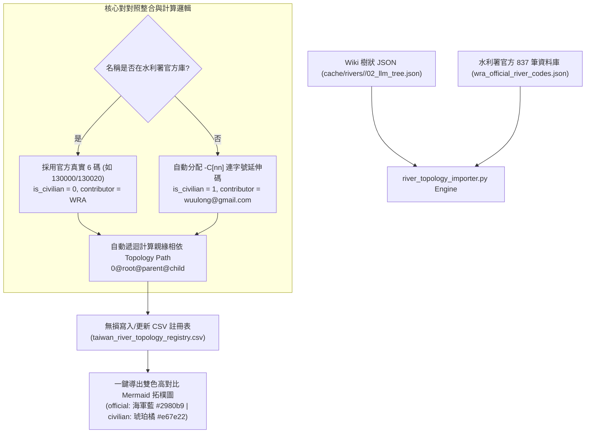

# 📖 河川拓樸自動化導入與 Mermaid 導出器說明書 (river_topology_importer.md)

`river_topology_importer.py` 是遵循 **CGS v2.0 規範** 的水文拓樸治理核心工具。它自動結合 **水利署 110 年全量官方開放資料集** (`wra_official_river_codes.json`) 與 `cache/rivers/` 快取之維基水系樹狀 JSON，自動完成 100% 硬性程式碼對照整合、`-C[nn]` 連字號民間野溪下鑽編碼、`topology_path` 算定、17 屬性過濾器與高對比雙色 Mermaid 視覺化導出。

---

## ⚙️ 核心處理與產製邏輯 (Processing Architecture)



1. **官方程式碼硬性對對照整合 (Zero Hallucination)**：
   * 工具啟動時會加載 `wra_official_river_codes.json`（包含水利署 837 筆主流、一級支流、二級次支流與維基對照 ID）。
   * 演演演演演演演演演演演演演演算法處理任何條目時，只要官方資料庫有紀錄，**硬性使用官方 6 位編碼（如頭前溪 `130000`、油羅溪 `130020`、宜蘭河 `256020`），`is_civilian` 設為 `0`**。
2. **民間野溪下鑽編碼 (`-[CivCode]`)**：
   * 對於官方未收錄之深山野溪或無名溪，依其 Parent 節點自動計算 `-C[nn]` 連字號延伸號碼（如 `130000-C01`），`is_civilian` 設為 `1`。
3. **拓樸親緣路徑算定 (`topology_path`)**：
   * 保證所有 998 筆節點皆產生以 `0@` 開頭、精確回溯至出海口主流的完整樹狀路徑。
4. **Mermaid 暗色模式高對比雙色圖導出**：
   * 官方節點標示海軍藍背景（`fill:#2980b9`），民間野溪標示琥珀橘背景（`fill:#e67e22`），均配以 `color:#ffffff` 白色文字，確保在 Dark Mode 底下清晰可讀。

---

## 🛠️ CLI 標準使用 SOP

```bash
# 1. 導出特定水系 (如頭前溪) 之高對比雙色 Mermaid 拓樸圖
python3 scripts/river_topology_importer.py mermaid -b "頭前溪"

# 2. 導出全台過濾後的拓樸 CSV (僅保留主流與一級大支流 stream_order <= 2)
python3 scripts/river_topology_importer.py export --min-stream-order 2

# 3. 導出指定水系 (如淡水河) 之乾淨拓樸 JSON 陣列
python3 scripts/river_topology_importer.py export -b "淡水河" --min-stream-order 2 -j

# 4. 單一水系 JSON 匯入註冊表
python3 scripts/river_topology_importer.py import -i cache/rivers/130000_頭前溪/02_llm_tree.json -p 0 -b "頭前溪"
```

